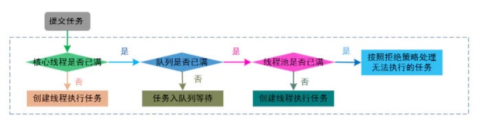

# 基础问题

## 01. 创建线程的四种方式

1. 继承 Thread 类；

2. 实现 Runnable 接口；

3. 实现 Callable 接口；

4. 使用匿名内部类方式

## 02. runnable 和 callable 有什么区别

- Runnable 接口 run 方法无返回值；Callable 接口 call 方法有返回值，是个泛型，和Future、 FutureTask配合可以用来获取异步执行的结果 
- Runnable 接口 run 方法只能抛出运行时异常，且无法捕获处理；Callable 接口 call 方法允许抛出 异常，可以获取异常信息 注：Callalbe接口支持返回执行结果，需要调用FutureTask.get()得到， 此方法会阻塞主进程的继续往下执行，如果不调用不会阻塞。

## 03. 加锁的方式有哪些 ?

使用synchronized关键字

使用Lock锁

synchronized和Lock有什么区别 ? 

> 首先synchronized是Java内置关键字，在JVM层面，Lock是个Java类；
>
> synchronized 可以给类、方法、代码块加锁；而 lock 只能给代码块加锁。 
>
> synchronized 不需要手动获取锁和释放锁，使用简单，发生异常会自动释放锁，不会造成死锁； 而 lock 需要自己加锁和释放锁，如果使用不当没有 unLock()去释放锁就会造成死锁。 
>
> 通过 Lock 可以知道有没有成功获取锁，而 synchronized 却无法办到。

## 04. 如果你提交任务时，线程池队列已满，这时会发生什么

有俩种可能： 

1. 如果使用的是无界队列 LinkedBlockingQueue，也就是无界队列的话，没关系，继续添加任务到 阻塞队列中等待执行，因为 LinkedBlockingQueue 可以近乎认为是一个无穷大的队列，可以无限存放 任务 
2. 如果使用的是有界队列比如 ArrayBlockingQueue，任务首先会被添加到ArrayBlockingQueue 中ArrayBlockingQueue 满了，会根据maximumPoolSize 的值增加线程数量，如果增加了线程数量 还是处理不过来，ArrayBlockingQueue 继续满，那么则会使用拒绝策略RejectedExecutionHandler 处理满了的任务，默认是 AbortPolicy

## 05. 在你们的项目中有没有使用到线程池

我们的项目中很多地方使用了线程池 , 使用的场景经常有如下几种情况

1. 业务层处理分多个业务线 , 多条业务线的优先级有高有低 , 使用异步线程池执行优先级较低的业务

   比如: 搜索历史记录的异步保存 , 用户行为数据异步入库

2. 任务很多很重 , 比如说 : 现在有1000w数据需要进行统计运算 (10个线程 每个线程计算100w数据 , 计算完毕之后把10个线程结算结果合并即可) 

   每天晚上计算运营统计数据  , 售货机补货数据计算

## 06. 你了解的线程池的种类有哪些 ?

1. newCachedThreadPool创建一个可缓存线程池，如果线程池长度超过处理需要，可灵活回 收空闲线程，若无可回收，则新建线程。 

2. newFixedThreadPool 创建一个定长线程池，可控制线程最大并发数，超出的线程会在队列 中等待。 

3. newScheduledThreadPool 创建一个定长线程池，支持定时及周期性任务执行。 

4. newSingleThreadExecutor 创建一个单线程化的线程池，它只会用唯一的工作线程来执行任 务，保证所有任务按照指定顺序(FIFO, LIFO, 优先级)执行。

   

## 07. 线程池的核心参数有哪些 ? 

corePoolSize 核心线程数量 

maximumPoolSize 最大线程数量 

keepAliveTime 线程保持时间，N个时间单位 

unit 时间单位（比如秒，分） 

workQueue 阻塞队列 

threadFactory 线程工厂 

handler 线程池拒绝策略

## 08. 你们项目中使用线程池, 核心线程数如何配置 ? 

1. IO密集型任务 : 核心线程数的数量  约等于   CPU核心数 * 2-3倍
2. 计算密集型任务 :  核心线程数 约等于 CPU核心数+1

## 09.线程池的执行原理知道嘛

提交一个任务到线程池中，线程池的处理流程如下：

1. 判断线程池里的核心线程是否都在执行任务，如果不是（核心线程空闲或者还有核心线程没有被创建）则创建一个新的工作线程来执行任务。如果核心线程都在执行任务，则进入下个 流程。 
2. 线程池判断工作队列是否已满，如果工作队列没有满，则将新提交的任务存储在这个工作队 列里。如果工作队列满了，则进入下个流程。 
3. 判断线程池里的线程是否都处于工作状态，如果没有，则创建一个新的工作线程来执行任 务。如果已经满了，则交给饱和策略来处理这个任务。

## 10. 新建 T1、T2、T3 三个线程，如何保证它们按顺序执行？

用 join 方法

# 项目问题

## 01- 你们项目中文章是怎么发布 ?

## 02- 文章发布用到哪些表, 他们之间的关系是什么 ? 

