## 课程引入

### 问题演示1-分层耦合问题

某业务接口

```java
public interface UserService {
    public void foo();
}
```

其中一种实现 A

```java
public class UserServiceImplA implements UserService{
    @Override
    public void foo() {
        System.out.println("UserServiceImplA.foo()...");
    }
}
```

业务功能使用者调用业务层方法

```java
public class UserController {

    private UserService userService = new UserServiceImplA();
    
    public void foo() {
        // 调用业务方法
        userService.foo();
    }

}
```

测试

```java
UserController controller = new UserController();
controller.foo();
```

如果业务功能发生了调整，变成了实现 B

```java
public class UserServiceImplB implements UserService{
    @Override
    public void foo() {
        System.out.println("UserServiceImplB.foo()...");
    }
}
```

可以看到，业务功能的使用者（UserController）也会受到影响，使用实现 A 的地方都需要修改：

```java
public class UserController {

	// 这里要修改为实现 B
    private UserService userService = new UserServiceImplB();
    
    public void foo() {
        userService.foo();
    }

}
```

之前老师应该都这么讲：为了降低耦合，需要在分层调用时去使用接口，不要直接使用实现类。但看看下面例子，你会发现，Controller 使用 Service 的实现类是无法避免的！上面的问题在于 Controller 与 Service 产生了耦合：即一方的改变影响了另一方。能否达到如下的效果，Service 发生变更，但 Controller 不受影响？

**答案：可以达到，使用Spring来解决。**

① 交出对象的控制权：把 Service 实现的控制权交给 Spring 容器

```java
@Service  //Spring扫描到@Service注解之后，会创建UserServiceImplA对象，保存到Spring容器中。
public class UserServiceImplA implements UserService{
    @Override
    public void foo() {
        System.out.println("UserServiceImplA.foo()...");
    }
}
```

② 建立对象的依赖关系：把 Controller 交给 Spring 容器，并接受容器提供的 Service 对象

```java
@Contrller
public class UserController {
	@Autowried  //Spring会从自身容器中找到UserService类型的对象赋值给该变量
    private UserService userService; //此处就没有new实现类对象。
    
    public void foo() {
        userService.foo();
    }

}
```

> ***名词解释：容器***
>
> - 英文对应 Container，指对象的运行环境，同时负责管理这些对象的创建、初始化、销毁等
> - 见过的容器有 Tomcat 容器，管理 Servlet，Filter 等对象
> - 而 Spring 也是一种容器，管理 Controller，Service，Dao 等对象

### 问题演示2-使用框架复杂

- 没有使用Spring我们service层方法使用mybatis框架

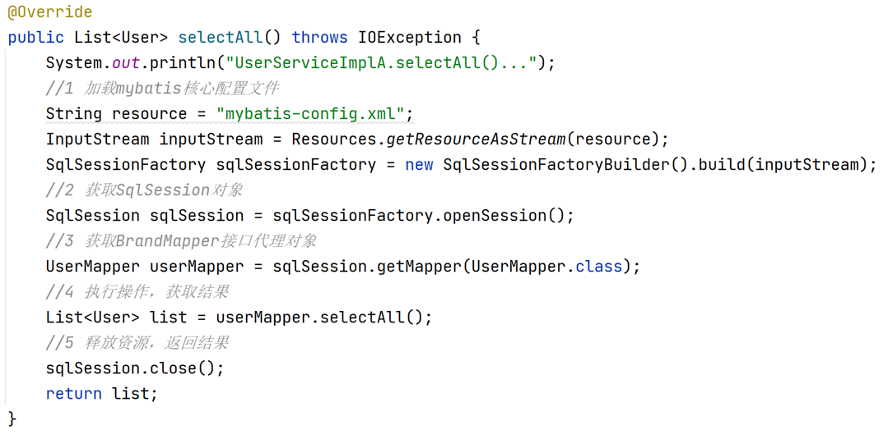

- 使用Spring我们service层方法使用mybatis框架

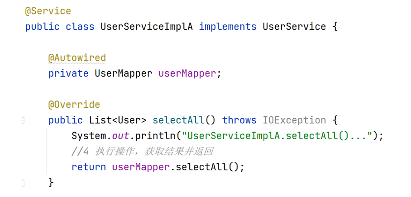

我们发现，使用了Spring之后，我们使用mybatis也变简单了。

### 总结

Spring能解决我们开发中的哪两类问题？

  1.1 代码分层耦合的问题

  1.2 使用框架复杂的问题

==**所以：我们必须学好Spring框架！！**==

## 1 Spring和SpringBoot简介

### 1.1 Spring简介

#### 1.1.1 Spring概念和作用

- Spring 是一款目前主流的 Java EE ==轻量级开源框架== ，是 Java 世界最为成功的框架之一。Spring 由“Spring 之父”Rod Johnson 提出并创立，其目的是用于简化 Java 企业级应用的开发难度和开发周期。
- 自 ==2004== 年 4 月，Spring 1.0 版本正式发布以来，**Spring** 已经步入到了第 5 个大版本，也就是我们常说的 Spring 5
- lSpring基础的是 Spring Framework，其功能有：
  - ==IoC –控制反转，Spring 两大核心技术之一==
  - ==AOP – 面向切面编程，Spring 两大核心技术之一==
  - 事务 - 无需编写代码，即可实现数据库事务管理
  - 测试 - 与测试框架集成、web 单元测试
  - MVC - 开发 web 应用程序
  - 缓存 - 对缓存进行抽象
  - 调度 - 延时任务、定时任务

- Spring Framework 在开发中的作用：
  - ==分层解耦 - 让单体应用的可扩展性更强==
  - ==整合框架 - 整合第三方框架，使之协同工作==
  - 实用技术 - 自身强大，提供各种实用功能

#### 1.1.2 Spring体系架构

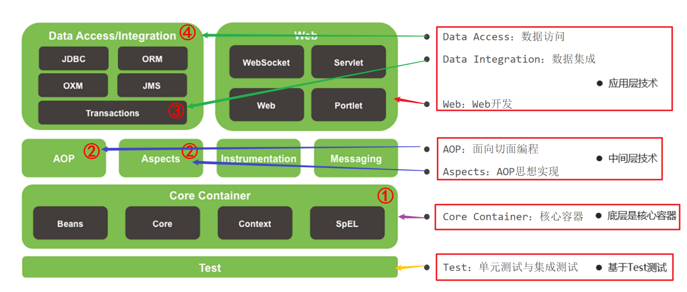

#### 1.1.3 总结

1、Spring的两大核心？

​	==1.1、IOC：控制反转==

​	==1.2、AOP：面向切面编程==

2、Spring在开发中的作用有哪些？

​	==2.1、分层解耦 - 让单体应用的可扩展性更强==

​	==2.2、整合框架 - 整合第三方框架，使之协同工作==

​	2.3、实用技术 - 自身强大，提供各种实用功能

### 1.2 SpringBoot简介

#### 1.2.1 SpringBoot介绍

- Spring Boot 是 Pivotal 团队在 Spring 的基础上提供的一套全新的开源框架，其目的是为了简化 Spring 应用的搭建和开发过程。==Spring Boot 去除了大量的 XML 配置文件，简化了复杂的依赖管理==。

  - **Spring Boot 去除了大量的 XML 配置文件**

  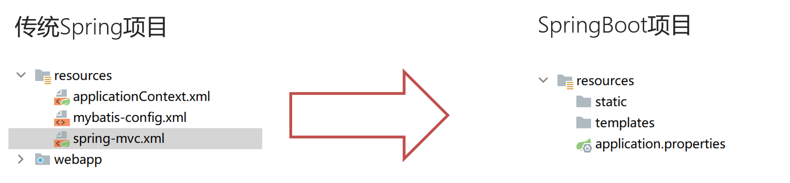

  - **简化了复杂的依赖管**

  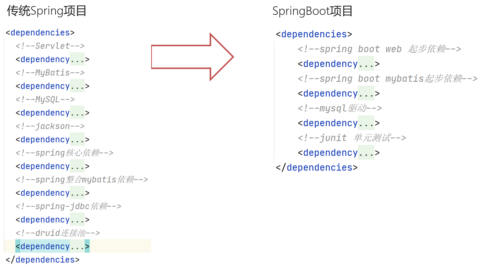

发现：使用了SpringBoot开发项目确实简介了很多。

- Spring Boot 具有 Spring 一切优秀特性，==Spring 能做的事，Spring Boot 都可以做，而且使用更加简单，功能更加丰富，性能更加稳定而健壮==。随着近些年来微服务技术的流行，Spring Boot 也成了时下炙手可热的技术。

- ==Spring Boot 集成了大量常用的第三方库配置，Spring Boot 应用中这些第三方库几乎可以是零配置的开箱即用（out-of-the-box）==，大部分的 Spring Boot 应用都只需要非常少量的配置代码（基于 Java 的配置），开发者能够更加专注于业务逻辑。

  - 传统Spring项目配置繁多且复杂

  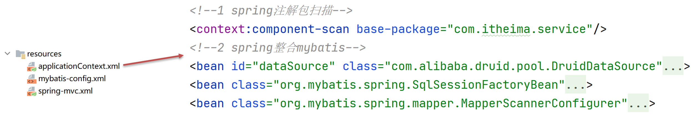

  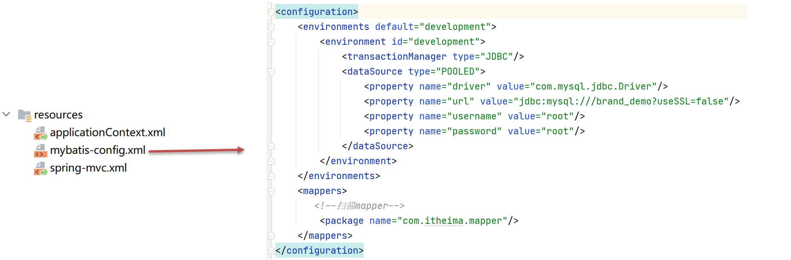

  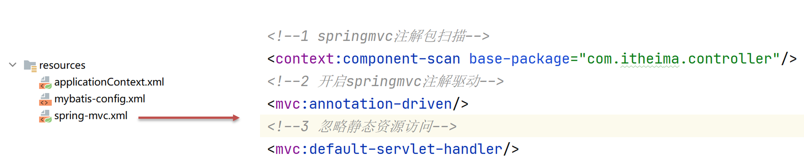

  - SpringBoot项目配置极少且简单

  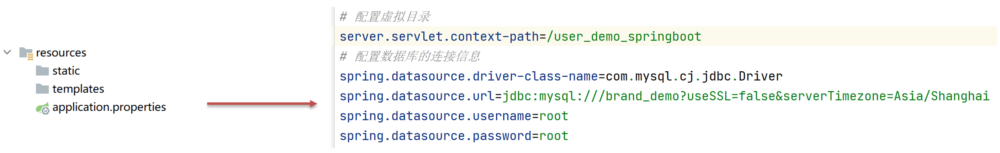

#### 1.2.2 总结

1.Spring Boot去除了大量的Spring的XML 配置文件，简化了复杂的依赖管理

2.Spring 能做的事，Spring Boot 都可以做，而且使用更加简单，功能更加丰富。

==说明：使用Spring Boot去学习Spring，利用SpringBoot配置简单的优越性，让大家学习Spring更容易，来更轻松。==

## 2 SpringBoot的快速入门

### 【第一步】创建SpringBoot的项目

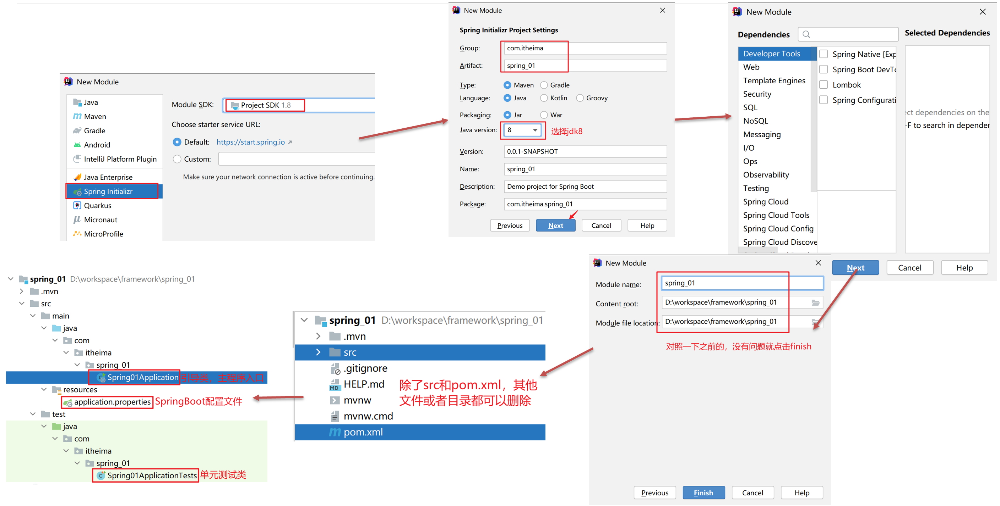

### 【第二步】创建UserService接口和UserServiceImplA实现类

```java
public interface UserService {
    void foo();
}
```

```java
@Service
public class UserServiceImplA implements UserService {
    @Override
    public void foo() {
        System.out.println("UserServiceImplA.foo()...");
    } 
}
```

### 【第三步】在引导类中获取UserService实现类对象，并调用方法。

```java
@SpringBootApplication//表示该类是SpringBoot程序入口
public class Spring01Application {
    public static void main(String[] args) {
        //1 返回值为Spring容器对象
        ConfigurableApplicationContext ac = SpringApplication.run(Spring01Application.class, args);
        //2 从Spring容器中获取UserService实现类对象
        UserService userService = ac.getBean(UserService.class);
        //3 调用UserService的foo方法
        userService.foo();
    }
}
```

## 3 控制反转(IoC)

### 3.1 IoC概念

- 控制反转：（Inversion of Control，缩写为IoC）把==**创建对象**==的权利交给==**Spring**==容器。

- 之前对象如何来的？

 	==new出来的==

- 之前对象属性如何赋值？

 	==调用构造方法、调用set方法完成赋值==

- 如果使用了Spring之后，对象那里来？

​	 ==由Spring创建并保存到Spring容器中，我们从Spring容器中获取对象==

- 如果使用了Spring之后，对象属性的赋值？

​	 ==由Spring给对象的属性赋值==

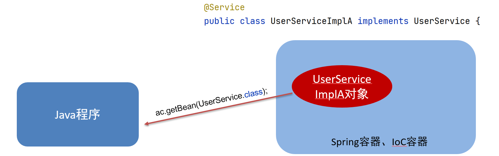

- 总结：使用了Spring之后，对象由Spring创建和管理，我们从Spring容器中获取需要的Bean对象就行了。

### 3.2 扫描Bean

- 要把某些==**类的对象**==交给 Spring 管理，需要在类上标注如下注解之一

  @Component –把==**普通类**==交给 Spring管理，这个类不属于三层架构中的类

  @Controller - 把==**控制器类**==交给 Spring管理(学习SpringMVC会用到)

  @Service - 把==**业务层类**==交给 Spring管理

  @Repository - 把==**数据访问层类**==交给Spring管理（用得少，因为与 MyBatis 整合）

```java
@Service
public class UserServiceImplA implements UserService {
    @Override
    public void foo() {
        System.out.println("UserServiceImplA.foo()...");
    } 
}
```

注意：Spring默认是加载==引导类/启动类所在包及其子包中所有带有以上注解的类==，创建这些类的对象，保存到Spring容器中。

思考：如果Bean不在引导类/启动类所在包及其子包中，那Bean是否被加载到？

答案：不能，需要在引导类上使用@ComponentScan(“要扫描的包”)注解指定要加载哪个包中的Bean。

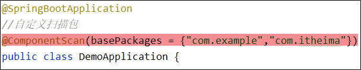

### 3.3 获取Bean

#### 3.3.1 方法介绍

Spring容器启动时，会把其中的bean都创建好，如果想要主动获取这些 bean，可以使用容器的如下方法

- 根据类型获取 bean - ==<T> T  getBean(Class<T>  requiredType)==，返回值是方法参数传入的类型
  - 可以传递父类型，返回子类型
  - 可以传递接口类型，返回实现类型
- 根据 id 获取 bean - ==Object getBean(String name)==，返回值是Object类型，后期自己需要强转

- 根据 id 获取 bean -  ==<T> T   getBean (String name, Class<T> requiredType)==，返回值是方法参数传入的类型

#### 3.3.2 Spring容器介绍

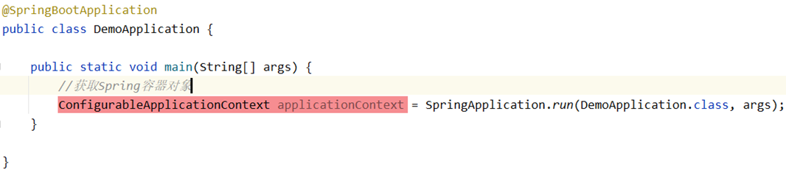


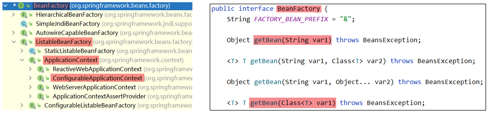


### 3.4 Bean的范围

在类上使用@scope注解定义Bean的作用域，Spring支持五种作用域，后三种在 web 环境才生效。

- ==singleton - 容器内同 id 的 bean 只有一个实例（默认）==
- ==prototype - 每次使用该 bean 时会创建新的实例==
- request - 在 web 环境中，每个请求范围内会创建新的实例
- session - 在 web 环境中，每个会话范围内会创建新的实例
- application- 在 web 环境中，每个应用范围内会创建新的实例

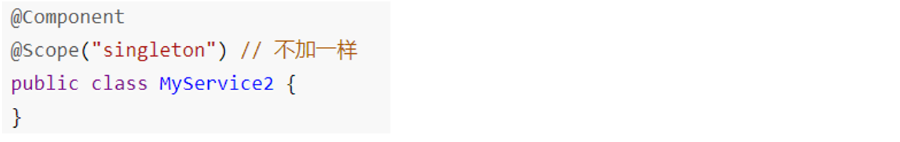、

### 3.5 Bean的生命周期

- 标注了 ==**@PostConstruct**== 的方法是初始化方法，会==**在bean被创建之后**==调用。

- 标注了 **@PreDestroy** 的方法是销毁方法，**==singleton范围的bean==**的销毁方法会**==在容器关闭前被调用==**。

- 延迟初始化

  ​	默认情况下 singleton范围的的 bean 是容器创建时就会==**创建**==

  ​	如果希望==**用到时才创建**==，可以使用 ==**@Lazy**== 注解标注在类上来延迟创建

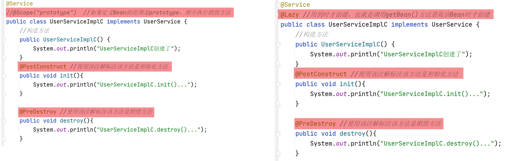

### 3.6 管理第三方Bean

如果要管理的对象来自于第三方，这时是==**无法用@Component**==等注解来实现的，解决方法：使用@Configuration注解定义配置类，在配置类中定义方法使用==**@Bean**==注解将返回返回的对象保存到Spring容器中。

#### 3.6.1 编写配置类

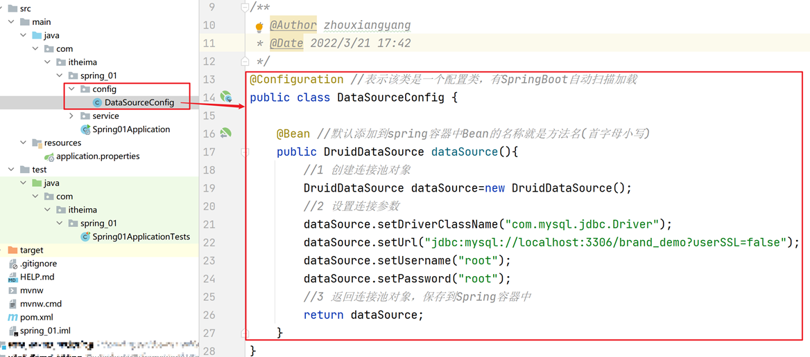

```java
@Configuration //表示该类是一个配置类，有SpringBoot自动扫描加载
public class DataSourceConfig {

    @Bean //默认添加到spring容器中Bean的名称就是方法名(首字母小写)
    public DruidDataSource dataSource(){
        //1 创建连接池对象
        DruidDataSource dataSource=new DruidDataSource();
        //2 设置连接参数
        dataSource.setDriverClassName("com.mysql.jdbc.Driver");
        dataSource.setUrl("jdbc:mysql://localhost:3306/brand_demo?useSSL=false");
        dataSource.setUsername("root");
        dataSource.setPassword("root");
        //3 返回连接池对象，保存到Spring容器中
        return dataSource;
    }
}
```

@Configuration：写在类上，表示该类是一个配置类，有SpringBoot自动扫描加载

@Bean：写在方法上，表示将该方法的返回值添加到Spring容器中，默认添加到spring容器中Bean的名称就是方法名(首字母小写)。

#### 3.6.2 在引导类中使用连接池

```java
@SpringBootApplication//表示该类是SpringBoot程序入口
public class Spring01Application {

    public static void main(String[] args) {
        //1 返回值为Spring容器对象
        ConfigurableApplicationContext ac = SpringApplication.run(Spring01Application.class, args);
        //2 从Spring容器中获取DataSource连接池对象
        DataSource dataSource = ac.getBean(DataSource.class);
        //3 调用DataSource的getConnection()获取连接的方法
        Connection conn=dataSource.getConnection();
        System.out.println("conn = "+conn)
    }
}
```

## 4 依赖注入(DI)

依赖注入：Dependency Injection，缩写为DI。就是指被 Spring管理的Bean对象之间的依赖关系。由==**Spring容器**==完成**==对象属性==**的**==赋值==**。

依赖注入相关的注解有

1、给对象类型的属性赋值

​	@Autowired

​	@Qualifier

2、给普通类型的属性赋值

​	@Value

​	@ConfigurationProperties

### 4.1 给对象类型的属性赋值

####  @Autowired注解

作用：给对象类型的属性赋值，可以用在成员变量、成员方法、构造方法上

- 加在成员变量上，会根据成员变量的**类型**到容器中找类型匹配的bean进行注入(赋值)

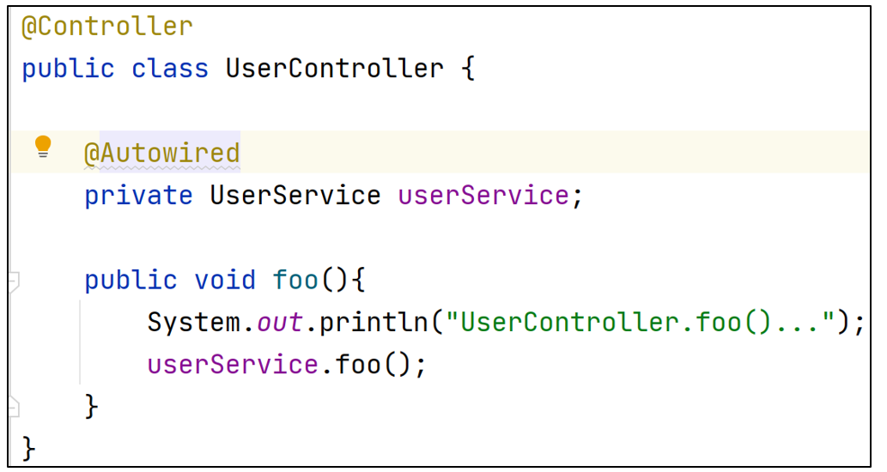

- 加在普通方法上，会根据方法的参数**类型**到容器中找类型匹配的bean进行注入(赋值)

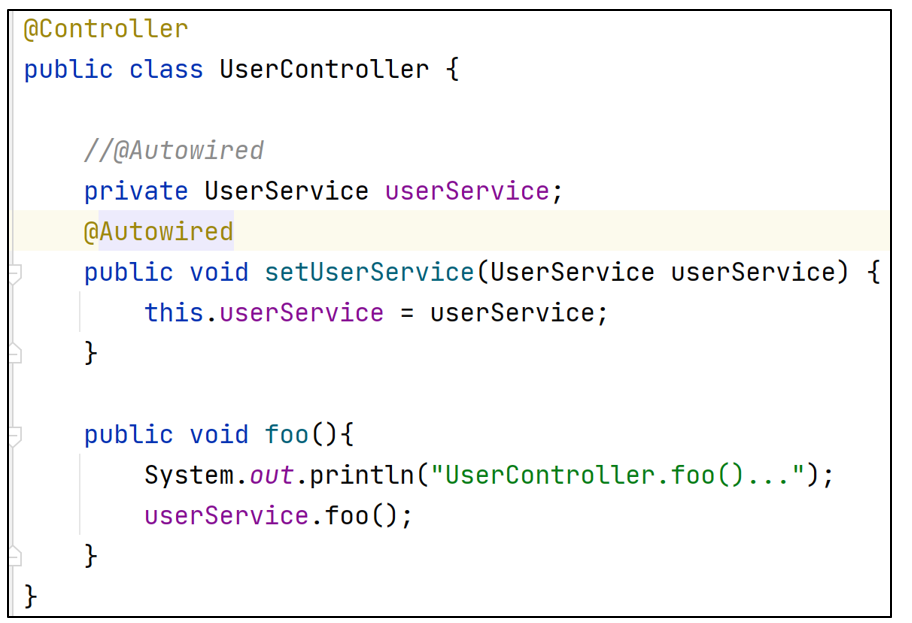

- 加在构造方法上，会根据构造方法的参数**类型**到容器中类型匹配的bean进行注入(赋值)，如果仅有唯一的有参构造，可以省略 @Autowired。

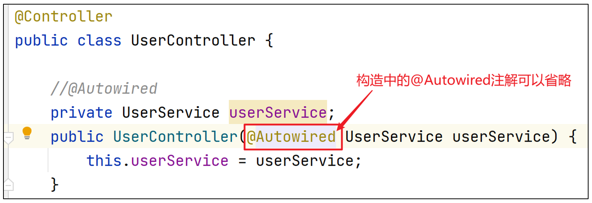

#### @Qualifier注解

问题：使用@Autowired给对象类型的属性赋值，如果同类型的对象有多个，赋值是否有问题？

自动注入规则：使用@Autowired给对象类型的属性赋值，如果同类型的对象有多个，就按照变量名和Bean的名称进行匹配，建议使用@Qualifier注解指定要匹配的Bean的名称。

==@Qualifier注解作用：指定要匹配的Bean的名称。==

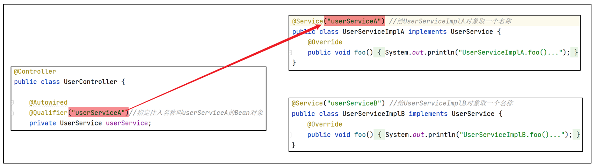

### 4.2 给普通类型的属性赋值

#### @Value注解

作用：给普通类型(基本类型、包装类类型、Sring类型)的属性赋值。

应用场景：==变化的配置信息==写死在java代码中不好，建议放入配置文件，Spring Boot采用==application.properties== 作为配置文件，可以使用 ==@Value==注解结合EL表达式根据key读取配置文件中对应的value值。

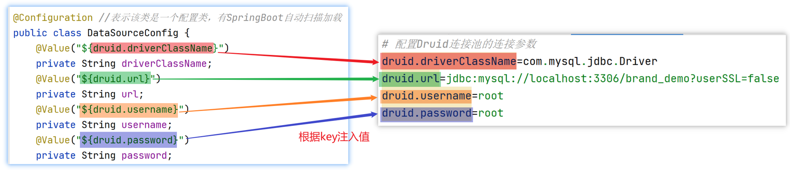

#### @ConfigurationProperties注解

@Value 只能一个个属性来进行，比较麻烦，可以用 @ConfigurationProperties注解来简化。

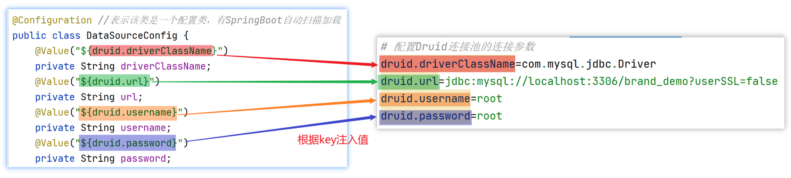

## 5 拔高知识

### 5.1 整合Junit单元测试

1、其实我们创建的SpringBoot工程已经整合了Junit单元测试，并且使用的是Junit5的版本，好处是测试方法不需要使用public修饰。

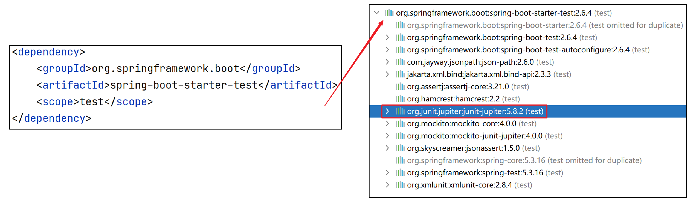

2、测试类上的@SpringBootTest注解表示该类是一个SpringBoot单元测试类，在该测试类中可以直接使用@Autowired注解注入要使用对象

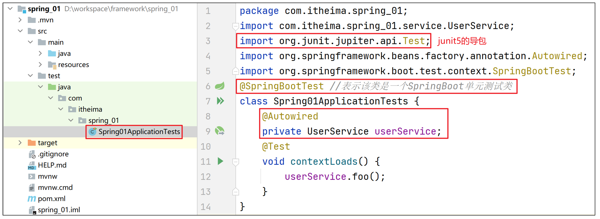

### 5.2 lombok工具包

- 平时我们在定义JavaBean的时候经常需要使用idea给Bean生成构造方法、getter和setter方法、toString等方法。虽然不难，但是也挺累的。
- 使用了lombok工具包就能完美的解决这个问题

```xml
<!--lombok-->
<dependency>
    <groupId>org.projectlombok</groupId>
    <artifactId>lombok</artifactId>
</dependency>
```

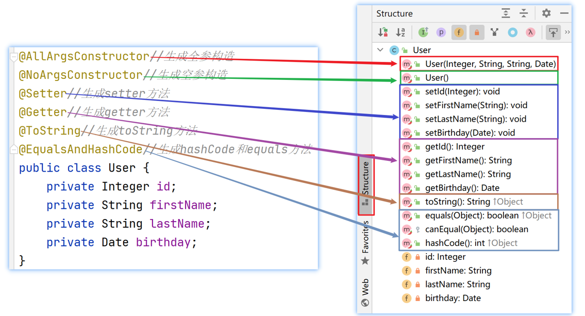

- @Data注解

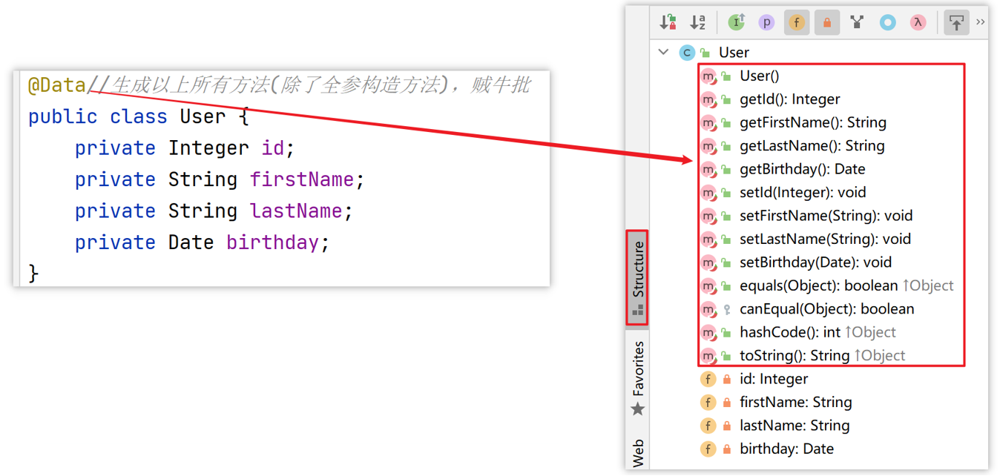

- @Slf4j注解

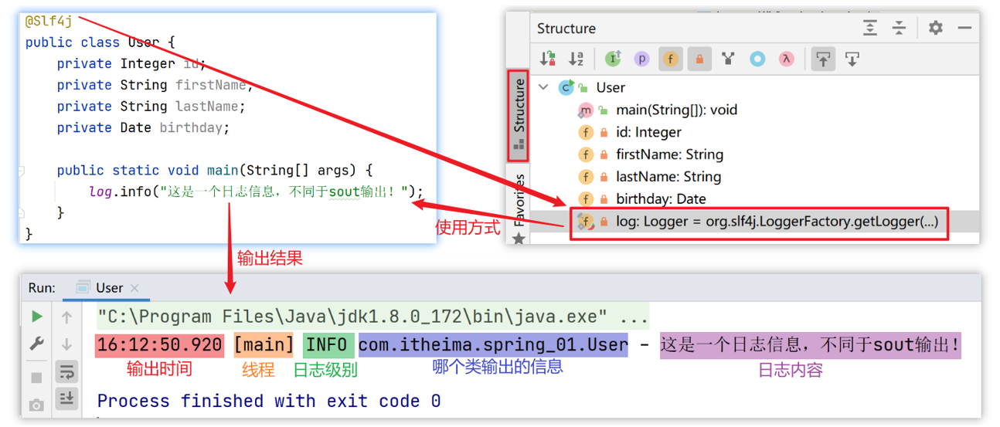

以后我们将经常在Bean上使用@Slf4j注解，然后使用log对象进行日志输出，代替System.out.println()输出。例如：

```java
@Service
@Slf4j
public class BrandServiceImpl implements BrandService {…}
```

```java
@SpringBootTest
@Slf4j
class Spring01HomeworkApplicationTests {…}
```

### 5.3 循环依赖问题

#### 5.3.1 set方式循环依赖

- bean的初始化过程

  bean 从创建到初始化三个阶段，此顺序不能颠倒，并且只发生一次！

  

- 代码演示：

  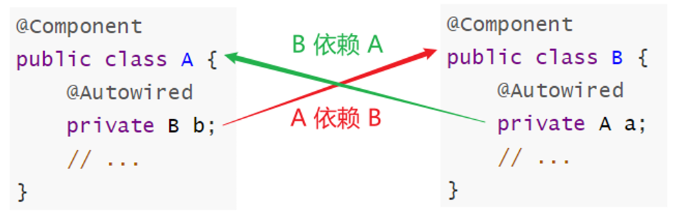

  单例 set 循环依赖==**无需任何配置**==，Spring 会自动调整执行顺序，调整后的初始化顺序是：

  

#### 5.3.2 构造方式循环依赖

- 代码演示：

  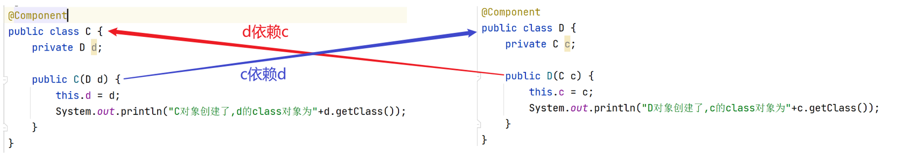

- 循环依赖报错：

  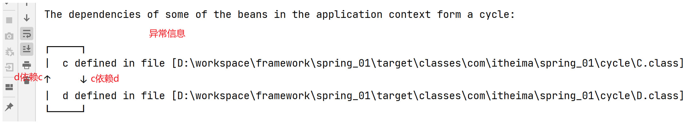

- 只要能打破循环依赖的局面，然一个对象先初始化完就行了

  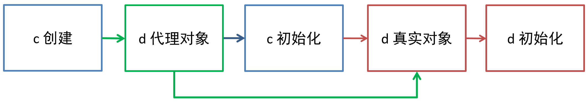

- 做法

  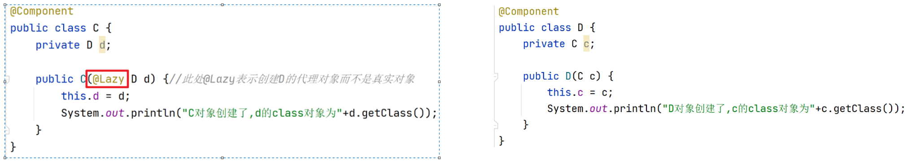

## 今日注解

| 注解名称                 | 位置     | 注解作用                                  | 备注                                |
| ------------------------ | -------- | ----------------------------------------- | ----------------------------------- |
| @SpringBootApplication   | 引导类   | 标识 SpringBoot 程序入口                  | 每个项目（module）只能有一个引导类  |
| @SpringBootTest          | 测试类   | 标注测试入口                              | 与引导类要同包                      |
| @Component               | 类       | 标注该注解的类由Spring管理                | 必须处于扫描范围内                  |
| @Controller              | 类       | 同上，特定用于控制器类                    |                                     |
| @Service                 | 类       | 同上，特定用于业务逻辑类                  |                                     |
| @Repository              | 类       | 同上，特定用于数据访问类                  |                                     |
| @ComponentScan           | 类       | 控制扫描范围                              | 隐含在 @SpringBootApplication 中    |
| @Scope                   | 类       | 控制 scope                                | 取值常见的有 singleton 与 prototype |
| @PostConstruct           | 成员方法 | 表示该方法为初始化方法                    | 方法需无参，无返回值                |
| @PreDestroy              | 成员方法 | 表示该方法未销毁方法                      | 方法需无参，无返回值                |
| @Lazy                    | 类       | 表示该类延迟创建                          | 用到时才会创建和初始化              |
| @Bean                    | 成员方法 | 方法的返回结果由Spring管理                | 方法参数带按类型装配功能            |
| @Autowried               | 成员方法 | 方法参数根据类型装配                      |                                     |
| @Autowried               | 构造方法 | 方法参数根据类型装配                      | 如果只有一个有参构造可以省略        |
| @Autowried               | 成员变量 | 成员变量根据类型装配                      |                                     |
| @Value                   | 成员变量 | 成员变量根据 ${key} 找 value              | 键值信息存于 application 配置文件中 |
| @Value                   | 参数     | 方法参数根据 ${key} 找 value              | 键值信息存于 application 配置文件中 |
| @ConfigurationProperties | 类       | 类的成员与 key 绑定                       | 键值信息存于 application 配置文件中 |
| @Data                    | 类       | 生成空参构造/getter/setter/toString等方法 |                                     |
| @Slf4j                   | 类       | 生成log对象，log.info("")进行日志输出     |                                     |


