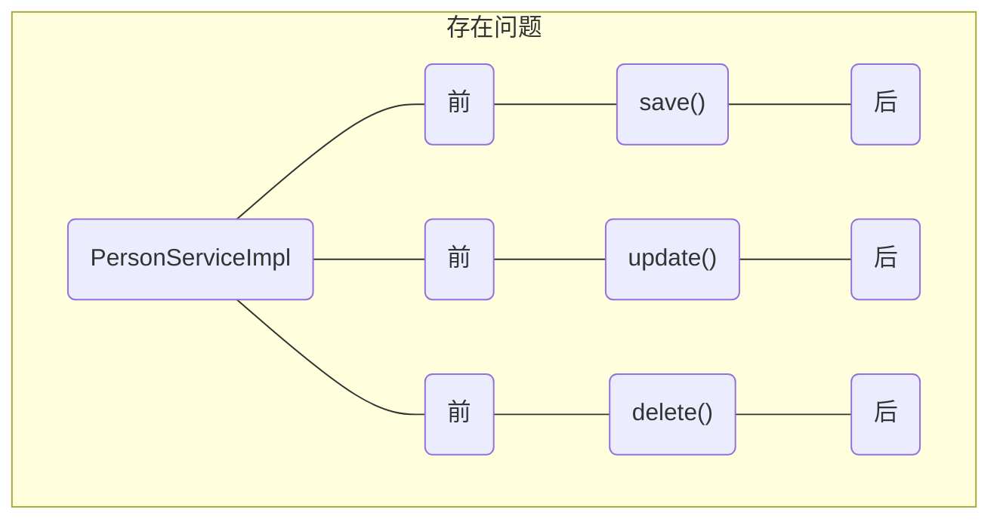
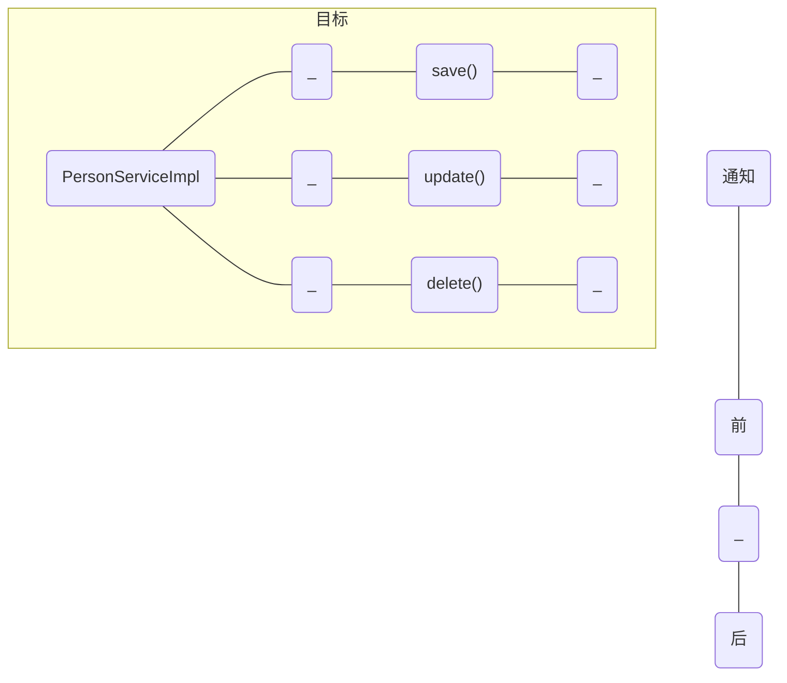
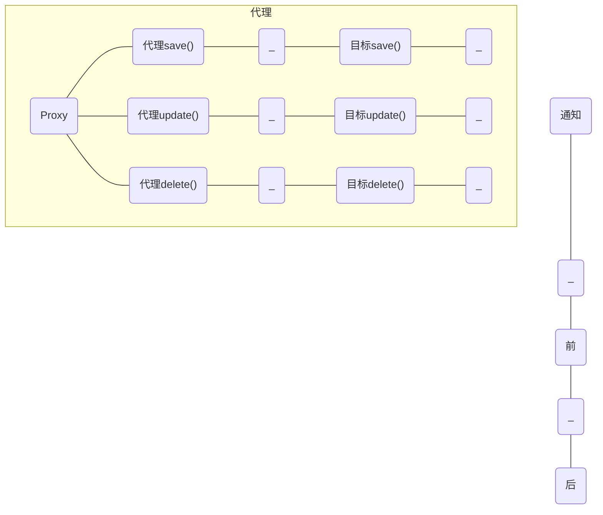
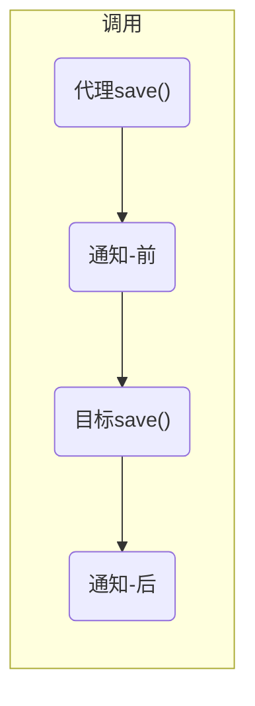
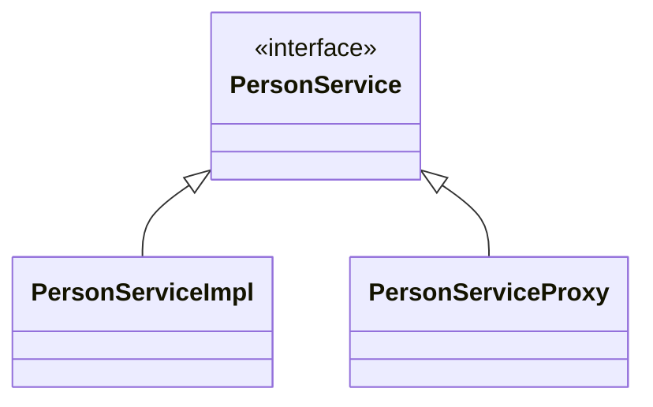
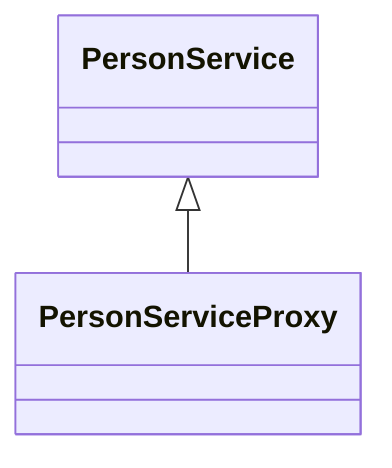

## 1 AOP 

作用：对方法进行增强。

### 1.1 AOP 入门

#### 1) 日志问题

要对业务方法的执行时间进行日志记录

```java
public interface PersonService {
    void save(Person person);

    void update(Person person);

    void delete(int id);

    List<Person> findAll();

    List<Person> findByPage(int page, int size);

    Person findById(int id);
}
```

```java
@Service
public class PersonServiceImpl implements PersonService {
    private static final Logger log = LoggerFactory.getLogger(PersonServiceImpl.class);

    @Override
    public void save(Person person) {
        long start = System.nanoTime();
        log.info("save({})", person);
        long end = System.nanoTime();
        log.info("cost time: {} ns", (end - start));
    }

    @Override
    public void update(Person person) {
        long start = System.nanoTime();
        log.info("update({})", person);
        long end = System.nanoTime();
        log.info("cost time: {} ns", (end - start));
    }
	
	// ...
}
```

发现有很多重复代码，如果需求有变更，改动很大


#### 2) 解决思路

AOP 即 aspect oriented programming（面向切面编程），它的核心思想是将重复的逻辑剥离出来（称为通知），以达到增强扩展性的目的

目标

```java
@Service
public class PersonServiceImpl implements PersonService {
    private static final Logger log = LoggerFactory.getLogger(PersonServiceImpl.class);

    @Override
    public void save(Person person) {
        log.info("save({})", person);
    }

    @Override
    public void update(Person person) {
        log.info("update({})", person);
    }
	
	// ...
}
```

通知-前增强

```java
long start = System.nanoTime();
```

通知-后增强

```java
long end = System.nanoTime();
log.info("cost time: {} ns", (end - start));
```


#### 3) 概念引入

问题示意图



解决示意图
先把重复的逻辑抽取出去，称为通知



由代理把它们在运行时结合起来



某次的调用流程



#### :triangular_flag_on_post:重要概念

其中

* 目标 - 英文 target，需要被增强的对象
* 通知 - 英文 advice，那些重复的逻辑，可以理解为增强
* 代理 - 英文 proxy，光有目标和通知还不够，需要代理来结合二者
* 连接点 - 英文 joinpoint，在 Spring 中特指**方法执行**（暗含方法执行时的相关信息）
* 切点 - 英文 pointcut，匹配连接点的条件，通知仅会在匹配切点的方法执行时被应用
* 切面 - 英文 aspect，通知和切点合在一起，称为切面


代理类伪代码

```java
public class PersonServiceProxy implements PersonService {
    @Override
    public void save(Person person) {
        // 执行通知方法及目标方法
    }

    @Override
    public void update(Person person) {
        // 执行通知方法及目标方法
    }
}
```

> ***思考***
>
> 代理为何也要实现 PersonService 接口？
>
> * 因为要让使用者感知不到自己使用了代理，原有的调用无需更改（图1 所示）
>
> 如果目标没有实现接口，能否使用代理
>
> * 可以。使用目标的子类作为代理（图2 所示）

图1，若目标 PersonServiceImpl 实现了 PersonService 接口，那么采用与之平级、同样实现了 PersonService 接口的类作为代理



图2，若目标 PersonService 不是接口，已经是具体类，采用它的子类作为代理




#### 4) 日志问题解决

步骤

1. 引入 aop 相关坐标 - 代码片段1
2. 编写切面类 - 代码片段2
   1. 写切面
   1. 写通知
   2. 调目标
   3. 定切点

代码片段1

```xml
<dependency>
    <groupId>org.aspectj</groupId>
    <artifactId>aspectjweaver</artifactId>
</dependency>
```

代码片段2

```java
@Component // 写切面. 切面类也需要配合组件扫描被 Spring 管理起来
@Aspect // 写切面. 标注此类是一个切面类
public class Aspect1 {
    private static final Logger log = LoggerFactory.getLogger(Aspect1.class);
	// 写通知. 标注 @Around 注解的方法称为通知方法，内含增强逻辑
	// 定切点. 最后在 @Around 内书写切点表达式，确定哪些目标方法需要增强
    @Around("execution(* com.itheima.demo1.service.impl.PersonServiceImpl.*(..))")
    public Object around(ProceedingJoinPoint pjp) throws Throwable {
        long start = System.nanoTime();
		
		// 调目标. pjp.proceed() 即表示调用目标方法
        Object result = pjp.proceed();
		
        long end = System.nanoTime();
        log.info("cost time: {} ns", (end - start));
        return result;
    }
}
```

测试

```java
@SpringBootTest
class Aop1Tests {

    @Autowired
    private PersonService personService;

    @Test
    public void save() {
        personService.save(new Person(3, "李四"));
    }

    @Test
    public void update() {
        personService.update(new Person(3, "李小四"));
    }

    @Test
    public void delete() {
        personService.delete(1);
    }

    @Test
    public void findById() {
        Person person = personService.findById(1);
    }

    @Test
    public void findAll() {
        List<Person> all = personService.findAll();
    }

    @Test
    public void findByPage() {
        List<Person> all = personService.findByPage(1, 5);
    }

}
```

部分运行结果

```
...
15:55:40  INFO PersonServiceImpl : findByPage(1, 5)
15:55:40  INFO Aspect1           : cost time: 322800 ns
15:55:40  INFO PersonServiceImpl : save(Person{id=3, name='李四'})
15:55:40  INFO Aspect1           : cost time: 370600 ns
```


### 1.2 AOP 进阶

#### 1) 切点表达式

切点表达式用来匹配【哪些】目标方法需要应用通知，常见的切点表达式如下

* `execution(返回值类型 包名.类名.方法名(参数类型))`
  * `*` 可以通配任意返回值类型、包名、类名、方法名、或任意类型的一个参数
  * `..` 可以通配任意层级的包、或任意类型、任意个数的参数
* `@annotation()` 根据注解匹配

测试代码均一样，仅粘贴一次

```java
@SpringBootTest
class Aop5Tests {

    @Autowired
    private Service5 service5;

    @Test
    public void save() {
        service5.save(new Person(3, "李四"));
    }

    @Test
    public void update() {
        service5.update(new Person(3, "李小四"));
    }

    @Test
    public void delete() {
        service5.delete(1);
    }

    @Test
    public void findById() {
        Person person = service5.findById(1);
    }

    @Test
    public void findAll() {
        List<Person> all = service5.findAll();
    }

    @Test
    public void findByPage() {
        List<Person> all = service5.findByPage(1, 5);
    }

}
```

##### execution()

它主要根据方法的返回值、包名、类名、方法名、方法参数等信息来匹配，语法为

```
execution(@注解? 访问修饰符? 返回值 包名.类名?.方法名(方法参数) throws 异常?)
```

其中带 ? 的表示可以省略的部分

* 注解可省略（没啥用）
* 访问修饰符可省略（没啥用，仅能匹配 public、protected、包级，private 不能增强）
* 包名.类名可省略
* thorws 异常可省略（注意是方法上声明抛出的异常，不是实际抛出的异常）

例1 `..` 出现在包部分表示任意层级的包

```java
@Aspect
@Component
public class Aspect5 {

    private static final Logger log = LoggerFactory.getLogger(Aspect5.class);

    // 例1 .. 出现在包部分表示任意层级的包
    @Pointcut("execution(* com.itheima.demo1..Service5Impl.*(..))")
    public void pt1() {
    }

    @Before("pt1()")
    public void before() {
        log.info("before...");
    }
}

```

结果（所有方法都被增强了）

```
16:37:49  INFO Aspect5           : before...
16:37:49  INFO Service5Impl      : delete(1)
16:37:49  INFO Aspect5           : before...
16:37:49  INFO Service5Impl      : findAll()
16:37:49  INFO Aspect5           : before...
16:37:49  INFO Service5Impl      : update(Person{id=3, name='李小四'})
16:37:49  INFO Aspect5           : before...
16:37:49  INFO Service5Impl      : findById(1)
16:37:49  INFO Aspect5           : before...
16:37:49  INFO Service5Impl      : findByPage(1, 5)
16:37:49  INFO Aspect5           : before...
16:37:49  INFO Service5Impl      : save(Person{id=3, name='李四'})
```

例2 切点加在接口上, 会匹配此接口的实现类

```java
@Aspect
@Component
public class Aspect5 {

    private static final Logger log = LoggerFactory.getLogger(Aspect5.class);

    // 例2 切点加在接口上, 会匹配此接口的实现类
    @Pointcut("execution(* com.itheima.demo1.service.Service5.*(..))")
    public void pt2() {
    }
	
    @Before("pt2()")
    public void before() {
        log.info("before...");
    }
}
```

测试结果同 例1（所有方法都被增强了）

例3 `*` 可以通配方法名的一部分

```java
@Aspect
@Component
public class Aspect5 {

    private static final Logger log = LoggerFactory.getLogger(Aspect5.class);

    // 例3 * 可以通配方法名的一部分
    @Pointcut("execution(* com.itheima.demo1.service.Service5.find*(..))")
    public void pt3() {
    }
	
    @Before("pt3()")
    public void before() {
        log.info("before...");
    }
}
```

结果（所有 find 开头的方法都被增强了）

```java
16:44:41  INFO Service5Impl      : delete(1)
16:44:41  INFO Aspect5           : before...
16:44:41  INFO Service5Impl      : findAll()
16:44:41  INFO Service5Impl      : update(Person{id=3, name='李小四'})
16:44:41  INFO Aspect5           : before...
16:44:41  INFO Service5Impl      : findById(1)
16:44:41  INFO Aspect5           : before...
16:44:41  INFO Service5Impl      : findByPage(1, 5)
16:44:42  INFO Service5Impl      : save(Person{id=3, name='李四'})
```

例4 `*` 通配参数，是匹配【任意类型的一个参数】

```java
@Aspect
@Component
public class Aspect5 {

    private static final Logger log = LoggerFactory.getLogger(Aspect5.class);

    // 例4 * 通配参数, 是匹配【任意类型的一个参数】
    @Pointcut("execution(* com.itheima.demo1.service.Service5.*(*))")
    public void pt4() {
    }
	
    @Before("pt4()")
    public void before() {
        log.info("before...");
    }
}

```

结果（save、update、delete 方法都被增强了，因为它们均有一个参数）

```
16:47:56  INFO Aspect5           : before...
16:47:56  INFO Service5Impl      : delete(1)
16:47:56  INFO Service5Impl      : findAll()
16:47:56  INFO Aspect5           : before...
16:47:56  INFO Service5Impl      : update(Person{id=3, name='李小四'})
16:47:56  INFO Aspect5           : before...
16:47:56  INFO Service5Impl      : findById(1)
16:47:56  INFO Service5Impl      : findByPage(1, 5)
16:47:56  INFO Aspect5           : before...
16:47:56  INFO Service5Impl      : save(Person{id=3, name='李四'})
```

##### @annotation

自定义 @Log 注解

```java
@Retention(RetentionPolicy.RUNTIME)
@Target(ElementType.METHOD)
@Documented
public @interface Log {

    String value() default "console";
}
```

目标类上也挑几个方法加上 @Log 注解

```java
@Service
public class Service5Impl implements com.itheima.demo1.service.Service5 {
    private static final Logger log = LoggerFactory.getLogger(Service5Impl.class);

    @Log
    public void save(Person person) {
        log.info("save({})", person);
    }

    @Log("file")
    public void update(Person person) {
        log.info("update({})", person);
    }

    @Log("db")
    public void delete(int id) {
        log.info("delete({})", id);
    }

    public List<Person> findAll() {
        log.info("findAll()");
        List<Person> people = Arrays.asList(new Person(1, "王五"), new Person(2, "赵六"));
        return people;
    }

    public List<Person> findByPage(int page, int size) {
        log.info("findByPage({}, {})", page, size);
        List<Person> people = Arrays.asList(new Person(3, "王五"), new Person(4, "赵六"));
        return people;
    }

    public Person findById(int id) {
        log.info("findById({})", id);
        Person person = new Person(id, "张三");
        return person;
    }
}
```

例5，匹配有没有 @Log 注解

切面类

```java
@Aspect
@Component
public class Aspect5 {

    private static final Logger log = LoggerFactory.getLogger(Aspect5.class);

    // 例5 匹配【注解信息】
    @Pointcut("@annotation(com.itheima.demo1.service.Log)")
    public void pt5() {
    }
    
    @Before("pt5()")
    public void before() {
        log.info("before...");
    }
}
```

结果（加了 @Log 注解的方法 save、update、delete 均被增强）

```
16:50:49  INFO Aspect5           : before...
16:50:49  INFO Service5Impl      : delete(1)
16:50:49  INFO Service5Impl      : findAll()
16:50:49  INFO Aspect5           : before...
16:50:49  INFO Service5Impl      : update(Person{id=3, name='李小四'})
16:50:49  INFO Service5Impl      : findById(1)
16:50:49  INFO Service5Impl      : findByPage(1, 5)
16:50:49  INFO Aspect5           : before...
16:50:49  INFO Service5Impl      : save(Person{id=3, name='李四'})
```

例6，匹配并捕获 @Log 注解

切面类

```java
@Aspect
@Component
public class Aspect5 {

    private static final Logger log = LoggerFactory.getLogger(Aspect5.class);

    // 例6 匹配并捕获【注解信息】
    @Before("@annotation(logObj)")
    public void before(Log logObj) {
        log.info("before...{}", logObj.value());
    }
}
```

结果（首先，加了 @Log 注解的方法才会被增强；其次，在通知方法参数上获得了具体的 @Log 注解对象，可以获取它配置的值）

```
16:55:29  INFO Aspect5           : before...db
16:55:29  INFO Service5Impl      : delete(1)
16:55:29  INFO Service5Impl      : findAll()
16:55:29  INFO Aspect5           : before...file
16:55:29  INFO Service5Impl      : update(Person{id=3, name='李小四'})
16:55:29  INFO Service5Impl      : findById(1)
16:55:29  INFO Service5Impl      : findByPage(1, 5)
16:55:29  INFO Aspect5           : before...console
16:55:29  INFO Service5Impl      : save(Person{id=3, name='李四'})
```

例7，匹配并捕获【注解信息】及【目标方法参数】

切面类

```java
@Aspect
@Component
public class Aspect5 {

    private static final Logger log = LoggerFactory.getLogger(Aspect5.class);

    @Before("@annotation(logObj) && args(person)")
    public void before(Log logObj, Person person) {
        log.info("before...{}, {}", logObj, person);
    }
}
```

结果（类似的、在例2 的基础上又做了参数类型的匹配和捕获，只增强了带 Person 参数的 save 和 update 方法，delete 方法并未增强）

```
16:57:25  INFO Service5Impl      : delete(1)
16:57:25  INFO Service5Impl      : findAll()
16:57:25  INFO Aspect5           : before...@com.itheima.demo1.service.Log(value=file), Person{id=3, name='李小四'}
16:57:25  INFO Service5Impl      : update(Person{id=3, name='李小四'})
16:57:25  INFO Service5Impl      : findById(1)
16:57:25  INFO Service5Impl      : findByPage(1, 5)
16:57:25  INFO Aspect5           : before...@com.itheima.demo1.service.Log(value=console), Person{id=3, name='李四'}
16:57:25  INFO Service5Impl      : save(Person{id=3, name='李四'})
```

#### 2) 通知类型

之前介绍的是环绕通知，它是功能最为强大的通知，但除此以外还有四种通知类型

* @Before - 此注解标注的通知方法在目标方法前被执行
* @After - 此注解标注的通知方法在目标方法后被执行，无论是否有异常
* @AfterReturning - 此注解标注的通知方法在目标方法后被执行，有异常不会执行
* @AfterThrowing - 此注解标注的通知方法发生异常后执行

它们与 @Around 有一个区别是，它们不用考虑目标方法的执行，而 @Around 需要自己调用 ProceedingJoinPoint.proceed() 来让目标方法执行

##### @Before前置通知

```java
@Aspect
@Component
public class Aspect31 {
    private static final Logger log = LoggerFactory.getLogger(Aspect31.class);

    @Before("execution(* com.itheima.demo1.service.Service3.*(..))")
    public void before() {
        log.info("before...");
    }
}
```

##### @AfterReturning后置通知

```java
@Aspect
@Component
public class Aspect33 {
    private static final Logger log = LoggerFactory.getLogger(Aspect33.class);

    @AfterReturning("execution(* com.itheima.demo1.service.Service3.*(..))")
    public void afterReturning() {
        log.info("after returning...");
    }
}
```

##### @AfterThrowing异常通知

```java
@Aspect
@Component
public class Aspect34 {
    private static final Logger log = LoggerFactory.getLogger(Aspect34.class);

    @AfterThrowing("execution(* com.itheima.demo1.service.Service3.*(..))")
    public void afterThrowing() {
        log.info("after throwing...");
    }
}
```

##### @After最终通知

```java
@Aspect
@Component
public class Aspect32 {
    private static final Logger log = LoggerFactory.getLogger(Aspect32.class);

    @After("execution(* com.itheima.demo1.service.Service3.*(..))")
    public void after() {
        log.info("after...");
    }
}
```

目标方法执行没有异常时，以下三个通知生效

@Before、@After、@AfterReturning

```
16:12:57  INFO Aspect31          : before...
16:12:57  INFO Service3Impl      : save(Person{id=3, name='李四'})
16:12:57  INFO Aspect33          : after returning...
16:12:57  INFO Aspect32          : after...
```

目标方法执行出现异常时，以下三个通知生效
@Before、@After、@AfterThrowing

```
16:15:37  INFO Aspect31          : before...
16:15:37  INFO Service3Impl      : save(Person{id=3, name='李四'})
16:15:37  INFO Aspect34          : after throwing...
16:15:37  INFO Aspect32          : after...

java.lang.ArithmeticException: / by zero
...
```


#### 3) 连接点

连接点概念的原始定义不是特别好理解

```
A point during the execution of a program, such as the execution of a method or the handling of an exception
```

简单理解就是 `目标方法`，在Spring 中用 JoinPoint 抽象了连接点，用它可以获得方法执行时的相关信息，如方法名、方法参数类型、方法实际参数等等

* 对于 @Around 通知，获取连接点信息只能使用 ProceedingJoinPoint
* 对于其他四种通知，获取连接点信息只能使用 JoinPoint，它是 ProceedingJoinPoint 的父类型

那么如何获取这些信息呢？参考下面的代码

```java
private void printMethodInfo(JoinPoint pjp) {
	MethodSignature signature = (MethodSignature) pjp.getSignature();
    Method method = signature.getMethod();
    log.info("连接点方法:{}", method);
    log.info("参数类型:{}", Arrays.toString(signature.getParameterTypes()));
    log.info("参数名:{}",
             Arrays.stream(method.getParameters())
             .map(Parameter::getName)
             .collect(Collectors.toList())
            );
    log.info("参数值:{}", Arrays.toString(pjp.getArgs()));
}
```

#### 4) 通知顺序

当有多个切面的切点都匹配目标时，多个通知方法都会被执行。之前介绍的 pjp.proceed() 在有多个通知方法匹配时，更准确的描述应该是这样的：

* 如果还有下一个通知，则调用下一个通知
* 如果没有下一个通知，则调用目标

那么它们的执行顺序是怎样的呢？

* 默认按照 bean 的名称字母排序
* 用 `@Order(数字)` 加在切面类上来控制顺序
  * 目标前的通知方法：数字小先执行
  * 目标后的通知方法：数字小后执行

下面是三个切面类，都使用了环绕通知
切面类1

```java
@Aspect
@Component
@Order(3)
public class Aspect21 {
    private static final Logger log = LoggerFactory.getLogger(Aspect21.class);

    @Around("execution(* com.itheima.demo1.service.Service2.*(..))")
    public Object around(ProceedingJoinPoint pjp) throws Throwable {
        log.info("before...");
        Object result = pjp.proceed();
        log.info("after...");
        return result;
    }
}
```

切面类2

```java
@Aspect
@Component
@Order(2)
public class Aspect22 {
    private static final Logger log = LoggerFactory.getLogger(Aspect22.class);

    @Around("execution(* com.itheima.demo1.service.Service2.*(..))")
    public Object around(ProceedingJoinPoint pjp) throws Throwable {
        log.info("before...");
        Object result = pjp.proceed();
        log.info("after...");
        return result;
    }
}
```

切面类3

```java
@Aspect
@Component
@Order(1)
public class Aspect23 {
    private static final Logger log = LoggerFactory.getLogger(Aspect23.class);

    @Around("execution(* com.itheima.demo1.service.Service2.*(..))")
    public Object around(ProceedingJoinPoint pjp) throws Throwable {
        log.info("before...");
        Object result = pjp.proceed();
        log.info("after...");
        return result;
    }
}
```

目标类

```java
@Service
public class Service2Impl implements Service2 {
    private static final Logger log = LoggerFactory.getLogger(Service2Impl.class);

    @Override
    public void save(Person person) {
        log.info("save({})", person);
    }
    // ...
}
```

测试

```java
@SpringBootTest
class Aop2Tests {

    @Autowired
    private Service2 service2;

    @Test
    public void save() {
        service2.save(new Person(3, "李四"));
    }

}
```

运行结果

```
16:02:35  INFO Aspect23          : before...
16:02:35  INFO Aspect22          : before...
16:02:35  INFO Aspect21          : before...
16:02:35  INFO Service2Impl      : save(Person{id=3, name='李四'})
16:02:35  INFO Aspect21          : after...
16:02:35  INFO Aspect22          : after...
16:02:35  INFO Aspect23          : after...
```

#### 5) 代理方式

Spring 支持两种代理方式

* jdk 动态代理
  * 仅支持接口方式的代理
* cglib 代理
  * 支持接口方式的代理，以及子类方式的代理

使用哪一种？

* springboot 默认配置 `spring.aop.proxy-target-class=true`
  * 此时无论目标是否实现接口，都是采用【cglib 技术】，生成的都是子类代理
* 如果设置了 `spring.aop.proxy-target-class=false`，那么又分两种情况
  * 如果【目标】实现了接口，Spring 会【jdk 动态代理技术】生成代理
  * 如果【目标】没有实现接口，Spring 会采用【cglib 技术】生成代理

切面类  Aspect1

```java
@Component
@Aspect
public class Aspect6 {
    private static final Logger log = LoggerFactory.getLogger(Aspect6.class);

    @Before("execution(* foo(..))")
    public void before() {
        log.info("before");
    }
}
```

配置

```properties
spring.aop.proxy-target-class=false
```


例1，目标实现了接口，会采用 jdk 动态代理

接口 Service6

```java
public interface Service6 {
    void foo();
}
```

接口 Service6 的实现类 Service6Impl

```java 
@Service
public class Service6Impl implements Service6 {
    private static final Logger log = LoggerFactory.getLogger(Service6Impl.class);

    @Override
    public void foo() {
        log.info("foo()");
    }
}
```

测试

```java
@SpringBootTest
class Aop6Tests {

    @Autowired
    private Service6 service6;

    @Test
    public void save() {
        service6.foo();
        System.out.println(service6.getClass());
        System.out.println(service6.getClass().getSuperclass());
    }
}
```

结果

```
18:19:49  INFO Aspect6           : before
18:19:49  INFO Service6Impl      : foo()
class com.sun.proxy.$Proxy55
class java.lang.reflect.Proxy
```


> ***思考***
>
> * 如果把 `@Autowired private Service6 service6` 换成 `@Autowired private Service6Impl service6` 行不行，为什么？


例2，目标实现接口，采用 cglib 代理的情况

配置修改为（或注释掉也可以），其它不变

```properties
spring.aop.proxy-target-class=true
```

结果

```
18:23:39  INFO Aspect6           : before
18:23:39  INFO Service6Impl      : foo()
class com.itheima.demo1.service.impl.Service6Impl$$EnhancerBySpringCGLIB$$fe669311
class com.itheima.demo1.service.impl.Service6Impl
```

请大家记住代理类的名字特征，以后可以简单地从类名上就能判断出是哪种代理方式


> ***思考***
>
> * 如果把 `@Autowired private Service6 service6` 换成 `@Autowired private Service6Impl service6` 行不行，为什么？

如果目标没有实现接口，则无论如何配置，都采用 cglib 生成子类代理，这个请大家自行验证

#### 6) 通知失效

例1，同一类内部，方法1 调用方法2，导致方法2 通知失效

```java
@Service
public class Service7 {
    private static final Logger log = LoggerFactory.getLogger(Service7.class);

    public void m1() {
        log.info("m1");
        // 1. 调用本类方法, 通知失效!
        m2();
    }

    public void m2() {
        log.info("m2");
    }
}
```

切面类

```java 
@Component
@Aspect
public class Aspect7 {
    private static final Logger log = LoggerFactory.getLogger(Aspect7.class);

    @Before("execution(* com.itheima.demo1.service.Service7.*(..))")
    public void before() {
        log.info("before");
    }
}
```

测试

```java
@SpringBootTest
class Aop7Tests {

    @Autowired
    private Service7 service7;

    @Test
    public void m1() {
        // 通过 m1 间接调用 m2, m1 的通知生效, 而 m2 的通知失效
        service7.m1();
    }

    @Test
    public void m2() {
        // 单独调用 m2 没有问题, 通知会生效
        service7.m2();
    }
}

```

m2 结果

```
18:30:46  INFO Aspect7           : before
18:30:46  INFO Service7          : m2
```

m1 结果

```
18:33:24  INFO Aspect7           : before
18:33:24  INFO Service7          : m1
18:33:24  INFO Service7          : m2
```

从运行结果可以看出

* 当我们直接调用 m2 方法时，m2 通知生效
* 但是当我们通过 m1 方法间接调用 m2 方法时，m1 通知生效，但是 m2 通知失效

失效的原因是，通过 m1 调用 m2 时，并没有走代理对象调用 m2，没有机会进行通知增强


##### 解决方法1

为引导类添加如下注解，开启 `expose-proxy="true"`

```java
@SpringBootApplication
@EnableAspectJAutoProxy(proxyTargetClass = true, exposeProxy = true)
public class Demo1Application {

    public static void main(String[] args) {
        SpringApplication.run(Demo1Application.class, args);
    }

}
```

Service7

```java
@Service
public class Service7 {
    private static final Logger log = LoggerFactory.getLogger(Service7.class);

    public void m1() {
        log.info("m1");
        ((Service7) AopContext.currentProxy()).m2();
    }

    public void m2() {
        log.info("m2");
    }
}
```

重新运行 m1 测试，结果为

```
18:37:35  INFO Aspect7           : before
18:37:35  INFO Service7          : m1
18:37:35  INFO Aspect7           : before
18:37:35  INFO Service7          : m2
```

##### 解决方法2

注入代理对象来调用，不需要加注解 @EnableAspectJAutoProxy 和开启 `expose-proxy="true"`

Service7

```java
@Service
public class Service7 {
    private static final Logger log = LoggerFactory.getLogger(Service7.class);

    @Autowired
    private Service7 proxy;

    public void m1() {
        log.info("m1");
        proxy.m2();
    }

    public void m2() {
        log.info("m2");
    }
}
```

重新运行 m1 测试，结果为

```
18:41:48  INFO Aspect7           : before
18:41:48  INFO Service7          : m1
18:41:48  INFO Aspect7           : before
18:41:48  INFO Service7          : m2
```

## 2. yaml

### 2.1 Yaml基本语法

读音 [ˈjæməl]

Spring 除了支持 properties 的配置文件格式以外，还支持 yaml 格式的配置文件，文件名不变仍然固定为 application，后缀变成 yaml 或 yml

yaml 应用还是非常广泛的：

* 第一种用途就像 properties，xml 可以作为程序的配置文件
* 第二种用途跟 json 更像，可以作为数据的序列化方式

下面就来学习 yaml 的语法格式

#### 2.1.1 yaml语法

1. 大小写敏感
2. 冒号之后如果有值，那么冒号与值之间必须加空格（好在 idea 能语法高亮提示）
3. 以空格的缩进表示层次关系，左对齐的数据属于同一层级的
4. 不能以 tab 的缩进表示层次关系（好在 idea 能将 tab 自动转空格）
5. 注释与 properties 一样，使用 #
6. 一些特殊字符如 `&`，`*` 等有特殊含义，要用单引号或双引号引起来 
7. 可以使用EL表达式${}引用文件中的属性

#### 2.1.2 普通键值

```yml
name: zhangsan
age: 18
```

#### 2.1.3 对象

```yml
user:
  name: zhangsan
  age: 18
```

等价方式

```yml
user: { name: zhangsan, age: 18 }
```

#### 2.1.4 数组

```yml
user:
  name: zhangsan
  age: 18
  address:
    - 西安未央区
    - 西安雁塔区
    - 西安碑林区
```

等价方式

```yml
user:
  name: zhangsan
  age: 18
  address: [ 西安未央区,西安雁塔区,西安碑林区 ]
```

#### 2.1.5 properties与yaml的对应关系

properties 中的 `.` 视为 yaml 中的对象的层级关系即可，例如：

```properties
spring.aop.proxy-target-class=false
```

对应下面的 yaml 文档

```yml
spring:
  aop:
    proxy-target-class: false
```

它们都支持文档内的变量引用，例如有如下配置

```properties
server.port=8080
app.host=localhost
app.url=http://${app.host}:${server.port}
```

或

```yml
app:
  host: localhost
  url: http://${app.host}:${server.port}
server:
  port: 8080
```

### 2.2 数据读取

#### 2.2.1 在application.yml中定义数据

```yaml
user:
  name: zhangsan
  age: 18
  address:
    - 西安未央区
    - 西安雁塔区
    - 西安碑林区
```

#### 2.2.2 定义javabean，封装yaml中的属性。

```java
@Data
@ConfigurationProperties(prefix = "user")
@Component//必须要添加到Spring容器中才能封装
public class User {
    private String username;
    private Integer age;
    private String[] address;
}
```

#### 2.2.3 单元测试中获取数据

```java
@SpringBootTest
class Spring02ApplicationTests {
    @Autowired
    private User user;

    @Test
    void testYaml() {
        System.out.println(user);
    }
}
```

> **springboot 默认会优先加载系统环境变量，此时获取到的user.name的值实际上指的是当前计算机的用户名。而不是properties/yaml配置文件中指定的user.name的值。**
>
> 解决方法的话，就是**尽量不要与系统环境变量的名称一致**，例如将**user.name**改为**user.name**即可或者改为其他的（另外，**username**也是会获取到系统变量名的）。

## 今日注解

本章注解总结

| 注解名称        | 位置     | 注解作用         | 备注                                       |
| --------------- | -------- | ---------------- | ------------------------------------------ |
| @Lazy           | 方法参数 | 解决构造循环依赖 |                                            |
| @Aspect         | 类上     | 标识切面类       | 该类必须同时也是 bean                      |
| @Around         | 方法上   | 环绕通知         | 必须提供  ProceedingJoinPoint 参数         |
| @Before         | 方法上   | 前置通知         |                                            |
| @After          | 方法上   | 标识后置通知     |                                            |
| @AfterReturning | 方法上   | 返回后通知       | 出现异常不会进入通知                       |
| @AfterThrowing  | 方法上   | 异常后通知       |                                            |
| @Pointcut       | 方法上   | 标识切点         | 标识的方法无参，无返回值，无实现           |
| @Order          | 类上     | 标识顺序         | 数字小的优先级高，不同切面类优先级才有意义 |

