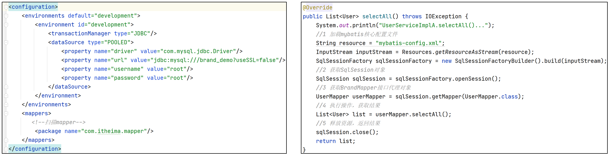
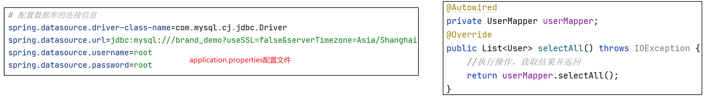

# 1. 整合Mybatis框架

## 1.1 整合Mybatis的原因

1、之前我们使用Mybatis框架既要提供mybatis-config.xml核心配置文件，service层方法写起来也复杂。



2、使用了SpringBoot整合Mybatis框架之后，mybatis-config.xml核心配置文件可以不要，service层方法写起来和很简单。



## 1.2 整合步骤

【第一步】在pom.xml中导入SpringBoot整合mybatis的依赖和mysql驱动

```xml
<!--spring boot mybatis起步依赖-->
<dependency>
    <groupId>org.mybatis.spring.boot</groupId>
    <artifactId>mybatis-spring-boot-starter</artifactId>
    <version>2.2.2</version>
</dependency>
<!--mysql驱动-->
<dependency>
    <groupId>mysql</groupId>
    <artifactId>mysql-connector-java</artifactId>
</dependency>
```

【第二步】在application.properties配置文件中配置连接参数

```properties
# 配置数据库的连接信息, serverTimezone表示时区，mysql驱动8.x版本有时区问题
spring.datasource.driver-class-name=com.mysql.cj.jdbc.Driver
spring.datasource.url=jdbc:mysql:///brand_demo?useSSL=false&serverTimezone=Asia/Shanghai
spring.datasource.username=root
spring.datasource.password=root
```

【第三步】定义Mapper接口和方法，在Mapper接口上使用**@Mapper**注解表示该类mybatis的mapper接口

```java
@Mapper
public interface UserMapper {
    @Select("select * from tb_user")
    List<User> selectAll();
}
```

【第四步】在单元测试中进行测试

```java
@SpringBootTest
class Spring03MybatisApplicationTests {
    @Autowired
    private UserMapper userMapper; //注入需要的UserMapper对象
    @Test
    void testSelectAll() {
    	//1 调用service的方法，查询所有
        List<User> list = userMapper.selectAll();
        //2 遍历打印
        list.forEach(user -> System.out.println(user));
    }
}
```

## 1.3 注意事项

注意1：很容易在Mapper接口上忘记写@Mapper注解

```java
@Mapper
public interface UserMapper {
    @Select("select * from tb_user")
    List<User> selectAll();
}
```

注意2：如果在SpringBoot的引导类上使用@MapperScan注解指定了mapper接口的包，那么在mapper接口上就可以不使用@Mapper注解【推荐】

```java
@SpringBootApplication
@MapperScan("com.itheima.mapper")//扫描mybatis的mapper接口
public class Spring03MybatisApplication {
    public static void main(String[] args) {
        SpringApplication.run(UserDemoSpringbootApplication.class, args);
    }
}
```

```java
public interface UserMapper {
    @Select("select * from tb_user")
    List<User> selectAll();
}
```

## 1.4 Mybatis相关配置

问题1：发现 firstName 和 lastName 这两个属性并未正确赋值？

原因：这是因为 java 对象中的属性是驼峰命名法，而数据库的字段名为 first_name 和 last_name，采用的是下划线命名法，二者并不一致

解决方法：添加配置

```properties
#mybatis相关配置
#开启mybatis驼峰命名自动隐式
mybatis.configuration.map-underscore-to-camel-case=true
```

问题2：使用注解配置复制SQL比较麻烦，通常使用xml配置SQL，那么如何加载xml映射配置文件？

```properties
#加载resources/com/itheima/mapper目录下所有Mapper结尾的xml文件
mybatis.mapper-locations=com/itheima/mapper/*Mapper.xml
#加载resources目录中mybatis核心配置文件【扩展】
mybatis.config-location=mybatis-config.xml
#给com.itheima.pojo包中的所有javabean取别名【扩展】
mybatis.type-aliases-package=com.itheima.pojo
```

## 1.5 日志级别配置

ALL 　   最低等级，用于打开所有日志记录。

TRACE 　很低的日志级别，一般不会使用。

**DEBUG**　　主要用于开发与测试过程中打印一些运行信息，不可以用于生产环境。

**INFO** 　  记录一些信息型消息比如服务器启动成功，输入的数据，输出的数据等等。

**WARN** 　 记录警告信息比如客户端和服务器之间的连接中断，数据库连接丢失等信息。

**ERROR**  用于记录ERROR和Exception信息。

FATAL　　 指可能导致程序终止的非常严重的信息。在这种事件之后你的应用很可能会崩溃。

OFF 　  最高等级，用于关闭所有日志记录。

① 设置整个项目日志级别

```properties
logging.level.root=info
```

==说明：logging.level表示设置日志级别，后面跟生效的区域，比如root表示整个项目，也可以设置为某个包下，也可以具体到某个类名，设置是方法名（日志级别的值不区分大小写）==

② 查看运行过程中mapper包下的SQL信息

```properties
logging.level.com.itheima.mapper=debug
```

③ 如果只想看某个类或某个方法的SQL，就需要提供更为具体的类名或方法名

```properties
logging.level.com.itheima.mapper.UserMapper.selectAll=debug
```

## 1.6 数据源配置

Spring Boot 使用的连接池是 hikari，可以在 application.yml 中敲入 hikari 提示相关配置，例如配置一下信息：

- 最大连接数

- 最小连接数

```properties
#hikari连接池配置信息
#最大连接数
spring.datasource.hikari.maximum-pool-size=10
#最小连接数
spring.datasource.hikari.minimum-idle=3
```

在单元测试类中获取以上配置信息

```java
@SpringBootTest //表示该类是一个SpringBoot单元测试类
class Spring01ApplicationTests {
    @Autowired //指定类型是HikariDataSource，否则无法调用特有方法
    private HikariDataSource dataSource;
    @Test
    void contextLoads() {
        System.out.println("最大连接数："+dataSource.getMaximumPoolSize());
        System.out.println("最小连接数："+dataSource.getMinimumIdle());
    }
}
```


# 2. 整合事务

## 2.1 环境搭建

完成如下功能：

环境准备，初始化表和数据：在 init.sql 中加入

```sql
drop table if exists account;
create table account
(
    accountNo int primary key auto_increment,
    balance   int not null
);

insert into account (accountNo, balance)
values (1, 1000), (2, 1000);
```

编写 domain

```java
public class Account {

    private int accountNo;

    private int balance;
    
    // 省略 get set 方法
}
```

编写 dao

```java
@Mapper
public interface AccountDao {
    // 方法1：更新某个账户余额，传入的余额参数是正数表示增加、是负数表示减少

    // 方法2：查询某个账户余额
}
```

编写 service

```java
@Service
public class AccountService1 implements AccountService {
    // 方法1：转账。要求：余额足够，才允许从 from 账户转账至 to 账户，转账金额为 amount
    
    // 方法2：查询某个账户余额
}
```

## 2.2 问题

练习 dao 的参考解答

```java
@Mapper
public interface AccountDao {

    @Update("update account set balance=balance+#{balance} where accountNo=#{accountNo}")
    void update(@Param("accountNo") int accountNo, @Param("balance") int balance);

    @Select("select balance from account where accountNo=#{accountNo}")
    int findBalanceBy(int accountNo);

}
```

练习 service 的参考解答

```java
@Service
public class AccountService1 implements AccountService {

    @Autowired
    private AccountDao accountDao;

    public void transfer(int from, int to, int amount) {
        int fromBalance = accountDao.findBalanceBy(from);
        if (fromBalance - amount >= 0) {
            accountDao.update(from, -1 * amount);

            int i = 1/0;

            accountDao.update(to, amount);
        }
    }

    public int findBalance(int accountNo) {
        return accountDao.findBalanceBy(accountNo);
    }
}
```

但以上代码实际上如果不加事务控制，是有原子性问题的。


## 2.3 解决

给需要事务管理的方法上加 @Transactional 注解

```java
@Service
public class AccountService2 implements AccountService {

    // ...

    @Transactional
    public void transfer(int from, int to, int amount) {
        int fromBalance = accountDao.findBalanceBy(from);
        if (fromBalance - amount >= 0) {
            accountDao.update(from, -1 * amount);

            int i = 1/0;

            accountDao.update(to, amount);
        }
    }
}
```

重新运行 transfer 发现事务发生了回滚

如何不看数据库监测事务的运行情况呢？可以通过日志配置来实现

```yaml
logging:
  level:
    com.itheima.demo1.dao: debug
    org.springframework.jdbc.support.JdbcTransactionManager: debug
```

其中 spring boot 的 JdbcTransactionManager 中会显示事务的开始、提交、回滚等信息，只需要把它的日志级别调整为 debug 即可


日志输出解读

```
// 创建新事务  
[DEBUG] 18:47:58.033 [main] - Creating new transaction with name [com.itheima.demo1.service.impl.AccountService2.transfer]: PROPAGATION_REQUIRED,ISOLATION_DEFAULT 

// 打开数据库连接
[DEBUG] 18:47:58.034 [main] - Acquired Connection [HikariProxyConnection@1257703748 wrapping com.mysql.cj.jdbc.ConnectionImpl@35267fd4] for JDBC transaction 

// 切换数据库连接为手动提交事务
[DEBUG] 18:47:58.041 [main] - Switching JDBC Connection [HikariProxyConnection@1257703748 wrapping com.mysql.cj.jdbc.ConnectionImpl@35267fd4] to manual commit 

// 查询 转账账户余额
[DEBUG] 18:47:58.107 [main] - ==>  Preparing: select balance from account where accountNo=? 
[DEBUG] 18:47:58.142 [main] - ==> Parameters: 1(Integer) 
[DEBUG] 18:47:58.180 [main] - <==      Total: 1 

// 修改 转账账户减钱
[DEBUG] 18:47:58.190 [main] - ==>  Preparing: update account set balance=balance+? where accountNo=? 
[DEBUG] 18:47:58.190 [main] - ==> Parameters: -500(Integer), 1(Integer) 
[DEBUG] 18:47:58.192 [main] - <==    Updates: 1 

// 回滚事务
[DEBUG] 18:47:58.193 [main] - Initiating transaction rollback 
[DEBUG] 18:47:58.193 [main] - Rolling back JDBC transaction on Connection [HikariProxyConnection@1257703748 wrapping com.mysql.cj.jdbc.ConnectionImpl@35267fd4] 

// 归还数据库连接
[DEBUG] 18:47:58.195 [main] - Releasing JDBC Connection [HikariProxyConnection@1257703748 wrapping com.mysql.cj.jdbc.ConnectionImpl@35267fd4] after transaction 

```

## 2.4 初始化库

问题：每次执行测试之后，数据库表中的数据都会发生变化，为了方便测试，我们经常需要手动恢复表中的数据，比较麻烦。

```java
@SpringBootTest
@Slf4j//日志打印
class Spring03TransactionalApplicationTests {

    @Autowired
    private AccountService accountService;

    @Test
    void contextLoads() throws FileNotFoundException {
        log.info("转账开始...");
        accountService.transfer(1,2,1000)
        log.info("转账结束...");
    }
}
```

解决思路：把 DDL 和 DML 的 sql 分别存储于 resources/**schema.sql** 和 resources/**data.sql** 这两个文件中，然后 application.properties 中配置

- schema.sql

```sql
-- 删除tb_account表
drop table if exists tb_account;
-- 创建tb_account表
create table tb_account
(
    id int primary key auto_increment, -- 账户id,主键自增
    name varchar(20) not null, -- 账户名称
    amount double not null -- 金额
);
```

- data.sql

```sql
-- 初始化数据
insert into tb_account values(null,'张玮',1000),(null,'张益达',1000);
```

- application.properties 中配置

```properties
spring.datasource.initialization-mode=always
```

新版将以上配置标注为过时，该用下面的

```properties
spring.sql.init.mode=always
spring.sql.init.encoding=UTF-8
```

## 2.5 进阶

@Transactional 注解，它其中有很多配置，称为事务属性，摘录如下

| 属性名称      | 含义                   | 补充说明                                       |
| ------------- | ---------------------- | ---------------------------------------------- |
| propagation   | 传播行为               | -                                              |
| isolation     | 隔离级别               | -                                              |
| timeout       | 超时时间               | 当规定时间内，事务仍未完成时，会回滚并结束事务 |
| readOnly      | 是否只读               | 某些数据库驱动会对只读事务做优化               |
| rollbackFor   | 遇到什么异常回滚事务   | -                                              |
| noRollbackFor | 遇到什么异常不回滚事务 | -                                              |


### 1) 事务属性 - rollbackFor

```java
@Service
public class AccountService3 implements AccountService {

    @Autowired
    private AccountDao accountDao;

    @Transactional
    public void transfer(int from, int to, int amount) throws FileNotFoundException {
        int fromBalance = accountDao.findBalanceBy(from);
        if (fromBalance - amount >= 0) {
            accountDao.update(from, -1 * amount);

            // 测试编译时异常
            new FileInputStream("aaa");

            accountDao.update(to, amount);
        }
    }

    public int findBalance(int accountNo) {
        return accountDao.findBalanceBy(accountNo);
    }
}
```

在 AccountService 中抛出编译时异常，验证事务是否会回滚，查看运行结果

```
[DEBUG] 19:06:00.897 [main] - Creating new transaction with name [com.itheima.demo1.service.impl.AccountService3.transfer]: PROPAGATION_REQUIRED,ISOLATION_DEFAULT 
[DEBUG] 19:06:00.898 [main] - Acquired Connection [HikariProxyConnection@1257703748 wrapping com.mysql.cj.jdbc.ConnectionImpl@35267fd4] for JDBC transaction 
[DEBUG] 19:06:00.901 [main] - Switching JDBC Connection [HikariProxyConnection@1257703748 wrapping com.mysql.cj.jdbc.ConnectionImpl@35267fd4] to manual commit 

// 查询 转账账户余额
[DEBUG] 19:06:00.947 [main] - ==>  Preparing: select balance from account where accountNo=? 
[DEBUG] 19:06:00.973 [main] - ==> Parameters: 1(Integer) 
[DEBUG] 19:06:00.999 [main] - <==      Total: 1 

// 修改 转账账户减钱
[DEBUG] 19:06:01.005 [main] - ==>  Preparing: update account set balance=balance+? where accountNo=? 
[DEBUG] 19:06:01.005 [main] - ==> Parameters: -500(Integer), 1(Integer) 
[DEBUG] 19:06:01.010 [main] - <==    Updates: 1 

// 提交事务
[DEBUG] 19:06:01.011 [main] - Initiating transaction commit 
[DEBUG] 19:06:01.012 [main] - Committing JDBC transaction on Connection [HikariProxyConnection@1257703748 wrapping com.mysql.cj.jdbc.ConnectionImpl@35267fd4] 

// 归还数据库连接
[DEBUG] 19:06:01.015 [main] - Releasing JDBC Connection [HikariProxyConnection@1257703748 wrapping com.mysql.cj.jdbc.ConnectionImpl@35267fd4] after transaction 
```

发现虽然出现了异常，但事务仍然提交了。

原因：

* Spring 默认只有抛出运行时异常（即 RuntimeException 及子类）或 Error 及子类时，才会回滚事务
* 如果抛出的是其它编译时异常，仍然会提交事务

解决办法：配置 `rollbackFor = Exception.class`

> ***注意***
>
> * @Transactional(rollbackFor = Exception.class)  的含义是，只要出现的异常是 Exception 或 Exception 的子类异常，都会让事务回滚
>
> * 异常继承回顾
>
> ```mermaid
> classDiagram
> Throwable <|-- Exception
> Throwable <|-- Error
> Exception <|-- RuntimeException
> ```


### 2) 异常该不该捉？

经常有同学喜欢自己捕捉异常，如下所示

```java
@Service
public class AccountService4 implements AccountService {

    @Autowired
    private AccountDao accountDao;

    @Transactional(rollbackFor = Exception.class)
    public void transfer(int from, int to, int amount) {
        try {
            int fromBalance = accountDao.findBalanceBy(from);
            if (fromBalance - amount >= 0) {
                accountDao.update(from, -1 * amount);

                String str = null;
                str.toString();

                accountDao.update(to, amount);
            }
        } catch (Exception e) {
            e.printStackTrace();
        }
    }

    public int findBalance(int accountNo) {
        return accountDao.findBalanceBy(accountNo);
    }
}
```

结果发现最终事务还是提交了

原因：

* 事务提交、回滚，都是代理对象调用事务通知来完成的，如果代理对象不知道出现了异常，也就没有机会去执行回滚
* 自己 try-catch 异常，意味着代理对象认为【没有发生异常】，因此也会提交事务

解决办法：**业务方法内不要捕获异常、或者将捕获的异常重新抛出**

> ***注意***
>
> * 自己 catch 异常，这与 @Transactional 注解有无 rollbackFor = Exception.class 设置无关，因为异常根本没抛出去


### 3) 事务属性 - propagation

两个受事务控制的业务方法之间进行调用时，事务是合二为一、还是另开新事务，这可以通过传播行为进行控制，对其中最常用的 REQUIRED 和 REQUIRES_NEW 说明如下

```java
@Service
public class ServiceA {

    private static final Logger log = LoggerFactory.getLogger(ServiceA.class);

    @Autowired
    private ServiceB b;

    @Transactional(propagation = 传播行为)
    public void foo() {
        log.debug("foo");
        b.bar();
    }
}

@Service
public class ServiceB {
    private static final Logger log = LoggerFactory.getLogger(ServiceB.class);

    @Transactional(propagation = 传播行为)
    public void bar() {
        log.debug("bar");
    }
}
```

ServiceA.foo() 调用 ServiceB.bar()，其传播行为组合测试如下
测试1

* foo - @Transactional(propagation = Propagation.REQUIRED)
* bar - @Transactional(propagation = Propagation.REQUIRED)
* 结论 foo bar 同一事务

测试2

* foo - @Transactional(propagation = Propagation.REQUIRED)
* bar - @Transactional(propagation = Propagation.REQUIRES_NEW)
* 结论 foo bar 不同事务

测试3

* foo - @Transactional(propagation = Propagation.REQUIRED)
* bar - @Transactional(propagation = Propagation.REQUIRES_NEW)
* bar - 出现异常、foo 不捕获
* 结论 bar 回滚，foo 也会回滚

测试4

* foo - @Transactional(propagation = Propagation.REQUIRED)
* bar - @Transactional(propagation = Propagation.REQUIRES_NEW)
* bar - 出现异常、foo 捕获
* 结论 bar 回滚，foo 因为捕获了异常，因此会提交

#### 其它传播行为（了解）

| 属性名称      | 含义                                           | 补充说明                                   |
| ------------- | ---------------------------------------------- | ------------------------------------------ |
| REQUIRED      | 需要事务，有则加入，无则创建新事务             |                                            |
| REQUIRES_NEW  | 需要新事务，无论有无，总是创建新事务           |                                            |
| SUPPORTS      | 支持事务，有则加入，无则在独立的连接中运行 SQL | 结合 Hibernate、JPA 时有用，配在查询方法上 |
| NOT_SUPPORTED | 不支持事务，不加入，在独立的连接中运行 SQL     | -                                          |
| MANDATORY     | 必须有事务，否则抛异常                         | -                                          |
| NEVER         | 必须没事务，否则抛异常                         | -                                          |
| NESTED        | 嵌套事务                                       | 仅对 DataSourceTransactionManager 有效     |

#### 嵌套事务（了解）

* a 配置 REQUIRED
* b 配置 NESTED
  a 调用 b，它们在同一个事务内，进入 b 时，利用了数据库的保存点原理
  情况1：

```
a -> sql1
a -> sql2
a -> b（设置 savepoint）
b -> sql3
b -> 出错回滚（仅会回滚 sql3）
a -> catch b 的异常
a -> 提交 sql1 与 sql2
```

情况2

```
a -> sql1
a -> sql2
a -> b（设置 savepoint）
b -> sql3
b -> 出错回滚（仅会回滚 sql3）
a -> 没 catch b 的异常
a -> 回滚 sql1 与 sql2
```


### 4) 传播行为失效

```java
@Service
public class ServiceC {

    private static final Logger log = LoggerFactory.getLogger(ServiceC.class);

    @Transactional(propagation = Propagation.REQUIRED)
    public void foo() {
        log.debug("foo");
        bar();
    }

    @Transactional(propagation = Propagation.REQUIRES_NEW)
    public void bar() {
        log.debug("bar");
    }
}
```

在 foo 方法内调用 bar 方法，因为两个方法都配置了 @Transactional，现在测试 foo 方法，根据配置，期望有两个事务

```java
@SpringBootTest
public class TransactionalTests {

    // ...

    @Autowired
    private ServiceC serviceC;

    @Test
    void test5() throws Exception {
        serviceC.foo();
    }
}
```

观察发现，自始至终只有一个事务，并没有像预期的在 bar 方法调用时由 `@Transactional(propagation = Propagation.REQUIRES_NEW)` 创建一个新事务

原因：
这实际就是前面讲代理时的通知失效问题，同类的两个方法调用不走代理

解决方法1：

引导类中新增 `@EnableAspectJAutoProxy(exposeProxy = true)`，同时添加 aop 依赖

```xml
<dependency>
    <groupId>org.aspectj</groupId>
    <artifactId>aspectjweaver</artifactId>
</dependency>
```

调用时修改为

```java
@Service
public class ServiceC {

    private static final Logger log = LoggerFactory.getLogger(ServiceC.class);

    @Transactional(propagation = Propagation.REQUIRED)
    public void foo() {
        log.debug("foo");
        ((ServiceC) AopContext.currentProxy()).bar();
    }

    @Transactional(propagation = Propagation.REQUIRES_NEW)
    public void bar() {
        log.debug("bar");
    }
}
```

解决方法2：

自己注入自己（其实注入了代理），其它不用动

```java
@Service
public class ServiceC {

    private static final Logger log = LoggerFactory.getLogger(ServiceC.class);

    @Autowired
    private ServiceC serviceC;

    @Transactional(propagation = Propagation.REQUIRED)
    public void foo() {
        log.debug("foo");
        serviceC.bar();
    }

    @Transactional(propagation = Propagation.REQUIRES_NEW)
    public void bar() {
        log.debug("bar");
    }
}
```

## 本章注解

| 注解名称       | 位置   | 注解作用                                 | 备注                |
| -------------- | ------ | ---------------------------------------- | ------------------- |
| @Mapper        | 接口   | 标注该接口为Mapper接口                   |                     |
| @MapperScan    | 引导类 | 用来指定Mapper接口的package              | 与@Mapper二选一即可 |
| @Transactional | 方法   | 该方法受事务控制                         | 方法必须是 public   |
| @Transactional | 类     | 类中所有 public 方法受事务控制           | 不推荐              |
| @Transactional | 接口   | 该接口的实现类所有 public 方法受事务控制 | 不推荐              |

还有一个事务注解 @EnableTransactionManagement，用在非 Spring Boot 程序，用来开启声明式事务，了解即可
