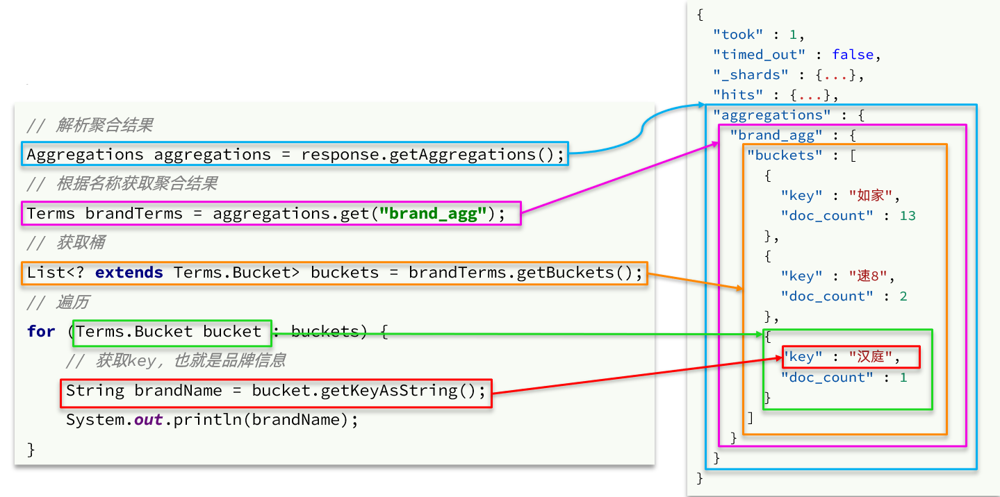
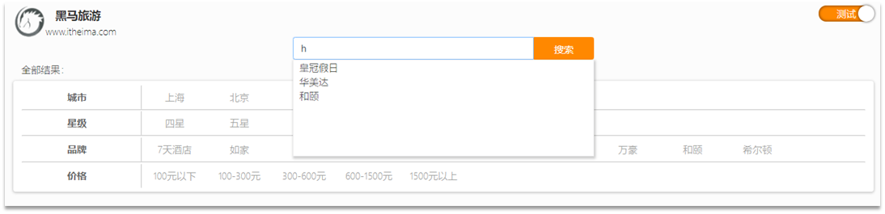
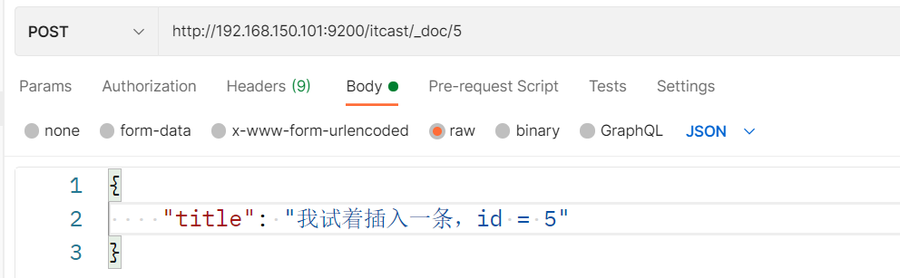

# 分布式搜索引擎03


# 1.数据聚合

**[聚合（](https://www.elastic.co/guide/en/elasticsearch/reference/current/search-aggregations.html)[aggregations](https://www.elastic.co/guide/en/elasticsearch/reference/current/search-aggregations.html)[）](https://www.elastic.co/guide/en/elasticsearch/reference/current/search-aggregations.html)**可以让我们极其方便的实现对数据的统计、分析、运算。例如：

- 什么品牌的手机最受欢迎？
- 这些手机的平均价格、最高价格、最低价格？
- 这些手机每月的销售情况如何？

实现这些统计功能的比数据库的sql要方便的多，而且查询速度非常快，可以实现近实时搜索效果。


## 1.1.聚合的种类

聚合常见的有三类：

- **桶（Bucket）**聚合：用来对文档做分组
  - TermAggregation：按照文档字段值分组，例如按照品牌值分组、按照国家分组
  - Date Histogram：按照日期阶梯分组，例如一周为一组，或者一月为一组

- **度量（Metric）**聚合：用以计算一些值，比如：最大值、最小值、平均值等
  - Avg：求平均值
  - Max：求最大值
  - Min：求最小值
  - Stats：同时求max、min、avg、sum等
- **管道（pipeline）**聚合：其它聚合的结果为基础做聚合


> **注意：**参加聚合的字段必须是keyword、日期、数值、布尔类型

## 1.2.DSL实现聚合

现在，我们要统计所有数据中的酒店品牌有几种，其实就是按照品牌对数据分组。此时可以根据酒店品牌的名称做聚合，也就是Bucket聚合。

### 1.2.1.Bucket聚合语法

语法如下：

```json
# size设置为0，结果中不包含文档，只包含聚合结果
GET /hotel/_search
{
  "size": 0,
  "aggs": {
    "brandAgg": {
      "terms": {
        "field": "brand",
        "size": 20
      }
    }
  }
}
```

结果如图：

 


### 1.2.2.聚合结果排序

默认情况下，Bucket聚合会统计Bucket内的文档数量，记为_count，并且按照_count降序排序。

我们可以指定order属性，自定义聚合的排序方式：

```json
GET /hotel/_search
{
  "size": 0,
  "aggs": {
    "brandAgg": {
      "terms": {
        "field": "brand",
        "order": {
          "_count": "asc"
        },
        "size": 20
      }
    }
  }
}
```


### 1.2.3.限定条件聚合范围

默认情况下，Bucket聚合是对索引库的所有文档做聚合，但真实场景下，用户会输入搜索条件，因此聚合必须是对搜索结果聚合。那么聚合必须添加限定条件。

我们可以限定要聚合的文档范围，只要添加query条件即可：

```json
# 只对200元以下的文档聚合
GET /hotel/_search
{
  "query": {
    "range": {
      "price": {
        "lte": 200
      }
    }
  },
  "size": 0,
  "aggs": {
    "brandAgg": {
      "terms": {
        "field": "brand",
        "size": 20
      }
    }
  }
}
```


这次，聚合得到的品牌明显变少了：

 


### 1.2.4.Metric聚合语法

上节课，我们对酒店按照品牌分组，形成了一个个桶。现在我们需要对桶内的酒店做运算，获取每个品牌的用户评分的min、max、avg等值。

这就要用到Metric聚合了，例如stats聚合：就可以获取min、max、avg等结果。

语法如下：

```json
GET /hotel/_search
{
  "size": 0,
  "aggs": {
    "brandAgg": {
      "terms": {
        "field": "brand",
        "size": 20
      },
      "aggs": {
        "score_stats": {
          "stats": {
            "field": "score"
          }
        }
      }
    }
  }
}
```

这次的score_stats聚合是在brandAgg的聚合内部嵌套的子聚合。因为我们需要在每个桶分别计算。


另外，我们还可以给聚合结果做个排序，例如按照每个桶的酒店平均分做排序：

 


### 1.2.5.小结

aggs代表聚合，与query同级，此时query的作用是？

- 限定聚合的的文档范围

聚合必须的三要素：

- 聚合名称
- 聚合类型
- 聚合字段

聚合可配置属性有：

- size：指定聚合结果数量
- order：指定聚合结果排序方式
- field：指定聚合字段


## 1.3.RestAPI实现聚合

### 1.3.1.API语法

聚合条件与query条件同级别，因此需要使用request.source()来指定聚合条件。

聚合条件的语法：

 


聚合的结果也与查询结果不同，API也比较特殊。不过同样是JSON逐层解析：

 


完整代码：

```java
//Bucket聚合查询，按brand分组，city分组
@Test
void testAgg() throws IOException {
    SearchRequest request = new SearchRequest("hotel");
    request.source().size(0);
    request.source()
            .aggregation(AggregationBuilders.terms("brandAgg").field("brand").size(10))
            .aggregation(AggregationBuilders.terms("cityAgg").field("city").size(10));

    SearchResponse response = client.search(request, RequestOptions.DEFAULT);

    //TODO 解析结果，获取品牌分桶数据
    Terms brandAgg = response.getAggregations().get("brandAgg");
    for (Terms.Bucket bucket : brandAgg.getBuckets()) {
        String brandName = bucket.getKeyAsString();
        long docCount = bucket.getDocCount();
        System.out.println(brandName + ":" + docCount);
    }
    //TODO 解析结果，获取城市分桶数据
    System.out.println("====================");
    Terms cityAgg = response.getAggregations().get("cityAgg");
    for (Terms.Bucket bucket : cityAgg.getBuckets()) {
        String cityAggName = bucket.getKeyAsString();
        long docCount = bucket.getDocCount();
        System.out.println(cityAggName + ":" + docCount);
    }
}
```


### 1.3.2.业务需求

需求：搜索页面的品牌、城市等信息不应该是在页面写死，而是通过聚合索引库中的酒店数据得来的：

 


分析：

使用聚合功能，利用Bucket聚合，对搜索结果中的文档基于品牌分组、基于城市分组，就能得知包含哪些品牌、哪些城市了。

因为是对搜索结果聚合，因此聚合是**限定范围的聚合**，也就是说聚合的限定条件跟搜索文档的条件一致。


查看浏览器可以发现，前端其实已经发出了这样的一个请求：

 


返回值类型就是页面要展示的最终结果：

 

结果是一个Map结构：

- key是字符串，城市、星级、品牌、价格
- value是集合，例如多个城市的名称

 

### 1.3.3.业务实现

在`cn.itcast.hotel.service.IHotelService`中定义新方法：

```java
Map<String, List<String>> filters(RequestParams params)  throws Exception;
```


在`cn.itcast.hotel.service.impl.HotelService`中实现该方法：

```java
//Map格式：{"city": ["上海", "北京"], "brand": ["如家", "希尔顿"], "starName": ["二星", "三星"]}
@Override
public Map<String, List<String>> filters(RequestParams params) throws Exception {
    //TODO 1. 创建request
    SearchRequest request = new SearchRequest("hotel");
    //TODO 2. 构造条件
    buildBasicQuery(params, request);
    request.source().size(0);
    //TODO 3. 设置聚合条件
    request.source()
            .aggregation(AggregationBuilders.terms("brand").field("brand").size(100))
            .aggregation(AggregationBuilders.terms("city").field("city").size(100))
            .aggregation(AggregationBuilders.terms("starName").field("starName").size(100));
    //TODO 4. 发送请求
    SearchResponse response = restHighLevelClient.search(request, RequestOptions.DEFAULT);
    
    
    //TODO 5. 解析响应
    Map<String, List<String>> result = new HashMap<>(3);

    //TODO 解析结果，获取品牌分桶数据
    Terms brand = response.getAggregations().get("brand");
    List<String> brandList = brand.getBuckets().stream().map(bucket -> {
        return bucket.getKeyAsString();
    }).collect(Collectors.toList());
    //TODO 解析结果，获取城市分桶数据
    Terms city = response.getAggregations().get("city");
    List<String> cityList = city.getBuckets().stream().map(bucket -> {
        return bucket.getKeyAsString();
    }).collect(Collectors.toList());
    //TODO 解析结果，获取星级分桶数据
    Terms starName = response.getAggregations().get("starName");
    List<String> starNameList = starName.getBuckets().stream().map(bucket -> {
        return bucket.getKeyAsString();
    }).collect(Collectors.toList());

    result.put("brand", brandList);
    result.put("city", cityList);
    result.put("starName", starNameList);

    /* //TODO 对以上三次获取分桶数据的简化方式
    Map<String, Aggregation> aggMap = response.getAggregations().getAsMap();
    aggMap.forEach((k, v) -> {
        Terms terms = (Terms) v;
        List<? extends Terms.Bucket> buckets = terms.getBuckets();
        List<String> collect = buckets.stream().map(t -> t.getKeyAsString()).collect(Collectors.toList());
        result.put(k, collect);
    });*/
    return result;
}
```


# 2.自动补全


## 2.1.自动补全查询

elasticsearch提供了[Completion Suggester](https://www.elastic.co/guide/en/elasticsearch/reference/7.6/search-suggesters.html)查询来实现自动补全功能。这个查询会匹配以用户输入内容开头的词条并返回。为了提高补全查询的效率，对于文档中字段的类型有一些约束：

- ==参与补全查询的字段必须是completion类型==。

- ==字段的内容一般是用来补全的多个词条形成的数组==。

## 2.2.实现酒店搜索框自动补全

现在，我们的hotel索引库还没有设置拼音分词器，需要修改索引库中的配置。但是我们知道索引库是无法修改的，只能删除然后重新创建。

另外，我们需要添加一个字段，用来做自动补全，将brand、suggestion、city等都放进去，作为自动补全的提示。


### 2.2.1.修改酒店映射结构

代码如下：

```json
# 酒店数据索引库
DELETE /hotel

# 酒店数据索引库
PUT /hotel
{
  "mappings": {
    "properties": {
      "id":{
        "type": "keyword"
      },
      "name":{
        "type": "text",
        "copy_to": "all"
      },
      "business":{
        "type": "keyword",
        "copy_to": "all"
      },  
      "brand":{
        "type": "keyword",
        "copy_to": "all"
      },
      "all":{
        "type": "text"
      },
      "suggestion":{
          "type": "completion"
      },
      "starName":{
        "type": "keyword"
      },
      "city":{
        "type": "keyword"
      },
      "address":{
        "type": "keyword",
        "index": false
      },
      "pic":{
        "type": "keyword",
        "index": false
      },
      "price":{
        "type": "integer"
      },
      "score":{
        "type": "integer"
      },
      "location":{
        "type": "geo_point"
      }
    }
  }
}

```


### 2.2.2.修改HotelDoc实体

HotelDoc中要添加一个字段，用来做自动补全，内容可以是酒店品牌、城市、商圈等信息。按照自动补全字段的要求，最好是这些字段的数组。

因此我们在HotelDoc中添加一个suggestion字段，类型为`List<String>`，然后将brand、city、business等信息放到里面。

代码如下：

```java
package cn.itcast.hotel.pojo;

import lombok.Data;
import lombok.NoArgsConstructor;

import java.util.ArrayList;
import java.util.Collections;
import java.util.List;

@Data
@NoArgsConstructor
public class HotelDoc {
    private Long id;
    private String name;
    private String address;
    private Integer price;
    private Integer score;
    private String brand;
    private String city;
    private String starName;
    private String business;
    private String location;
    private String pic;
    private Object distance; // 排序时的距离值
    private Boolean isAD; // 是否广告
    private List<String> suggestion = new ArrayList<>(); // 自动补全建议字段

    public HotelDoc(Hotel hotel) {
        this.id = hotel.getId();
        this.name = hotel.getName();
        this.address = hotel.getAddress();
        this.price = hotel.getPrice();
        this.score = hotel.getScore();
        this.brand = hotel.getBrand();
        this.city = hotel.getCity();
        this.starName = hotel.getStarName();
        this.business = hotel.getBusiness();
        this.location = hotel.getLatitude() + ", " + hotel.getLongitude();
        this.pic = hotel.getPic();

        // 自动补全建议字段：添加品牌、城市、商圈信息。其中商圈可能包含"/"需要切分
        this.suggestion.add(this.brand);
        this.suggestion.add(this.city);
        Collections.addAll(this.suggestion, this.business.split("/"));
    }
}

```


### 2.2.3.重新导入

重新执行之前编写的导入数据功能，可以看到新的酒店数据中包含了suggestion：

```json
GET /hotel/_search
{
  "query": {
    "match_all": {}
  }
}
```

 


### 2.2.4.自动补全查询的JavaAPI

之前我们学习了自动补全查询的DSL，而没有学习对应的JavaAPI，这里给出一个示例：

 


而自动补全的结果也比较特殊，解析的代码如下：

 


### 2.2.5.实现搜索框自动补全

查看前端页面，可以发现当我们在输入框键入时，前端会发起ajax请求：

 

返回值是补全词条的集合，类型为`List<String>`


1）在`cn.itcast.hotel.web`包下的`HotelController`中添加新接口，接收新的请求：

```java
@GetMapping("suggestion")
public List<String> getSuggestion(@RequestParam("key") String key) throws Exception {
    return hotelService.getSuggestion(key);
}
```


2）在`cn.itcast.hotel.service`包下的`IhotelService`中添加方法：

```java
List<String> getSuggestions(String prefix)  throws Exception;
```


3）在`cn.itcast.hotel.service.impl.HotelService`中实现该方法：

```java
@Override
public List<String> suggestion(String key) throws Exception {
    //TODO 1. 创建request
    SearchRequest request = new SearchRequest("hotel");
    //TODO 2.设置suggest条件
    request.source().suggest(new SuggestBuilder()
            .addSuggestion("hotelSuggest",
                    SuggestBuilders
                            .completionSuggestion("suggestion")
                            .size(10)
                            .skipDuplicates(true)
                            .prefix(key)
            ));
    //TODO 3. 发送请求
    SearchResponse response = restHighLevelClient.search(request, RequestOptions.DEFAULT);
    //TODO 4. 解析响应
    Suggest suggest = response.getSuggest();
    CompletionSuggestion suggestion = suggest.getSuggestion("hotelSuggest");
    List<String> list = suggestion.getOptions().stream().map(option -> {
        return option.getText().toString();
    }).collect(Collectors.toList());

    return list;
}
```


## 2.3.拼音分词器

当用户在搜索框输入字符时，我们应该提示出与该字符有关的搜索项，如图：

 

这种根据用户输入的字母，提示完整词条的功能，就需要根据拼音字母来推断，因此要用到拼音分词功能。


要实现根据字母做补全，就必须对文档按照拼音分词。在GitHub上恰好有elasticsearch的拼音分词插件。地址：https://github.com/medcl/elasticsearch-analysis-pinyin

 


课前资料中也提供了拼音分词器的安装包：

 


安装方式与IK分词器一样，分三步：

​	①解压

​	②上传到虚拟机中，elasticsearch的plugin目录

​	③重启elasticsearch

​	④测试


详细安装步骤可以参考IK分词器的安装过程。


测试用法如下：

```json
POST /_analyze
{
  "text": "如家酒店还不错",
  "analyzer": "pinyin"
}
```

结果：

  


## 2.4.自定义分词器

默认的拼音分词器会将每个汉字单独分为拼音，而我们希望的是每个词条形成一组拼音，需要对拼音分词器做个性化定制，形成自定义分词器。

elasticsearch中分词器（analyzer）的组成包含三部分：

- character filters：在tokenizer之前对文本进行处理。例如删除字符、替换字符
- tokenizer：将文本按照一定的规则切割成词条（term）。例如keyword，就是不分词；还有ik_smart
- tokenizer filter：将tokenizer输出的词条做进一步处理。例如大小写转换、同义词处理、拼音处理等


文档分词时会依次由这三部分来处理文档：

 

声明自定义分词器的语法如下：

```json
# 创建索引库
PUT /test
{
  "settings": {
    "analysis": {
      "analyzer": {
        "my_analyzer": {
          "tokenizer": "ik_max_word",
          "filter": "py"
        }
      },
      "filter": {
        "py": {
          "type": "pinyin",
          "keep_full_pinyin": false,
          "keep_joined_full_pinyin": true,
          "keep_original": true,
          "limit_first_letter_length": 16,
          "remove_duplicated_term": true,
          "none_chinese_pinyin_tokenize": false
        }
      }
    }
  }
}
```

| 属性                                    | 说明                                                         |
| --------------------------------------- | ------------------------------------------------------------ |
| keep_first_letter                       | 启用此选项时，例如：刘德华> ldh，默认值：true                |
| keep_separate_first_letter              | 启用该选项时，将保留第一个字母分开，例如：刘德华> l，d，h，默认：false。<br />注意：查询结果也许是太模糊，由于长期过频 |
| **limit_first_letter_length**           | 设置first_letter结果的最大长度，默认值：16                   |
| **keep_full_pinyin**                    | 当启用该选项，例如：刘德华 > [ liu，de，hua]，默认值：true   |
| **keep_joined_full_pinyin**             | 当启用此选项时，例如：刘德华 > [ liudehua]，默认值：false    |
| keep_none_chinese                       | 在结果中保留非中文字母或数字，默认值：true                   |
|                                         |                                                              |
| keep_none_chinese_in_first_letter       | 第一个字母保持非中文字母，例如：刘德华AT2016- > ldhat2016，默认值：true |
| keep_none_chinese_in_joined_full_pinyin | 保留非中文字母加入完整拼音，例如：刘德华2016- > liudehua2016，默认：false |
|                                         |                                                              |
| **keep_original**                       | 当启用此选项时，也会保留原始输入，默认值：false              |
| lowercase                               | 小写非中文字母，默认值：true                                 |
| trim_whitespace                         | 默认值：true                                                 |
| **remove_duplicated_term**              | 当启用此选项时，将删除重复项以保存索引，例如：de的 > de，默认值：false。<br />注意：位置相关查询可能受影响 |

测试：

```D
GET /test/_analyze
{
  "text": "刘德华还不错",
  "analyzer": "my_analyzer"
}
```


酒店完整索引结构：

```json
##### 重新创建酒店索引库，带拼音分词
DELETE /hotel

PUT /hotel
{
  "settings": {
    "analysis": {
      "analyzer": {
        "text_anlyzer": {
          "tokenizer": "ik_max_word",
          "filter": "py"
        },
        "completion_analyzer": {
          "tokenizer": "keyword",
          "filter": "py"
        }
      },
      "filter": {
        "py": {
          "type": "pinyin",
          "keep_full_pinyin": false,
          "keep_joined_full_pinyin": true,
          "keep_original": true,
          "limit_first_letter_length": 16,
          "remove_duplicated_term": true,
          "none_chinese_pinyin_tokenize": false
        }
      }
    }
  },
  "mappings": {
    "properties": {
      "id":{
        "type": "keyword"
      },
      "name":{
        "type": "text",
        "analyzer": "text_anlyzer",
        "search_analyzer": "ik_max_word",
        "copy_to": "all"
      },
      "address":{
        "type": "keyword",
        "index": false
      },
      "price":{
        "type": "integer"
      },
      "score":{
        "type": "integer"
      },
      "brand":{
        "type": "keyword",
        "copy_to": "all"
      },
      "city":{
        "type": "keyword"
      },
      "starName":{
        "type": "keyword"
      },
      "business":{
        "type": "keyword",
        "copy_to": "all"
      },
      "location":{
        "type": "geo_point"
      },
      "pic":{
        "type": "keyword",
        "index": false
      },
      "all":{
        "type": "text",
        "analyzer": "text_anlyzer",
        "search_analyzer": "ik_max_word"
      },
      "suggestion":{
         "type": "completion",
         "analyzer": "completion_analyzer",
         "search_analyzer": "ik_max_word"
      }
    }
  }
}
```


总结：

如何使用拼音分词器？

- ①下载pinyin分词器

- ②解压并放到elasticsearch的plugin目录

- ③重启即可

如何自定义分词器？

- ①创建索引库时，在settings中配置，可以包含三部分

- ②character filter

- ③tokenizer

- ④filter

拼音分词器注意事项？

- 为了避免搜索到同音字，搜索时不要使用拼音分词器


# 3.数据同步

elasticsearch中的酒店数据来自于mysql数据库，因此mysql数据发生改变时，elasticsearch也必须跟着改变，这个就是elasticsearch与mysql之间的**数据同步**。


 


## 3.1.思路分析

常见的数据同步方案有三种：

- 同步调用
- 异步通知
- 监听binlog


### 3.1.1.同步调用

方案一：同步调用

 

基本步骤如下：

- hotel-demo对外提供接口，用来修改elasticsearch中的数据
- 酒店管理服务在完成数据库操作后，直接调用hotel-demo提供的接口，


### 3.1.2.异步通知

方案二：异步通知

 


流程如下：

- hotel-admin对mysql数据库数据完成增、删、改后，发送MQ消息
- hotel-demo监听MQ，接收到消息后完成elasticsearch数据修改


### 3.1.3.监听binlog

方案三：监听binlog

 

流程如下：

- 给mysql开启binlog功能
- mysql完成增、删、改操作都会记录在binlog中
- hotel-demo基于canal监听binlog变化，实时更新elasticsearch中的内容


### 3.1.4.选择

方式一：同步调用

- 优点：实现简单，粗暴
- 缺点：业务耦合度高

方式二：异步通知

- 优点：低耦合，实现难度一般
- 缺点：依赖mq的可靠性

方式三：监听binlog

- 优点：完全解除服务间耦合
- 缺点：开启binlog增加数据库负担、实现复杂度高


## 3.2.实现数据同步


### 3.2.1.思路

利用课前资料提供的hotel-admin项目作为酒店管理的微服务。当酒店数据发生增、删、改时，要求对elasticsearch中数据也要完成相同操作。

步骤：

- 导入课前资料提供的hotel-admin项目，启动并测试酒店数据的CRUD

- 在hotel-admin中的增、删、改业务中完成消息发送

- 在hotel-demo中完成消息监听，并更新elasticsearch中数据

- 启动并测试数据同步功能


### 3.2.2.导入hotel-admin项目

导入课前资料提供的hotel-admin项目：

 

修改applicationyml的数据库用户名，密码

```yml
server:
  port: 8099
spring:
  datasource:
    url: jdbc:mysql://localhost:3306/heima?useSSL=false
    username: root
    password: root
    driver-class-name: com.mysql.jdbc.Driver

logging:
  level:
    cn.itcast: debug
  pattern:
    dateformat: MM-dd HH:mm:ss:SSS

mybatis-plus:
  configuration:
    map-underscore-to-camel-case: true
  type-aliases-package: cn.itcast.hotel.pojo
```

运行后，访问 http://localhost:8099

 

其中包含了酒店的CRUD功能。


 

### 3.2.3.两个项目集成MQ环境

MQ结构如图：

  

#### 3.2.3.1.引入mq依赖

在hotel-admin、hotel-demo中引入rabbitmq的依赖：

```xml
<!--amqp-->
<dependency>
    <groupId>org.springframework.boot</groupId>
    <artifactId>spring-boot-starter-amqp</artifactId>
</dependency>
```


#### 3.2.3.2.添加交换机队列常量值

在hotel-admin和hotel-demo中的`cn.itcast.hotel.constatnts`包下新建一个类`HotelMQConstants`：

```java
package cn.itcast.hotel.constants;

public class HotelMQConstants {

    //交换机名称
    public static final String EXCHANGE_NAME = "hotel.direct";
    //添加队列名称
    public static final String QUEUE_INSERT_NAME = "hotel.queue.insert";
    //删除队列名称
    public static final String QUEUE_DELETE_NAME = "hotel.queue.delete";
    //添加队列路由的key
    public static final String ROUTING_KEY_INSERT = "hotel.insert";
    //删除队列路由的key
    public static final String ROUTING_KEY_DELETE = "hotel.delete";

}

```

#### 3.2.3.3在yml中添加mq配置

在hotel-admin和hotel-demo中的yml中添加mq配置

```yml
spring:
  rabbitmq:
    host: 192.168.100.150
    port: 5672
    username: guest
    password: guest
    virtual-host: /
```


### 3.2.4.hotel-admin发送MQ消息

在hotel-admin中的增、删、改业务中分别发送MQ消息：

```java
package cn.itcast.hotel.web;

import cn.itcast.hotel.constants.HotelMQConstants;
import cn.itcast.hotel.pojo.Hotel;
import cn.itcast.hotel.pojo.PageResult;
import cn.itcast.hotel.service.IHotelService;
import com.baomidou.mybatisplus.extension.plugins.pagination.Page;
import org.springframework.amqp.rabbit.core.RabbitTemplate;
import org.springframework.beans.factory.annotation.Autowired;
import org.springframework.web.bind.annotation.*;

@RestController
@RequestMapping("hotel")
public class HotelController {

    @Autowired
    private IHotelService hotelService;
    @Autowired
    private RabbitTemplate rabbitTemplate;

    //根据id查询
    @GetMapping("{id}")
    public Hotel queryById(@PathVariable("id") Long id) {
        return hotelService.getById(id);
    }

    //分页查询
    @GetMapping("list")
    public PageResult hotelList(@RequestParam(value = "page", defaultValue = "1") Integer page,
                                @RequestParam(value = "size", defaultValue = "5") Integer size) {
        Page<Hotel> result = hotelService.page(new Page<>(page, size));
        return new PageResult(result.getTotal(), result.getRecords());
    }

    //新增酒店
    @PostMapping
    public void saveHotel(@RequestBody Hotel hotel) {
        // 新增酒店
        hotelService.save(hotel);
        // 发送MQ消息
        rabbitTemplate.convertAndSend(HotelMQConstants.EXCHANGE_NAME, HotelMQConstants.ROUTING_KEY_INSERT, hotel.getId());
    }

    //更新酒店
    @PutMapping
    public void updateById(@RequestBody Hotel hotel) {
        hotelService.updateById(hotel);
        // 发送MQ消息
        rabbitTemplate.convertAndSend(HotelMQConstants.EXCHANGE_NAME, HotelMQConstants.ROUTING_KEY_INSERT, hotel.getId());
    }

    //删除酒店
    @DeleteMapping("{id}")
    public void deleteById(@PathVariable("id") Long id) {
        hotelService.removeById(id);
        // 发送MQ消息
        rabbitTemplate.convertAndSend(HotelMQConstants.EXCHANGE_NAME, HotelMQConstants.ROUTING_KEY_DELETE, id);
    }
}

```


### 3.2.5.hotel-demo接收MQ消息

hotel-demo接收到MQ消息要做的事情包括：

- 新增消息：根据传递的hotel的id查询hotel信息，然后新增一条数据到索引库
- 删除消息：根据传递的hotel的id删除索引库中的一条数据

编写监听器，在hotel-demo中的`cn.itcast.hotel.mq`包新增一个类：

```java
package cn.itcast.hotel.mq;

import cn.itcast.hotel.constants.HotelMQConstants;
import cn.itcast.hotel.pojo.Hotel;
import cn.itcast.hotel.pojo.HotelDoc;
import cn.itcast.hotel.service.IHotelService;
import com.alibaba.fastjson.JSON;
import org.elasticsearch.action.delete.DeleteRequest;
import org.elasticsearch.action.index.IndexRequest;
import org.elasticsearch.client.RequestOptions;
import org.elasticsearch.client.RestHighLevelClient;
import org.elasticsearch.common.xcontent.XContentType;
import org.springframework.amqp.rabbit.annotation.Exchange;
import org.springframework.amqp.rabbit.annotation.Queue;
import org.springframework.amqp.rabbit.annotation.QueueBinding;
import org.springframework.amqp.rabbit.annotation.RabbitListener;
import org.springframework.beans.factory.annotation.Autowired;
import org.springframework.stereotype.Component;

@Component
public class HotelMqListener {

    @Autowired
    private IHotelService hotelService;
    @Autowired
    private RestHighLevelClient restHighLevelClient;

    /**
     * 监听酒店新增或修改的业务
     *
     * @param id 酒店id
     */
    @RabbitListener(bindings = @QueueBinding(
            exchange = @Exchange(name = HotelMQConstants.EXCHANGE_NAME),
            value = @Queue(name = HotelMQConstants.QUEUE_INSERT_NAME),
            key = HotelMQConstants.ROUTING_KEY_INSERT
    ))
    public void listenHotelInsertOrUpdate(Long id) throws Exception {
        // 查询酒店数据，应该基于Feign远程调用hotel-admin，根据id查询酒店数据（现在直接去数据库查）
        Hotel hotel = hotelService.getById(id);
        // 转换
        HotelDoc hotelDoc = new HotelDoc(hotel);
        // 1.创建Request
        IndexRequest request = new IndexRequest("hotel").id(id.toString());
        // 2.准备参数
        request.source(JSON.toJSONString(hotelDoc), XContentType.JSON);
        // 3.发送请求
        restHighLevelClient.index(request, RequestOptions.DEFAULT);
    }

    /**
     * 监听酒店删除的业务
     *
     * @param id 酒店id
     */
    @RabbitListener(bindings = @QueueBinding(
            exchange = @Exchange(name = HotelMQConstants.EXCHANGE_NAME),
            value = @Queue(name = HotelMQConstants.QUEUE_DELETE_NAME),
            key = HotelMQConstants.ROUTING_KEY_DELETE
    ))
    public void listenHotelDelete(Long id) throws Exception {
        // 1.创建request
        DeleteRequest request = new DeleteRequest("hotel", id.toString());
        // 2.发送请求
        restHighLevelClient.delete(request, RequestOptions.DEFAULT);
    }
}
```


# 4.集群

单机的elasticsearch做数据存储，必然面临两个问题：海量数据存储问题、单点故障问题。

- 海量数据存储问题：将索引库从逻辑上拆分为N个分片（shard），存储到多个节点
- 单点故障问题：将分片数据在不同节点备份（replica ）

**ES集群相关概念**:

* 集群（cluster）：一组拥有共同的 cluster name 的 节点。

* <font color="red">节点（node)</font>   ：集群中的一个 Elasticearch 实例

* <font color="red">分片（shard）</font>：索引可以被拆分为不同的部分进行存储，称为分片。在集群环境下，一个索引的不同分片可以拆分到不同的节点中

  解决问题：数据量太大，单点存储量有限的问题。

   

  > 此处，我们把数据分成3片：shard0、shard1、shard2

* 主分片（Primary shard）：相对于副本分片的定义。

* 副本分片（Replica shard）每个主分片可以有一个或者多个副本，数据和主分片一样。

  ​	

数据备份可以保证高可用，但是每个分片备份一份，所需要的节点数量就会翻一倍，成本实在是太高了！

为了在高可用和成本间寻求平衡，我们可以这样做：

- 首先对数据分片，存储到不同节点
- 然后对每个分片进行备份，放到对方节点，完成互相备份

这样可以大大减少所需要的服务节点数量，如图，我们以3分片，每个分片备份一份为例：

 

现在，每个分片都有1个备份，存储在3个节点：

- node0：保存了分片0和1
- node1：保存了分片0和2
- node2：保存了分片1和2


## 4.1.搭建ES集群

参考课前资料的文档：

 

其中的第四章节：

 


## 4.2.集群脑裂问题


### 4.2.1.集群职责划分

elasticsearch中集群节点有不同的职责划分：

 


但是真实的集群一定要将集群职责分离：

- master节点：对CPU要求高，但是内存要求第
- data节点：对CPU和内存要求都高
- 协调节点：对网络带宽、CPU要求高


主节点：即 Master 节点。主节点的职责主要是和集群操作相关的内容，如创建或删除索引，跟踪哪些节点是群集的一部分，决定哪些分片分配给相关的节点。默认情况下任何一个集群中的节点都有可能被选为主节点。虽然主节点也可以协调节点，路由搜索和新增数据到数据节点，但最好不要这样。一个重要的原则是，尽可能做尽量少的工作。

数据节点：即 Data 节点。数据节点主要是存储索引数据的节点，主要对文档进行增删改查操作，聚合操作等。数据节点对 CPU、内存、IO 要求较高，当资源不够的时候，需要在集群中添加新的节点。为了确保一个集群的稳定，分离主节点和数据节点是一个比较好的选择。

预处理节点：也称作 Ingest 节点，在检索数据之前可以先对数据做预处理操作，所有节点其实默认都是支持预处理操作，也可以专门将某个节点配置为 Ingest 节点。

协调节点：也称作 Client 节点、客户端节点、负载均衡节点。当一个节点既不配置为主节点，也不配置为数据节点时，该节点只能处理路由请求，处理搜索，分发索引操作等，从本质上来说该客户节点表现为智能负载平衡器。独立的客户端节点在一个比较大的集群中是非常有用的，他可以协调主节点和数据节点，获取集群的状态，根据集群的状态可以直接路由请求。


职责分离可以让我们根据不同节点的需求分配不同的硬件去部署。而且避免业务之间的互相干扰。

一个典型的es集群职责划分如图：

 


### 4.2.2.脑裂问题

脑裂是因为集群中的节点失联导致的。

例如一个集群中，主节点与其它节点失联：

 

此时，node2和node3认为node1宕机，就会重新选主：

 

当node3当选后，集群继续对外提供服务，node2和node3自成集群，node1自成集群，两个集群数据不同步，出现数据差异。

当网络恢复后，因为集群中有两个master节点，集群状态的不一致，出现脑裂的情况：

 


解决脑裂的方案是，要求选票超过 ( eligible节点数量 + 1 ）/ 2 才能当选为主，因此eligible节点数量最好是奇数。对应配置项是discovery.zen.minimum_master_nodes，在es7.0以后，已经成为默认配置，因此一般不会发生脑裂问题


例如：3个节点形成的集群，选票必须超过 （3 + 1） / 2 ，也就是2票。node3得到node2和node3的选票，当选为主。node1只有自己1票，没有当选。集群中依然只有1个主节点，没有出现脑裂。


### 4.2.3.小结

master eligible节点的作用是什么？

- 参与集群选主
- 主节点可以管理集群状态、管理分片信息、处理创建和删除索引库的请求

data节点的作用是什么？

- 数据的CRUD

coordinator节点的作用是什么？

- 路由请求到其它节点

- 合并查询到的结果，返回给用户


## 4.3.集群分布式存储

当新增文档时，应该保存到不同分片，保证数据均衡，那么coordinating node如何确定数据该存储到哪个分片呢？


### 4.3.1.分片存储测试

插入三条数据：

 


 


 


测试可以看到，三条数据分别在不同分片：

 

结果：

 


### 4.3.2.分片存储原理


elasticsearch会通过hash算法来计算文档应该存储到哪个分片：

 


说明：

- _routing默认是文档的id
- 算法与分片数量有关，因此索引库一旦创建，分片数量不能修改！


新增文档的流程如下：

 


解读：

- 1）新增一个id=1的文档
- 2）对id做hash运算，假如得到的是2，则应该存储到shard-2
- 3）shard-2的主分片在node3节点，将数据路由到node3
- 4）保存文档
- 5）同步给shard-2的副本replica-2，在node2节点
- 6）返回结果给coordinating-node节点


## 4.4.集群分布式查询

elasticsearch的查询分成两个阶段：

- scatter phase：分散阶段，coordinating node会把请求分发到每一个分片

- gather phase：聚集阶段，coordinating node汇总data node的搜索结果，并处理为最终结果集返回给用户


 


## 4.5.集群故障转移

集群的master节点会监控集群中的节点状态，如果发现有节点宕机，会立即将宕机节点的分片数据迁移到其它节点，确保数据安全，这个叫做故障转移。


1）例如一个集群结构如图：

 

现在，node1是主节点，其它两个节点是从节点。


2）突然，node1发生了故障：

 


宕机后的第一件事，需要重新选主，例如选中了node2：

 


node2成为主节点后，会检测集群监控状态，发现：shard-1、shard-0没有副本节点。因此需要将node1上的数据迁移到node2、node3：

 


