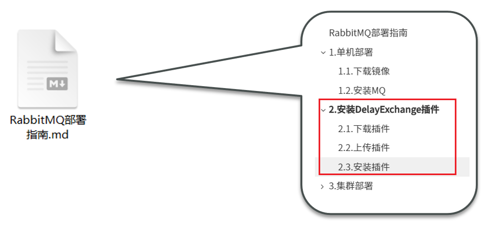

# 服务异步通信-高级篇


消息队列在使用过程中，面临着很多实际问题需要思考：

 


# 1.消息可靠性

消息从发送，到消费者接收，会经理多个过程：

 


其中的每一步都可能导致消息丢失，常见的丢失原因包括：

- 发送时丢失：
  - 生产者发送的消息未送达exchange
  - 消息到达exchange后未到达queue
- MQ宕机，queue将消息丢失
- consumer接收到消息后未消费就宕机


针对这些问题，RabbitMQ分别给出了解决方案：

- 生产者确认机制
- mq持久化
- 消费者确认机制
- 失败重试机制


下面我们就通过案例来演示每一个步骤。

首先，导入课前资料提供的demo工程：

 


项目结构如下：

 


## 1.1.生产者消息确认

RabbitMQ提供了publisher confirm机制来避免消息发送到MQ过程中丢失。这种机制必须给每个消息指定一个唯一ID。消息发送到MQ以后，会返回一个结果给发送者，表示消息是否处理成功。

返回结果有两种方式：

- publisher-confirm，发送者确认
  - 消息成功投递到交换机，返回ack
  - 消息未投递到交换机，返回nack
- publisher-return，发送者回执
  - 消息投递到交换机了，但是没有路由到队列。返回Code，及路由失败原因。


注意：

 


### 1.1.1.修改配置

首先，修改publisher服务中的application.yml文件，添加下面的内容：

```yaml
spring:
  rabbitmq:
    publisher-confirm-type: correlated
    publisher-returns: true
    template:
      mandatory: true
```

说明：

- `publish-confirm-type`：开启publisher-confirm，这里支持两种类型：
  - `simple`：同步等待confirm结果，直到超时
  - `correlated`：异步回调，定义ConfirmCallback，MQ返回结果时会回调这个ConfirmCallback
- `publish-returns`：开启publish-return功能，同样是基于callback机制，不过是定义ReturnCallback
- `template.mandatory`：定义消息路由失败时的策略。true，则调用ReturnCallback；false：则直接丢弃消息


### 1.1.2.定义ConfirmCallback

```java
package cn.itcast.mq.config;

import lombok.extern.slf4j.Slf4j;
import org.springframework.amqp.core.Message;
import org.springframework.amqp.rabbit.connection.CorrelationData;
import org.springframework.amqp.rabbit.core.RabbitTemplate;
import org.springframework.beans.BeansException;
import org.springframework.context.ApplicationContext;
import org.springframework.context.ApplicationContextAware;
import org.springframework.context.annotation.Configuration;

/**
 * MQ配置类
 */
@Slf4j
@Configuration
public class RabbitTemplateConfig implements ApplicationContextAware {
    @Override
    public void setApplicationContext(ApplicationContext applicationContext) throws BeansException {
        // 1. 从spring容器中取出RabbitTemplate
        RabbitTemplate rabbitTemplate = applicationContext.getBean(RabbitTemplate.class);
        //2. 设置回调方法ConfirmCallBack
        rabbitTemplate.setConfirmCallback((correlationData, ack, cause) -> {
            if (!ack) {
                log.error("消息未发送到交换机! {}", cause);
            } else {
                log.info("消息已发送到交换机!");
            }
        });
    }
}
```

发送消息时，可以指定一个CorrelationData对象，设置消息的唯一id

```java
@Test
public void testMessage() throws InterruptedException {
    //1. 创建CorrelationData对象，设置回调方法ConfirmCallback
    CorrelationData correlationData = new CorrelationData(UUID.randomUUID().toString());
    //2. 发送消息
    rabbitTemplate.convertAndSend("exchange1", "q1", "hello...", correlationData);
    //3. 休眠一会儿，等待successCallBack回调，不然程序结束看不到效果
    Thread.sleep(2000);
}
```


### 1.1.3.定义ReturnCallback

```java
package cn.itcast.mq.config;

import lombok.extern.slf4j.Slf4j;
import org.springframework.amqp.core.Message;
import org.springframework.amqp.rabbit.connection.CorrelationData;
import org.springframework.amqp.rabbit.core.RabbitTemplate;
import org.springframework.beans.BeansException;
import org.springframework.context.ApplicationContext;
import org.springframework.context.ApplicationContextAware;
import org.springframework.context.annotation.Configuration;

/**
 * MQ配置类
 */
@Slf4j
@Configuration
public class RabbitTemplateConfig implements ApplicationContextAware {
    @Override
    public void setApplicationContext(ApplicationContext applicationContext) throws BeansException {
        // 1. 从spring容器中取出RabbitTemplate
        RabbitTemplate rabbitTemplate = applicationContext.getBean(RabbitTemplate.class);
        //2. 设置回调方法ConfirmCallBack
        rabbitTemplate.setConfirmCallback((correlationData, ack, cause) -> {
            if (!ack) {
                log.error("消息未发送到交换机! {}", cause);
            } else {
                log.info("消息已发送到交换机!");
            }
        });
        //3. 设置回调方法ReturnCallBack
        rabbitTemplate.setReturnCallback((message, replyCode, replyText, exchange, routingKey) -> {
            log.error("消息未发送到队列，replyCode:{}, replyText:{}, routingKey:{}", replyCode, replyText, routingKey);
        });
    }
}
```


## 1.2.消息持久化

生产者确认可以确保消息投递到RabbitMQ的队列中，但是消息发送到RabbitMQ以后，如果突然宕机，也可能导致消息丢失。

要想确保消息在RabbitMQ中安全保存，必须开启消息持久化机制。

- 交换机持久化
- 队列持久化
- 消息持久化


### 1.2.1.交换机持久化

RabbitMQ中交换机默认是非持久化的，mq重启后就丢失。

SpringAMQP中可以通过代码指定交换机持久化：

```java
/**
 * 普通队列
 */
@RabbitListener(bindings = @QueueBinding(
        exchange = @Exchange(name = "exchange1", durable = "true", type = ExchangeTypes.DIRECT),
        value = @Queue(name = "queue1", durable = "true"),
        key = "q1"
))
public void listenQueue1(String msg) {
    log.debug("消费者queue1接收到消息：" + msg);
}
```


事实上，默认情况下，由SpringAMQP声明的交换机都是持久化的。可以在RabbitMQ控制台看到持久化的交换机都会带上`D`的标示：

 


### 1.2.2.队列持久化

RabbitMQ中队列默认是非持久化的，mq重启后就丢失。

SpringAMQP中可以通过代码指定交换机持久化：

```java
/**
 * 普通队列
 */
@RabbitListener(bindings = @QueueBinding(
        exchange = @Exchange(name = "exchange1", durable = "true", type = ExchangeTypes.DIRECT),
        value = @Queue(name = "queue1", durable = "true"),
        key = "q1"
))
public void listenQueue1(String msg) {
    log.debug("消费者queue1接收到消息：" + msg);
}
```


事实上，默认情况下，由SpringAMQP声明的队列都是持久化的。可以在RabbitMQ控制台看到持久化的队列都会带上`D`的标示：

 


### 1.2.3.消息持久化

利用SpringAMQP发送消息时，可以设置消息的属性（MessageProperties），指定delivery-mode：

- 1：非持久化
- 2：持久化

用java代码指定：

在consumer服务的SpringRabbitListener类中声明一个交换机，队列：

```java
@Test
public void testDurableMessage() {
    Message message = MessageBuilder
            .withBody("hello, Spring...".getBytes(StandardCharsets.UTF_8))
            .setDeliveryMode(MessageDeliveryMode.PERSISTENT) // 消息持久化
            .build();
    rabbitTemplate.convertAndSend("exchange1", "q1", message);
    log.info("消息已经成功发送！");
}
```

默认情况下，SpringAMQP发出的任何消息都是持久化的，不用特意指定。


## 1.3.消费者消息确认

RabbitMQ是**阅后即焚**机制，RabbitMQ确认消息被消费者消费后会立刻删除。

而RabbitMQ是通过消费者回执来确认消费者是否成功处理消息的：消费者获取消息后，应该向RabbitMQ发送ACK回执，表明自己已经处理消息。


设想这样的场景：

- 1）RabbitMQ投递消息给消费者
- 2）消费者获取消息后，返回ACK给RabbitMQ
- 3）RabbitMQ删除消息
- 4）消费者宕机，消息尚未处理

这样，消息就丢失了。因此消费者返回ACK的时机非常重要。


而SpringAMQP则允许配置三种确认模式：

• manual：手动ack，需要在业务代码结束后，调用api发送ack。

• auto：自动ack，由spring监测listener代码是否出现异常，没有异常则返回ack；抛出异常则返回nack

• none：关闭ack，MQ假定消费者获取消息后会成功处理，因此消息投递后立即被删除


由此可知：

- none模式下，消息投递是不可靠的，可能丢失
- auto模式类似事务机制，出现异常时返回nack，消息回滚到mq；没有异常，返回ack
- manual：自己根据业务情况，判断什么时候该ack


一般，我们都是使用默认的auto即可。


### 1.3.1.演示none模式

修改consumer服务的application.yml文件，添加下面内容：

```yaml
spring:
  rabbitmq:
    listener:
      simple:
        acknowledge-mode: none # 关闭ack
```

修改consumer服务的SpringRabbitListener类中的方法，模拟一个消息处理异常：

```java
/**
 * 普通队列
 */
@RabbitListener(bindings = @QueueBinding(
        exchange = @Exchange(name = "exchange1", durable = "true", type = ExchangeTypes.DIRECT),
        value = @Queue(name = "queue1", durable = "true"),
        key = "q1"
))
public void listenQueue1(String msg) {
    log.debug("消费者queue1接收到消息：" + msg);
    int i = 1 / 0;//模拟一个消费消息异常
}
```

测试可以发现，当消息处理抛异常时，消息依然被RabbitMQ删除了。


### 1.3.2.演示auto模式

再次把确认机制修改为auto:

```yaml
spring:
  rabbitmq:
    listener:
      simple:
        acknowledge-mode: auto
```


在异常位置打断点，再次发送消息，程序卡在断点时，可以发现此时消息状态为unack（未确定状态）：

 


抛出异常后，因为Spring会自动返回nack，所以消息恢复至Ready状态，并且没有被RabbitMQ删除：

 


## 1.4.消费失败重试机制

当消费者出现异常后，消息会不断requeue（重入队）到队列，再重新发送给消费者，然后再次异常，再次requeue，无限循环，导致mq的消息处理飙升，带来不必要的压力：

 


怎么办呢？


### 1.4.1.本地重试

我们可以利用Spring的retry机制，在消费者出现异常时利用本地重试，而不是无限制的requeue到mq队列。

修改consumer服务的application.yml文件，添加内容：

```yaml
spring:
  rabbitmq:
    listener:
      simple:
        retry:
          enabled: true # 开启消费者失败重试
          initial-interval: 1000 # 初始等待时长为1秒
          multiplier: 2 # 失败的等待时长倍数
          max-attempts: 3 # 最大重试次数
```


重启consumer服务，重复之前的测试。可以发现：

- 在重试3次后，SpringAMQP会抛出异常AmqpRejectAndDontRequeueException，说明本地重试触发了
- 查看RabbitMQ控制台，发现消息被删除了，说明最后SpringAMQP返回的是ack，mq删除消息了


结论：

- 开启本地重试时，消息处理过程中抛出异常，不会requeue到队列，而是在消费者本地重试
- 重试达到最大次数后，Spring会返回ack，消息会被丢弃


### 1.4.2.失败策略

在之前的测试中，达到最大重试次数后，消息会被丢弃，这是由Spring内部机制决定的。


在开启重试模式后，重试次数耗尽，如果消息依然失败，则需要有MessageRecovery接口来处理，它包含三种不同的实现：

 

- RejectAndDontRequeueRecoverer：重试耗尽后，直接reject，丢弃消息。默认就是这种方式
- ImmediateRequeueMessageRecoverer：重试耗尽后，返回nack，消息重新入队
- RepublishMessageRecoverer：重试耗尽后，将失败消息投递到指定的交换机


比较优雅的一种处理方案是RepublishMessageRecoverer，失败后将消息投递到一个指定的，专门存放异常消息的队列，后续由人工集中处理。


1）在consumer服务中定义处理失败消息的交换机和队列

```java
/**
 * 错误队列，死信队列
 */
@RabbitListener(bindings = @QueueBinding(
        exchange = @Exchange(name = "exchange2", type = ExchangeTypes.DIRECT),
        value = @Queue(name = "queue2", durable = "true"),
        key = "error"
))
public void listenQueue2(String msg) {
    log.debug("消费者queue2接收到消息：" + msg);
}

```

2）定义一个RepublishMessageRecoverer，关联队列和交换机，可以直接写在启动类中。完整代码：

```java
package cn.itcast.mq;

import org.springframework.amqp.rabbit.core.RabbitTemplate;
import org.springframework.amqp.rabbit.retry.MessageRecoverer;
import org.springframework.amqp.rabbit.retry.RepublishMessageRecoverer;
import org.springframework.boot.SpringApplication;
import org.springframework.boot.autoconfigure.SpringBootApplication;
import org.springframework.context.annotation.Bean;

@SpringBootApplication
public class ConsumerApplication {

    public static void main(String[] args) {
        SpringApplication.run(ConsumerApplication.class, args);
    }

    @Bean
    public MessageRecoverer messageRecoverer(RabbitTemplate rabbitTemplate) {
        return new RepublishMessageRecoverer(rabbitTemplate, "exchange2", "error");
    }
}
```


## 1.5.总结

如何确保RabbitMQ消息的可靠性？

- 开启生产者确认机制，确保生产者的消息能到达队列
- 开启持久化功能，确保消息未消费前在队列中不会丢失
- 开启消费者确认机制为auto，由spring确认消息处理成功后完成ack
- 开启消费者失败重试机制，并设置MessageRecoverer，多次重试失败后将消息投递到异常交换机，交由人工处理


# 2.死信交换机


## 2.1.初识死信交换机


### 2.1.1.什么是死信交换机

什么是死信？

当一个队列中的消息满足下列情况之一时，可以成为死信（dead letter）：

- 消费者使用basic.reject或 basic.nack声明消费失败，并且消息的requeue参数设置为false
- 消息是一个过期消息，超时无人消费
- 要投递的队列消息满了，无法投递


如果这个包含死信的队列配置了`dead-letter-exchange`属性，指定了一个交换机，那么队列中的死信就会投递到这个交换机中，而这个交换机称为**死信交换机**（Dead Letter Exchange，检查DLX）。


如图：


另外，队列将死信投递给死信交换机时，必须知道两个信息：

- 死信交换机名称
- 死信交换机与死信队列绑定的RoutingKey

这样才能确保投递的消息能到达死信交换机，并且正确的路由到死信队列。


### 2.1.2.利用死信交换机接收死信（拓展）

在失败重试策略中，默认的RejectAndDontRequeueRecoverer会在本地重试次数耗尽后，发送reject给RabbitMQ，消息变成死信，被丢弃。


我们可以给queue3添加一个死信交换机，给死信交换机绑定一个队列。这样消息变成死信后也不会丢弃，而是最终投递到死信交换机，路由到与死信交换机绑定的队列。


我们在consumer服务中，定义一组死信交换机、死信队列：

我们还是使用之前刚才的exchange2，queue2，当作死信队列

```java
/**
 * 错误队列，死信队列
 */
@RabbitListener(bindings = @QueueBinding(
        exchange = @Exchange(name = "exchange2", type = ExchangeTypes.DIRECT),
        value = @Queue(name = "queue2", durable = "true"),
        key = "error"
))
public void listenQueue2(String msg) {
    log.debug("消费者queue2接收到消息：" + msg);
}
```


### 2.1.3.总结

什么样的消息会成为死信？

- 消息被消费者reject或者返回nack
- 消息超时未消费
- 队列满了

死信交换机的使用场景是什么？

- 如果队列绑定了死信交换机，死信会投递到死信交换机；
- 可以利用死信交换机收集所有消费者处理失败的消息（死信），交由人工处理，进一步提高消息队列的可靠性。


## 2.2.TTL

一个队列中的消息如果超时未消费，则会变为死信，超时分为两种情况：

- 消息所在的队列设置了超时时间
- 消息本身设置了超时时间

 


### 2.2.1.接收超时死信的死信交换机

在consumer服务的SpringRabbitListener中，定义一个新的消费者，并且声明 死信交换机、死信队列：

```java
/**
 * 延迟队列
 */
@RabbitListener(bindings = @QueueBinding(
        exchange = @Exchange(name = "exchange3", type = ExchangeTypes.DIRECT),
        value = @Queue(name = "queue3", durable = "true", arguments =
                {
                        @Argument(name = "x-message-ttl", value = "10000", type = "java.lang.Integer"),
                        @Argument(name = "x-dead-letter-exchange", value = "exchange2"),
                        @Argument(name = "x-dead-letter-routing-key", value = "error")
                }
        ),
        key = "ttl"
))
public void listenQueue3(String msg) {
    log.info("消费者接收到queue3的消息：" + msg);
}
```

x-message-ttl：设置队列的超时时间，10秒

x-dead-letter-exchange：指定死信交换机

x-dead-letter-routing-key：指定死信交换机路由的key


### 2.2.2 发送消息，不指定TTL

<font color='red'>注意：发送消息之前，需要注释掉刚才的 listenQueue3 方法，因为我们不希望 queue3 中的数据消费掉，而是等待它队列的数据超时，被重新发送到死信队列。</font>

<font color='red'>注意：发送消息之前，需要注释掉刚才的 listenQueue3 方法，因为我们不希望 queue3 中的数据消费掉，而是等待它队列的数据超时，被重新发送到死信队列。</font>

<font color='red'>注意：发送消息之前，需要注释掉刚才的 listenQueue3 方法，因为我们不希望 queue3 中的数据消费掉，而是等待它队列的数据超时，被重新发送到死信队列。</font>

```java
@Test
public void testTTLMessage() {
    rabbitTemplate.convertAndSend("exchange3", "ttl", "hello, ttl message...");
    log.info("消息已经成功发送！");
}
```

因为队列的TTL值是10000ms，也就是10秒。可以看到消息发送与接收之间的时差刚好是10秒。


### 2.2.3.发送消息，设定TTL

在发送消息时，也可以指定TTL：

```java
@Test
public void testTTLMessage() {
    // 创建消息
    Message message = MessageBuilder
            .withBody("hello, ttl message......".getBytes(StandardCharsets.UTF_8))
            .setExpiration("5000")
            .build();
    rabbitTemplate.convertAndSend("exchange3", "ttl", message);
    log.info("消息已经成功发送！");
}
```


这次，发送与接收的延迟只有5秒。说明当队列、消息都设置了TTL时，任意一个到期就会成为死信。


### 2.2.4.总结

消息超时的两种方式是？

- 给队列设置ttl属性，进入队列后超过ttl时间的消息变为死信
- 给消息设置ttl属性，队列接收到消息超过ttl时间后变为死信

如何实现发送一个消息20秒后消费者才收到消息？

- 给消息的目标队列指定死信交换机
- 将消费者监听的队列绑定到死信交换机
- 发送消息时给消息设置超时时间为20秒


## 2.3.延迟队列

利用TTL结合死信交换机，我们实现了消息发出后，消费者延迟收到消息的效果。这种消息模式就称为延迟队列（Delay Queue）模式。

延迟队列的使用场景包括：

- 延迟发送短信
- 用户下单，如果用户在15 分钟内未支付，则自动取消
- 预约工作会议，20分钟后自动通知所有参会人员


因为延迟队列的需求非常多，所以RabbitMQ的官方也推出了一个插件，原生支持延迟队列效果。

这个插件就是DelayExchange插件。参考RabbitMQ的插件列表页面：https://www.rabbitmq.com/community-plugins.html

 


使用方式可以参考官网地址：https://blog.rabbitmq.com/posts/2015/04/scheduling-messages-with-rabbitmq


### 2.3.1.安装DelayExchange插件

参考课前资料：

 


### 2.3.2.DelayExchange原理

DelayExchange需要将一个交换机声明为delayed类型。当我们发送消息到delayExchange时，流程如下：

- 接收消息
- 判断消息是否具备x-delay属性
- 如果有x-delay属性，说明是延迟消息，持久化到硬盘，读取x-delay值，作为延迟时间
- 返回routing not found结果给消息发送者
- x-delay时间到期后，重新投递消息到指定队列


### 2.3.3.使用DelayExchange

插件的使用也非常简单：声明一个交换机，交换机的类型可以是任意类型，只需要设定delayed属性为true即可，然后声明队列与其绑定即可。

#### 1）声明DelayExchange交换机

```java
/**
 * DelayExchange，延迟队列
 */
@RabbitListener(bindings = @QueueBinding(
        exchange = @Exchange(name = "exchange4", delayed = "true", type = ExchangeTypes.DIRECT),
        value = @Queue(name = "queue4", durable = "true"),
        key = "delay"
))
public void listenQueue4(String msg) {
    log.info("消费者接收到queue4的消息：" + msg);
}

```

<font color='red'>注意：@Exchange 的 delayed 属性为true</font>


#### 2）发送消息

发送消息时，一定要携带x-delay属性，指定延迟的时间：

```java
@Test
public void testSendDelayMessage() throws InterruptedException {
    // 1.准备消息
    Message message = MessageBuilder
            .withBody("hello, ttl message......".getBytes(StandardCharsets.UTF_8))
            .setDeliveryMode(MessageDeliveryMode.PERSISTENT)
            .setHeader("x-delay", 5000)
            .build();
    rabbitTemplate.convertAndSend("exchange4", "delay", message);
    log.info("发送消息成功");
}
```


### 2.3.4.总结

延迟队列插件的使用步骤包括哪些？

•声明一个交换机，添加delayed属性为true

•发送消息时，添加x-delay头，值为超时时间


# 3.惰性队列

## 3.1.消息堆积问题

当生产者发送消息的速度超过了消费者处理消息的速度，就会导致队列中的消息堆积，直到队列存储消息达到上限。之后发送的消息就会成为死信，可能会被丢弃，这就是消息堆积问题。


 


解决消息堆积有两种思路：

- 增加更多消费者，提高消费速度。
- 扩大队列容积，提高堆积上限


要提升队列容积，把消息保存在内存中显然是不行的。


## 3.2.惰性队列

从RabbitMQ的3.6.0版本开始，就增加了Lazy Queues的概念，也就是惰性队列。惰性队列的特征如下：

- 接收到消息后直接存入磁盘而非内存
- 消费者要消费消息时才会从磁盘中读取并加载到内存
- 支持数百万条的消息存储

```java
/**
 * 惰性队列
 */
@RabbitListener(bindings = @QueueBinding(
        exchange = @Exchange(name = "exchange5", type = ExchangeTypes.DIRECT),
        value = @Queue(name = "queue5", durable = "true", arguments = @Argument(name = "x-queue-mode", value = "lazy")),
        key = "lazy"
))
public void listenQueue5(String msg) {
    log.debug("消费者queue5接收到消息：" + msg);
}

```

注意：@Queue(name = "queue5", durable = "true", arguments = @Argument(name = "x-queue-mode", value = "lazy")


向惰性队列中持续发送消息

```java
@Test
public void testLazyQueue() {
    for (int i = 0; i < 100000; i++) {
        // 发送消息，queue5是惰性队列
        rabbitTemplate.convertAndSend("exchange5", "lazy", "hello, Spring...");
        rabbitTemplate.convertAndSend("exchange1", "q1", "hello, Spring...");
    }
}
```


### 3.3.总结

消息堆积问题的解决方案？

- 队列上绑定多个消费者，提高消费速度
- 使用惰性队列，可以再mq中保存更多消息

惰性队列的优点有哪些？

- 基于磁盘存储，消息上限高

惰性队列的缺点有哪些？

- 基于磁盘存储，消息时效性会降低
- 性能受限于磁盘的IO


官网说明：https://www.rabbitmq.com/lazy-queues.html

在发送 1 百万条消息，每条消息大概占 1KB 的情况下，普通队列占用内存是 1.2GB，而惰性队列仅仅占用 1.5MB


# 4.MQ集群


## 4.1.集群分类

RabbitMQ是天然支持集群模式。RabbitMQ的集群有两种模式：

• **普通集群**：是一种分布式集群，将队列分散到集群的各个节点，从而提高整个集群的并发能力。

• **镜像集群**：是一种主从集群，普通集群的基础上，添加了主从备份功能，提高集群的数据可用性。


镜像集群虽然支持主从，但主从同步并不是强一致的，某些情况下可能有数据丢失的风险。因此在RabbitMQ的3.8版本以后，推出了新的功能：**仲裁队列**来代替镜像集群，底层采用Raft协议确保主从的数据一致性。


## 4.2.普通集群


### 4.2.1.集群结构和特征

普通集群，或者叫标准集群（classic cluster），具备下列特征：

- 会在集群的各个节点间共享部分数据，包括：交换机、队列元信息。不包含队列中的消息。
- 当访问集群某节点时，如果队列不在该节点，会从数据所在节点传递到当前节点并返回
- 队列所在节点宕机，队列中的消息就会丢失


结构如图：

 


### 4.2.2.部署

参考课前资料：《RabbitMQ部署指南.md》


## 4.3.镜像集群


### 4.3.1.集群结构和特征

镜像集群：本质是主从模式，具备下面的特征：

- 交换机、队列、队列中的消息会在各个mq的镜像节点之间同步备份。
- 创建队列的节点被称为该队列的**主节点，**备份到的其它节点叫做该队列的**镜像**节点。
- 一个队列的主节点可能是另一个队列的镜像节点
- 所有操作都是主节点完成，然后同步给镜像节点
- 主宕机后，镜像节点会替代成新的主

结构如图：

 


### 4.3.2.部署

参考课前资料：《RabbitMQ部署指南.md》


## 4.4.仲裁队列


### 4.4.1.集群特征

仲裁队列：仲裁队列是3.8版本以后才有的新功能，用来替代镜像队列，具备下列特征：

- 与镜像队列一样，都是主从模式，支持主从数据同步
- 使用非常简单，没有复杂的配置
- 主从同步基于Raft协议，强一致


### 4.4.2.部署

参考课前资料：《RabbitMQ部署指南.md》

### 4.4.3.Java代码创建仲裁队列

```java
@Bean
public Queue quorumQueue() {
    return QueueBuilder
        .durable("quorum2") // 持久化
        .quorum() // 仲裁队列
        .build();
}
```

注意：集群MQ中是没有安装DelayExchange插件的，无法创建delayed=true的交换机，需要注释掉才能正常启动。


### 4.4.4.SpringAMQP连接MQ集群

注意，这里用address来代替host、port方式

```yml
spring:
  rabbitmq:
    addresses: 192.168.100.150:8071, 192.168.100.150:8072, 192.168.100.150:8073
    username: guest
    password: guest
    virtual-host: /
```


