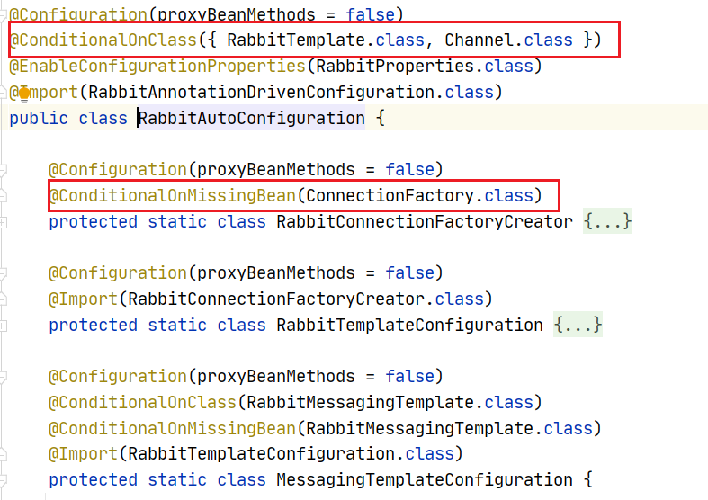
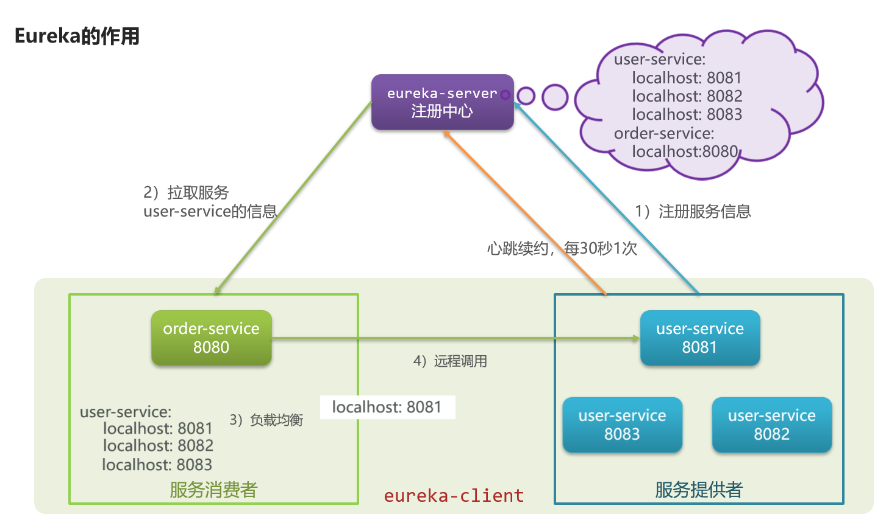

## 01- 讲一讲SpringBoot自动装配的原理

1.在SpringBoot项目的启动引导类上都有一个注解`@SpringBootApplication`


这个注解是一个复合注解, 其中有三个注解构成 , 分别是


- @SpringBootConfiguration : 是@Configuration的派生注解 , 标注当前类是一个SpringBoot的配置类
- @ComponentScan : 开启组件扫描, 默认扫描的是当前启动引导了所在包以及子包
- **@EnableAutoConfiguration : 开启自动配置(自动配置核心注解)**

2.在@EnableAutoConfiguration注解的内容使用@Import注解导入了一个`AutoConfigurationImportSelector.class`的类


在`AutoConfigurationImportSelector.class`中的`selectImports`方法内通过一系列的方法调用, 最终需要加载类加载路径下`META-INF`下面的`spring.factories`配置文件

3.在`META-INF/spring.factories`配置文件中, 定义了很多的自动配置类的完全限定路径


这些配置类都会被加载

4.加载配置类之后, 会配置类或者配置方法上的@ConditionalOnXxxx条件化注解是否满足条件



如果满足条件就会从属性配置类中读取相关配置 , 执行配置类中的配置方法 , 完成自动配置

## 02- 讲一讲SpringBoot启动流程

springboot项目在启动的时候, 首先会执行启动引导类里面的`SpringApplication.run(AdminApplication.class, args)`方法


这个run方法主要做的事情可以分为三个部分 : 

第一部分进行SpringApplication的初始化模块，配置一些基本的环境变量、资源、构造器、监听器

第二部分实现了应用具体的启动方案，包括启动流程的监听模块、加载配置环境模块、及核心的创建上下文环境模块

第三部分是自动化配置模块，该模块作为springboot自动配置核心，在后面的分析中会详细讨论


## 03- 你们常用的SpringBoot起步依赖有哪些


## 04- springBoot支持的配置文件有哪些 ? 加载顺序是什么样的

1 properties文件
2 YAML文件 
3 系统环境变量 
4 命令行参数

如果有相同的配置参数, 后加载的会覆盖先加载的


## 05- 运行一个SpringBoot项目有哪些方式

1. 直接使用jar -jar 运行

2. 开发过程中运行main方法

3. 可以配置插件 , 将springboot项目打war包, 部署到Tomcat中运行

4. 直接用maven插件运行 maven spring-boot：run

## 07-Spring Boot的核心注解是哪个？他由哪几个注解组成的？

Spring Boot的核心注解是@SpringBootApplication , 他由几个注解组成 : 

- @SpringBootConfiguration： 组合了- @Configuration注解，实现配置文件的功能；
- @EnableAutoConfiguration：打开自动配置的功能，也可以关闭某个自动配置的选项
- @ComponentScan：Spring组件扫描


## 08-Spring Boot 中如何解决跨域问题 ?

SpringMVC项目中使用@CrossOrigin注解来解决跨域问题 , 本质是CORS

```java
@RequestMapping("/hello")
@CrossOrigin(origins = "*")
//@CrossOrigin(value = "http://localhost:8081") //指定具体ip允许跨域
public String hello() {
    return "hello world";
}
```

SpringBoot项目采用自动配置的方式来配置CORS , 可以通过实现 WebMvcConfigurer接口然后重写addCorsMappings方法解决跨域问题。

```java
@Configuration
public class CorsConfig implements WebMvcConfigurer {

    @Override
    public void addCorsMappings(CorsRegistry registry) {
        registry.addMapping("/**")
                //是否发送Cookie
                .allowCredentials(true)
                //放行哪些原始域
                .allowedOrigins("*")
                .allowedMethods(new String[]{"GET", "POST", "PUT", "DELETE"})
                .allowedHeaders("*")
                .exposedHeaders("*");
    }
}
```

在SpringCloud项目中一般都会有网关 , 在网关中可以配置CORS跨域, 这样所有通过网关的请求都解决了跨域问题

```yml
spring:
  cloud:
    gateway:
      globalcors:
        cors-configurations:
          '[/**]': # 匹配所有请求
            allowedOrigins: "*" #跨域处理 允许所有的域
            allowedMethods: # 支持的方法
              - GET
              - POST
              - PUT
              - DELETE
```


## 09- 你们项目中使用的SpringBoot是哪个版本 ? 

- SpringBoot : 2.3.4.RELEASE

- SpringCloud : Hoxton.SR10

- SpringCloudAlibaba : 2.2.5.RELEASE

## 10- Spring Cloud 5大组件有哪些？

早期我们一般认为的Spring Cloud五大组件是 

- Eureka   : 注册中心
- Ribbon  : 负载均衡
- Feign     : 远程调用
- Hystrix :  服务熔断
- Zuul/Gateway  : 网关

随着SpringCloudAlibba在国内兴起 , 我们项目中使用了一些阿里巴巴的组件 

- 注册中心/配置中心 Nacos

- 负载均衡 Ribbon

- 服务调用 Feign

- 服务保护 sentinel

- 服务网关 Gateway

## 11- 什么是微服务?微服务的优缺点是什么?

微服务就是一个独立的职责单一的服务应用程序，一个模块

1．优点：松耦合，聚焦单一业务功能，无关开发语言，团队规模降低 , 扩展性好, 天然支持分库
2．缺点：随着服务数量增加，管理复杂，部署复杂，服务器需要增多，服务通信和调用压力增大


## 12- 你们项目中微服务之间是如何通讯的?

1．同步通信：通过Feign发送http请求调用

2．异步：消息队列，如RabbitMq、KafKa等


## 13- 服务注册和发现是什么意思？Spring Cloud 如何实现服务注册发现？

各种注册中心组件的原理和流程其实大体上类似



核心的功能就一下几个 : 

1. 服务注册 : 服务启动的时候会将服务的信息注册到注册中心, 比如: 服务名称 , 服务的IP , 端口号等
2. 服务发现 : 服务调用方调用服务的时候, 根据服务名称从注册中心拉取服务列表 , 然后根据负载均衡策略 , 选择一个服务, 获取服务的IP和端口号, 发起远程调用
3. 服务状态监控 : 服务提供者会定时向注册中心发送心跳 , 注册中心也会主动向服务提供者发送心跳探测, 如果长时间没有接收到心跳, 就将服务实例从注册中心下线或者移除

使用的话, 首先需要部署注册中心服务 , 然后在我们自己的微服务中引入注册中心依赖, 然后再配置文件中配置注册中心地址 就可以了

```yml
spring:
  application:
    name: leadnews-admin
  cloud:
    nacos:
      # 注册中心地址
      discovery:
        server-addr: 124.221.75.8:8848
      # 配置中心地址
      config:
        server-addr: 124.221.75.8:8848
        file-extension: yml
```


## 14- 你们项目负载均衡如何实现的 ? 

服务调用过程中的负载均衡一般使用SpringCloud的Ribbon 组件实现  , Feign的底层已经自动集成了Ribbon  , 使用起来非常简单

客户端调用的话一般会通过网关, 通过网关实现请求的路由和负载均衡

```yml
spring:
  cloud:
    gateway:
      routes:
        # 平台管理
        - id: wemedia
          uri: lb://leadnews-wemedia
          predicates:
            - Path=/wemedia/**
          filters:
            - StripPrefix= 1
```


## 15- Ribbon负载均衡策略有哪些 ? 如果想自定义负载均衡策略如何实现 ? 

Ribbon默认的负载均衡策略有七种 : 

| **内置负载均衡规则类 **   | **规则描述**                                                 |
| ------------------------- | ------------------------------------------------------------ |
| RoundRobinRule            | 简单轮询服务列表来选择服务器。它是Ribbon默认的负载均衡规则。 |
| AvailabilityFilteringRule | 对以下两种服务器进行忽略：   （1）在默认情况下，这台服务器如果3次连接失败，这台服务器就会被设置为“短路”状态。短路状态将持续30秒，如果再次连接失败，短路的持续时间就会几何级地增加。  （2）并发数过高的服务器。如果一个服务器的并发连接数过高，配置了AvailabilityFilteringRule规则的客户端也会将其忽略。并发连接数的上限，可以由客户端的<clientName>.<clientConfigNameSpace>.ActiveConnectionsLimit属性进行配置。 |
| WeightedResponseTimeRule  | 为每一个服务器赋予一个权重值。服务器响应时间越长，这个服务器的权重就越小。这个规则会随机选择服务器，这个权重值会影响服务器的选择。 |
| **ZoneAvoidanceRule**     | 以区域可用的服务器为基础进行服务器的选择。使用Zone对服务器进行分类，这个Zone可以理解为一个机房、一个机架等。而后再对Zone内的多个服务做轮询。 |
| BestAvailableRule         | 忽略那些短路的服务器，并选择并发数较低的服务器。             |
| RandomRule                | 随机选择一个可用的服务器。                                   |
| RetryRule                 | 重试机制的选择逻辑                                           |

**默认的实现就是ZoneAvoidanceRule，是一种轮询方案**

如果想要自定义负载均衡 , 可以自己创建类实现IRule接口 , 然后再通过配置类或者配置文件配置即可 : 

通过定义IRule实现可以修改负载均衡规则，有两种方式：

1. 代码方式：在order-service中的OrderApplication类中，定义一个新的IRule：

```java
@Bean
public IRule randomRule(){
    return new RandomRule();
}
```

2. 配置文件方式：在order-service的application.yml文件中，添加新的配置也可以修改规则：

```yaml
userservice: # 给某个微服务配置负载均衡规则，这里是userservice服务
  ribbon:
    NFLoadBalancerRuleClassName: com.netflix.loadbalancer.RandomRule # 负载均衡规则 
```


## 16- 你们项目的配置文件是怎么管理的 ? 

大部分的固定的配置文件都放在服务本地 , 一些根据环境不同可能会变化的部分, 放到Nacos中

## 17- 你们项目中有没有做过限流 ? 怎么做的 ? 

限流一般有二种方式设置 : 

**第一种  : 网关配置限流**

```
spring:
  application:
    name: api-gateway
  redis:
    host: localhost
    port: 6379
    password:
  cloud:
    gateway:
      routes:
        - id: cloud-gateway
          uri: http://192.168.1.211:8088/
          predicates:
            - Path=/ytb/**
          filters:
            - StripPrefix=1
            - name: RequestRateLimiter
              args:
                redis-rate-limiter.replenishRate: 1   # 令牌桶每秒填充速率
                redis-rate-limiter.burstCapacity: 2   # 令牌桶总容量
                key-resolver: "#{@pathKeyResolver}"   # 使用 SpEL 表达式按名称引用 bean
```

> 在上面的配置文件，配置了 redis 的信息，并配置了 RequestRateLimiter 的限流过滤器，该过滤器需要配置三个参数：
>
> burstCapacity，令牌桶总容量。
> replenishRate，令牌桶每秒填充平均速率。
> key-resolver，用于限流的键的解析器的 Bean 对象的名字。它使用 SpEL 表达式根据 #{@beanName} 从 Spring 容器中获取 Bean 对象
>
> ```
> @Configuration
> public class KeyResolverConfiguration {
>     @Bean
>     public KeyResolver pathKeyResolver(){
>         return exchange -> Mono.just(exchange.getRequest().getURI().getPath());
>     }
> }
> ```

常见的限流算法有：计数器算法，漏桶（Leaky Bucket）算法，令牌桶（Token Bucket）算法。

**Spring Cloud Gateway官方提供了RequestRateLimiterGatewayFilterFactory过滤器工厂，使用Redis 和Lua脚本实现了 令牌桶 的方式。**

令牌桶算法 是对漏桶算法的一种改进，漏桶算法能够限制请求调用的速率，而令牌桶算法能够在限制调用的平均速率的同时还允许一定程度的突发调用。在令牌桶算法中，存在一个桶，用来存放固定数量的令牌。算法中存在一种机制，以一定的速率往桶中放令牌。每次请求调用需要先获取令牌，只有拿到令牌，才有机会继续执行，否则选择选择等待可用的令牌、或者直接拒绝。

放令牌这个动作是持续不断的进行，如果桶中令牌数达到上限，就丢弃令牌。所以就存在这种情况，桶中一直有大量的可用令牌，这时进来的请求就可以直接拿到令牌执行，比如设置qps为100，那么限流器初始化完成一秒后，桶中就已经有100个令牌了，这时服务还没完全启动好，等启动完成对外提供服务时，该限流器可以抵挡瞬时的100个请求。所以，只有桶中没有令牌时，请求才会进行等待，最后相当于以一定的速率执行。


**第二种 : 使用服务保护组件Sentinel实现限流**

建议回去看看**微服务保护**课程中的限流配置


## 18- 断路器/熔断器用过嘛 ? 断路器的状态有哪些 

我们项目中使用Hystrix/Sentinel实现的断路器  ,  断路器状态机包括三个状态：


- closed：关闭状态，断路器放行所有请求，并开始统计异常比例、慢请求比例。超过阈值则切换到open状态
- open：打开状态，服务调用被**熔断**，访问被熔断服务的请求会被拒绝，快速失败，直接走降级逻辑。Open状态5秒后会进入half-open状态
- half-open：半开状态，放行一次请求，根据执行结果来判断接下来的操作。
  - 请求成功：则切换到closed状态
  - 请求失败：则切换到open状态


## 19- 你们项目中有做过服务降级嘛 ? 

我们项目中涉及到服务调用得地方都会定义降级, 一般降级逻辑就是返回默认值  , 降级的实现也非常简单 , 就是创建一个类实现`FallbackFactory`接口 , 然后再对应的Feign客户端接口上面 , 通过@FeignClient指定降级类

```java
@Component
@Slf4j
public class OrderServiceFallbackFactory implements FallbackFactory<OrderService> {
    @Override
    public OrderService create(Throwable throwable) {
        log.error("调用订单服务失败",throwable);

        return new OrderService() {
            @Override
            public String weixinPay(PayVO payVO) {
                return null;
            }

            @Override
            public Pager<OrderVO> search(Integer pageIndex, Integer pageSize, String orderNo, String openId, String startDate, String endDate) {
                return new Pager<>();
            }

            @Override
            public List<Long> getBusinessTop10Skus(Integer businessId) {
                return Lists.newArrayList();
            }
        };
    }
}
```


## 20- 你们项目中异常是怎么控制的 ? 

我们会根据不同的异常情况定义异常类 , 实现RuntimeException接口 , 然后在需要进行异常处理的位置对外抛出对应异常 

在项目中使用@ControllerAdvice  +  @ExceptionHandler 捕获指定异常 , 处理异常


