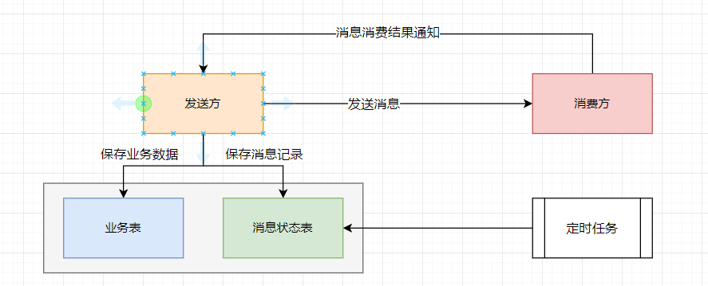

# RabbitMQ

## 01- 你们项目中哪里用到了RabbitMQ ? 

我们项目中很多地方都使用了RabbitMQ , RabbitMQ 是我们项目中服务通信的主要方式之一 , 我们项目中服务通信主要有二种方式实现 : 

1. 通过Feign实现服务调用
2. 通过MQ实现服务通信

基本上除了查询请求之外, 大部分的服务调用都采用的是MQ实现的异步调用 , 例如 : 

1. 发布内容的异步审核
2. 验证码的异步发送
3. 用户行为数据的异步采集入库
4. 搜索历史记录的异步保存
5. 用户信息修改的异步通知(用户修改信息之后, 同步修改其他服务中冗余/缓存的用户信息)
6. 静态化页面的生成
7. MYSQL和Redis , ES之间的数据同步
8. ....

## 02- 为什么会选择使用RabbitMQ ? 有什么好处 ?

选择使用RabbitMQ是因为RabbitMQ的功能比较丰富 , 支持各种消息收发模式(简单队列模式, 工作队列模式 , 路由模式 , 直接模式 , 主题模式等) , 支持延迟队列  , 惰性队列而且天然支持集群, 保证服务的高可用, 同时性能非常不错 , 社区也比较活跃, 文档资料非常丰富


> 连续三天都登录过app  , 查询用户id 
>
> 


**使用MQ有很多好处：**

- 吞吐量提升：无需等待订阅者处理完成，响应更快速

- 故障隔离：服务没有直接调用，不存在级联失败问题
- 调用间没有阻塞，不会造成无效的资源占用
- 耦合度极低，每个服务都可以灵活插拔，可替换
- 流量削峰：不管发布事件的流量波动多大，都由Broker接收，订阅者可以按照自己的速度去处理事件

**使用MQ也有很多缺点：**

- 架构复杂了，业务没有明显的流程线，不好管理
- 需要依赖于Broker的可靠、安全、性能


## 03- 使用RabbitMQ如何保证消息不丢失 ? 

消息从发送，到消费者接收，会经理多个过程 , 其中的每一步都可能导致消息丢失 


**针对这些问题，RabbitMQ分别给出了解决方案：**

- 消息发送到交换机丢失 : **发布者确认机制`publisher-confirm`**

  > 消息发送到交换机失败会向生产者返回ACK , 生产者通过回调接收发送结果 , 如果发送失败, 重新发送, 或者记录日志人工介入

- 消息从交换机路由到队列丢失 : **发布者回执机制`publisher-return`**

  > 消息从交换机路由到队列失败会向生产者返回失败原因 , 生产者通过回调接收回调结果 , 如果发送失败, 重新发送, 或者记录日志人工介入

- 消息保存到队列中丢失 : MQ持久化(交换机持久化, 队列持久化 , 消息持久化)

- 消费者消费消息丢失 : 消费者确认机制 , 消费者失败重试机制


通过RabbitMQ本身所提供的机制基本上已经可以保证消息不丢失  , 但是因为一些特殊的原因还是会发送消息丢失问题 , 例如 : 回调丢失 , 系统宕机, 磁盘损坏等 , 这种概率很小 , 但是如果想规避这些问题 , 进一步提高消息发送的成功率, 也可以通过程序自己进行控制



设计一个消息状态表 , 主要包含 : 消息id , 消息内容 , 交换机 , 消息路由key , 发送时间, 签收状态等字段 , 发送方业务执行完毕之后 , 向消息状态表保存一条消息记录, 消息状态为未签收 , 之后再向MQ发送消息 , 消费方接收消息消费完毕之后 , 向发送方发送一条签收消息 , 发送方接收到签收消息之后 , 修改消息状态表中的消息状态为已签收 ! 之后通过定时任务扫描消息状态表中这些未签收的消息 , 重新发送消息, 直到成功为止 , 对于已经完成消费的消息定时清理即可 !


## 04- 消息的重复消费问题如何解决的 ?

在使用RabbitMQ进行消息收发的时候, 如果发送失败或者消费失败会自动进行重试, 那么就有可能会导致消息的重复消费 , 具体的解决方案其实非常简单, 为每条消息设置一个唯一的标识id , 将已经消费的消息记录保存起来 , 后期再进行消费的时候判断是否已经消费过即可 , 如果已经消费过则不消费 , 如果没有消费过则正常消费 

## 05- 如果有100万消息堆积在MQ , 如何解决 ?

解决消息堆积有三种思路：


- 提高消费者的消费能力 

  > 使用多线程消费

- 增加更多消费者，提高消费速度 

  > 使用工作队列模式, 设置多个消费者消费消费同一个队列中的消息

- 扩大队列容积，提高堆积上限 

  > 使用RabbitMQ惰性队列


## 06- RabbitMQ如何保证消费的顺序性 ?

一个队列只设置一个消费者消费即可 , 多个消费者之间是无法保证消息消费顺序性的


## 07- RabbitMQ的延迟队列有了解过嘛 ? 

RabbitMQ的延迟队列有二种实现方案 : 

1. 使用消息过期TTL + 死信交换机
2. 使用延迟交换机插件

## 08- RabbitMQ如何设置消息过期 ?

RabbitMQ置消息过期的方式有二种 : 

1. 为队列设置过期时间, 所有进到这个队列的消息就会具有统一的过期时间

   ```
   @Bean
   public Queue ttlQueue(){
       return QueueBuilder.durable("ttl.queue") // 指定队列名称，并持久化
           .ttl(10000) // 设置队列的超时时间，10秒
           .deadLetterExchange("dl.ttl.direct") // 指定死信交换机
           .build();
   }
   ```

2. 为消息单独设置过期时间

   ```
   @Test
   public void testTTLQueue() {
       // 创建消息
       String message = "hello, ttl queue";
       // 消息ID，需要封装到CorrelationData中
       CorrelationData correlationData = new CorrelationData(UUID.randomUUID().toString());
       // 发送消息
       rabbitTemplate.convertAndSend("ttl.direct", "ttl", message, correlationData);
       // 记录日志
       log.debug("发送消息成功");
   }
   ```

**注意 :** 

1. 队列过期和消息过期同时存在 , 会以时间短的时间为准
2. RabbitMQ队列消息过期的机制是判断队列头部元素是否过期 , 如果队里头部消息没有到过期时间 , 中间消息到了过期时间, 这个消息也不会被自动剔除

## 09- 什么情况下消息会成为死信 ? 

当一个队列中的消息满足下列情况之一时，就会成为死信（dead letter）：

- 消费者使用basic.reject或 basic.nack声明消费失败，并且消息的requeue参数设置为false

- 消息是一个过期消息，超时无人消费

- 要投递的队列消息满了，无法投递

  

## 10- 什么是死信交换机 ? 如何为队列绑定死信交换机 ?

死 信交换机和正常的交换机没有什么不同 , 如果一个包含死信的队列配置了`dead-letter-exchange`属性，指定了一个交换机，那么队列中的死信就会投递到这个交换机中，而这个交换机称为**死信交换机**


为队列绑定死信交换机 , 只需要设置队列属性 `dead-letter-exchange`即可

## 11- RabbitMQ的高可用机制有了解过嘛 ? 

RabbitMQ的是基于Erlang语言编写，而Erlang又是一个面向并发的语言，天然支持集群模式。RabbitMQ的集群有两种模式：

•**普通集群**：是一种分布式集群，将队列分散到集群的各个节点，从而提高整个集群的并发能力。

> - 会在集群的各个节点间共享部分数据，包括：交换机、队列元信息。不包含队列中的消息。
> - 当访问集群某节点时，如果队列不在该节点，会从数据所在节点传递到当前节点并返回
> - 队列所在节点宕机，队列中的消息就会丢失

•**镜像集群**：是一种主从集群，普通集群的基础上，添加了主从备份功能，提高集群的数据可用性。

> - 交换机、队列、队列中的消息会在各个MQ的镜像节点之间同步备份。
> - 所有操作都是主节点完成，然后同步给镜像节点
> - 主宕机后，镜像节点会替代成新的主


# Kafka

## 01- 你们项目中哪里用到了Kafka? 

我们项目中很多地方都使用了Kafka, Kafka是我们项目中服务通信的主要方式之一 , 我们项目中服务通信主要有二种方式实现 : 

1. 通过Feign实现服务调用

2. 通过Kafka实现服务通信

   

基本上除了查询请求之外, 大部分的服务调用都采用的是Kafka实现的异步调用 , 例如 : 

1. 发布内容的异步审核
2. 验证码的异步发送
3. 用户行为数据的异步采集入库
4. 搜索历史记录的异步保存
5. 用户信息修改的异步通知(用户修改信息之后, 同步修改其他服务中冗余/缓存的用户信息)
6. 静态化页面的生成
7. MYSQL和Redis , ES之间的数据同步
8. 推荐数据实时计算
9. .....

## 02- 为什么会选择使用Kafka? 有什么好处 ?

选择使用Kafka是因为Kafka作为中间件他的吞吐量比较高 , 我们的系统中主要使用Kafka来处理一些用户的行为数据 , 用户行为数据用户操作成本低 , 数据量比较大 , 需要有更高的吞吐量支持 , 并且我们在项目中需要实现根据用户行为的实时推荐 , 运营端后台管理系统首页看板数据的实体展示 ! 


**使用Kafka有很多好处：**

- 吞吐量提升：无需等待订阅者处理完成，响应更快速

- 故障隔离：服务没有直接调用，不存在级联失败问题
- 调用间没有阻塞，不会造成无效的资源占用
- 耦合度极低，每个服务都可以灵活插拔，可替换
- 流量削峰：不管发布事件的流量波动多大，都由Broker接收，订阅者可以按照自己的速度去处理事件

**使用Kafka也有很多缺点：**

- 架构复杂了，业务没有明显的流程线，不好管理
- 需要依赖于Broker的可靠、安全、性能


## 03- 使用Kafka如何保证消息不丢失 ?

使用Kafka在消息的收发过程都会出现消息丢失  , Kafka分别给出了解决方案

1. 生产者发送消息到Brocker丢失

   > 设置同步发送和异步发送 
   >
   > - 同步发送可以通过get()获取到消息的发送结果 , 阻塞方案, 效率比较低
   > - 异步发送可以通过回调获取到消息的发送接口 , 非阻塞方案, 效率较高 , 可能会出现回调丢失
   > - 设置消息发送失败的重试次数, 设置为一个很大的值, 发送失败不断重试

2. 消息在Brocker中存储丢失

   > Kafka提供了分区的备份机制 , 可以为每个分区设置多个副本 , 主分区服务器宕机, 副本分区还有完整数据
   >
   > 主分区数据同步到副本分区之前, 主分区宕机也有可能会出现消息丢失问题 , 解决方案就是设置消息确认的ACKS 
   >
   > | **确认机制**     | **说明**                                                     |
   > | ---------------- | ------------------------------------------------------------ |
   > | acks=0           | 生产者在成功写入消息之前不会等待任何来自服务器的响应,消息有丢失的风险，但是速度最快 |
   > | acks=1（默认值） | 只要集群首领节点收到消息，生产者就会收到一个来自服务器的成功响应 |
   > | acks=all         | 只有当所有参与赋值的节点全部收到消息时，生产者才会收到一个来自服务器的成功响应 |

3. 消费者从Brocker接收消息丢失

   > 消费者是通过offset来定位消费数据的 , 当消费者出现故障之后会触发重平衡, 会为消费者组中的消费者重新分配消费分区, 正常情况下是没有问题的 , 这也是Kafka提供的消费保障机制
   >
   > 但是在重平衡的过程中 , 因为Kafka默认子每隔5S自动提交偏移量 , 那么就有可能会出现消息丢失和重复消费问题
   >
   > - 如果提交偏移量小于客户端处理的最后一个消息的偏移量，那么处于两个偏移量之间的消息就会被重复处理。
   > - 如果提交的偏移量大于客户端的最后一个消息的偏移量，那么处于两个偏移量之间的消息将会丢失。
   >
   > 解决方案有二种 : 
   >
   > 1. 设置更小的自动提交偏移量的周期 , 周期越小出现问题的概率也就越小, 对消费者性能和服务器压力的影响就越大(缓解方案,不能从根本上解决问题)
   > 2. 消费完毕手动提交偏移量
   >    1. 同步提交  : 会阻塞, 效率低 , 但是会重试 , 直到成功为止
   >    2. 异步提交 : 不会阻塞 , 效率高 , 但是不会重试 , 可能会出现提交失败问题
   >    3. 同步异步结合


通过Kafka本身所提供的机制基本上已经可以保证消息不丢失  , 但是因为一些特殊的原因还是会发送消息丢失问题 , 例如 : 回调丢失 , 系统宕机, 磁盘损坏等 , 这种概率很小 , 但是如果想规避这些问题 , 进一步提高消息发送的成功率, 也可以通过程序自己进行控制


设计一个消息状态表 , 主要包含 : 消息id , 消息内容 , 交换机 , 消息路由key , 发送时间, 签收状态等字段 , 发送方业务执行完毕之后 , 向消息状态表保存一条消息记录, 消息状态为未签收 , 之后再向Kafka发送消息 , 消费方接收消息消费完毕之后 , 向发送方发送一条签收消息 , 发送方接收到签收消息之后 , 修改消息状态表中的消息状态为已签收 ! 之后通过定时任务扫描消息状态表中这些未签收的消息 , 重新发送消息, 直到成功为止 , 对于已经完成消费的消息定时清理即可 !


## 04- 消息的重复消费问题如何解决的 ?

消费者是通过offset来定位消费数据的 , 当消费者出现故障之后会触发重平衡, 会为消费者组中的消费者重新分配消费分区, 正常情况下是没有问题的 , 这也是Kafka提供的消费保障机制

但是在重平衡的过程中 , 因为Kafka默认子每隔5S自动提交偏移量 , 那么就有可能会出现消息丢失和重复消费问题

如果提交偏移量小于客户端处理的最后一个消息的偏移量，那么处于两个偏移量之间的消息就会被重复处理。

> 解决方案有二种 : 
>
> 1. 设置更小的自动提交偏移量的周期 , 周期越小出现问题的概率也就越小, 对消费者性能和服务器压力的影响就越大(缓解方案,不能从根本上解决问题)
> 2. 消费完毕手动提交偏移量
>    1. 同步提交  : 会阻塞, 效率低 , 但是会重试 , 直到成功为止
>    2. 异步提交 : 不会阻塞 , 效率高 , 但是不会重试 , 可能会出现提交失败问题
>    3. 同步异步结合


基于上面的操作如果因为网络原因, 服务器原因出现偏移量提交失败的情况 , 还是会出现重复消费 , 具体的解决方案其实非常简单, 为每条消息设置一个唯一的标识id , 将已经消费的消息记录保存起来 , 后期再进行消费的时候判断是否已经消费过即可 , 如果已经消费过则不消费 , 如果没有消费过则正常消费 


## 05- Kafka如何保证消费的顺序性 ?

topic分区中消息只能由消费者组中的唯一一个消费者处理，所以消息肯定是按照先后顺序进行处理的。

但是它也仅仅是保证Topic的一个分区顺序处理，不能保证跨分区的消息先后处理顺序。 

所以，如果你想要顺序的处理Topic的所有消息，那就只提供一个分区。


## 06- Kafka的高可用机制有了解过嘛 ? 

Kafka作为一款使用比较广泛的消息中间件产品, 本身也提供了一些机制去实现高可用 , 主要包括 : 

1. Kafka 集群  : 通过集群模式, 保证Brocker的高可用
2. 分区备份机制  : Kafka会为每一个分区设置副本 , 可以手动指定副本数量 , 这些副本会分配到Kafka的不同的Brocker上存储 , 这样可以保证Kafka数据高可用 
3. 重平衡 : 当消费者组中重新加入消费者 , 或者消费者组中有消费者宕机 , 这个时候Kafka会为消费者组中的消费者从新分配消费分区的过程就是再均衡 , 通过重平衡消实现了消费者的高可用


## 07- Kafka实现高性能的设计有了解过嘛 ?

Kafka 高性能，是多方面协同的结果，包括宏观架构、分布式存储、ISR 数据同步、以及高效的利用磁盘、操作系统特性等。总结一下其实就是五个要点

- 顺序读写
- 消息分区
- 页缓存
- 零拷贝
- 消息压缩
- 分批发送

## 08- Kafka数据清理机制了解过嘛 ?

Kafka中的数据保存在磁盘上以索引(xxxx.index)和日志文件(xxxx.log)的形式存储 

日志是分段存储的，一方面能够减少单个文件内容的大小，另一方面，方便kafka 进行日志清理。

日志的清理策略有两个：

1. 根据消息的保留时间，当消息在kafka中保存的时间超过了指定的时间，就会触发清理过程 `log.retention.hours=168` 默认7天

2. 根据topic存储的数据大小，当topic所占的日志文件大小大于一定的阈值，则开始删除最久的消息。

   > kafka会启动一个后台线程，定期检查是否存在可以删除的消息。`log.retention.bytes=1073741824` 默认1G

通过上面这两个参数来设置，当其中任意一个达到要求，都会执行删除。

## 09- 使用Kafka如何实现点对点消息和发布订阅消息

Kafka的点对点消息和发布订阅消息是通过消费者组实现的 , `消费者组（Consumer Group）`是由一个或多个消费者实例（Consumer Instance）组成的群组，具有可扩展性和可容错性的一种机制。

- 点对点模式 : 让多个消费者在同一个组中, 这样同一个组中只能有有个消费者消费同一个分区的数据就是点对点模式

- 发布-订阅模式 :  让多个消费者处于不同的组 , 这样不同组中的消费者都能消费同一个分区的数据就是发布-订阅模式

# EMQ

## 01- EMQ是什么 ? 你们项目中哪里用到了EMQ? 

EMQ X 是开源社区中最流行的 MQTT 消息服务器。

> MQTT协议广泛应用于物联网、移动互联网、智能硬件、车联网、电力能源等领域。
>
> - 物联网M2M通信，物联网大数据采集
> - Android消息推送，WEB消息推送
> - 移动即时消息，例如Facebook Messenger
> - 智能硬件、智能家居、智能电器
> - 车联网通信，电动车站桩采集
> - 智慧城市、远程医疗、远程教育
> - 电力、石油与能源等行业市场

所以EMQ的主要运用领域也就是物联网领域, 主要使用EMQ实现物联网设备之间的相互通信, 以及服务器和物联网设备之间的相互通信

EMQ X 是开源百万级分布式 MQTT 消息服务器（MQTT Messaging Broker），用于支持各种接入标准 MQTT 协议的设备，实现从设备端到服务器端的消息传递，以及从服务器端到设备端的设备控制消息转发。从而实现物联网设备的数据采集，和对设备的操作和控制


在我们的项目中主要使用EMQ实现了服务器和物联网设备之间的信息传输 , 而且使用EMQ作为消息队列产品实现了各个微服务之间的数据传输 , 例如 : 

- 设置状态实时监控
- 自动维修工单创建和自动补货工单创建
- 订单创建以及支付结果确认
- 设备出货控制
- 设置出货结果通知处理等
- .....


## 02- 使用EMQ如何保证消息不丢失 ? 

在MQTT 协议中规定了消息服务质量（Quality of Service），它保证了在不同的网络环境下消息传递的可靠性 !

MQTT消息服务质量QoS等级有三个级别 : 

- 0 : 消息最多传递一次, 可能会存在消息丢失
- **1 : 消息至少传递一次 , 不会出现消息丢失, 但是可能会出现消息重复**
- **2 : 消息仅传递一次 , 不会出现消息丢失, 也不会出现消息重复**


## 03- 使用EMQ如何保证消息不重复消费 ? 

在MQTT 协议中规定了消息服务质量（Quality of Service），它保证了在不同的网络环境下消息传递的可靠性 !

MQTT消息服务质量QoS等级有三个级别 : 

- 0 : 消息最多传递一次, 可能会存在消息丢失
- 1 : 消息至少传递一次 , 不会出现消息丢失, 但是可能会出现消息重复
- **2 : 消息仅传递一次 , 不会出现消息丢失, 也不会出现消息重复**

## 04- EMQ支不支持延迟消息, 如何实现 ? 

EMQ X 的延迟发布功能可以实现按照用户配置的时间间隔延迟发布 PUBLISH 报文的功能。当客户端使用特殊主题前缀 `$delayed/{DelayInteval}` 发布消息到 EMQ X 时，将触发延迟发布功能。延迟发布的功能是针对消息发布者而言的，订阅方只需要按照正常的主题订阅即可


## 05- 使用EMQ如何实现点对点消息和发布订阅消息 ? 

默认情况下EMQ中的消息会发送给所有订阅了主题的订阅者 , 就是一种发布订阅机制

 EMQ X 支持两种格式的共享订阅前缀： 

| 模式             | 示例              | 前缀       | 真实主题名 |
| ---------------- | ----------------- | ---------- | ---------- |
| 不带群组共享订阅 | $queue/t/1        | $queue/    | t/1        |
| 带群组共享订阅   | $share/组名称/t/1 | $share/abc | t/1        |


如果想实现点对点消息, 可以采用EMQ中的`不带群组的共享订阅   ` , 这样消息就只会被订阅者列表中的某一个订阅者接收, 可以在配置文件中配置负载均衡的策略`broker.shared_subscription_strategy = random  `

| 均衡策略    | 描述                         |
| :---------- | :--------------------------- |
| random      | 在所有订阅者中随机选择       |
| round_robin | 按照订阅顺序轮询             |
| sticky      | 一直发往上次选取的订阅者     |
| hash        | 按照发布者 ClientID 的哈希值 |

如果想不通的群组都只能有一个订阅者接收到消息, 可以使用带群组的共享订阅   , 这样每个群组中都会有一个订阅者接收到消息


