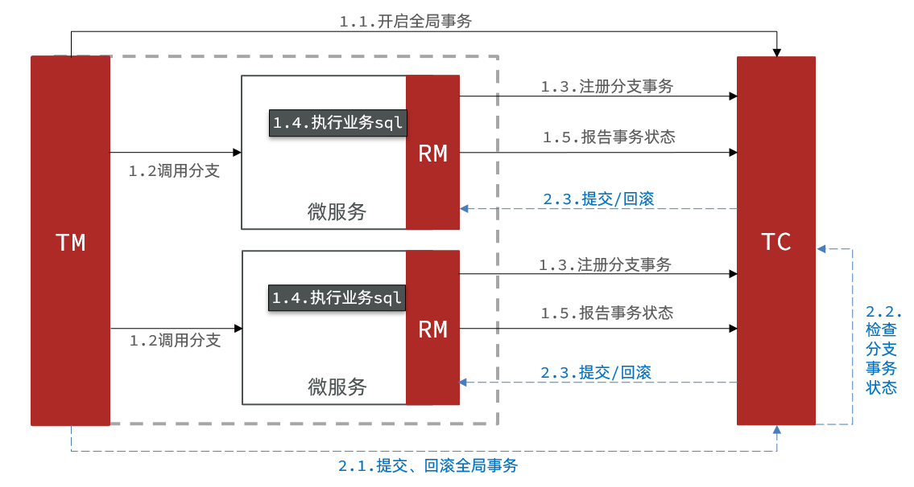
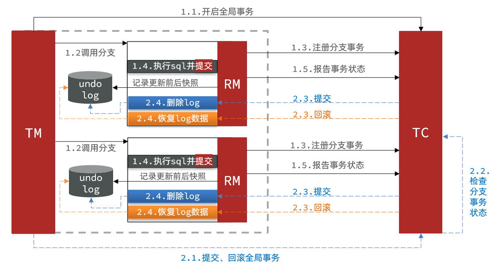
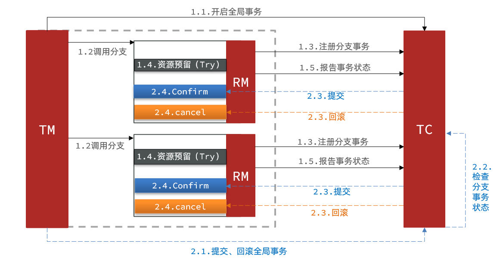

## 01- 什么是事务 ? 

事务就是用户定义的一系列数据库操作，这些操作可以视为一个完成的逻辑处理工作单元，要么全部执行，要么全部不执行，是不可分割的工作单元

## 02- 事务的特性有哪些 ?

- 原子性（Atomicity）：事务是不可分割的最小操作单元，要么全部成功，要么全部失败。

- 一致性（Consistency）：事务完成时，必须使所有的数据都保持一致状态。

- 隔离性（Isolation）：数据库系统提供的隔离机制，保证事务在不受外部并发操作影响的独立环境下运行。

- 持久性（Durability）：事务一旦提交或回滚，它对数据库中的数据的改变就是永久的。

## 03- 如果不考虑隔离性会引发什么问题 ? 

如果不考虑事务的隔离性，会发生的几种问题：

- 赃读：一个事务读到另外一个事务还没有提交的数据。

- 不可重复读：一个事务先后读取同一条记录，但两次读取的数据不同，称之为不可重复读。

- 幻读：一个事务按照条件查询数据时，没有对应的数据行，但是在插入数据时，又发现这行数据已经存在，好像出现了 "幻影"。

## 04- 如何解决上述问题 ? 

**可以通过调整事务的隔离级别解决上述问题**

- **read uncommitted** : 读取尚未提交的数据 ：哪个问题都不能解决

- **read committed**：读取已经提交的数据 ：可以解决脏读  ---- oracle、sql server、postgresql 默认的

- **repeatable read**：重读读取：可以解决脏读 和 不可重复读  ---mysql默认的

- **serializable：**串行化：可以解决 脏读 不可重复读 和 虚读 ---相当于锁表

## 05- 事务隔离级别是怎么实现的 , 你有了解过嘛 ? 

隔离级别的实现主要有读写锁和MVCC( Multi-Version Concurrency Control )多版本并发处理方式。

- 读未提交，它是性能最好，也可以说它是最野蛮的方式，因为它压根儿就不加锁，所以根本谈不上什么隔离效果，可以理解为没有隔离。

- 串行化。读的时候加共享锁，也就是其他事务可以并发读，但是不能写。写的时候加排它锁，其他事务不能并发写也不能并发读。

- 读已提交

  在读已提交隔离级别下，在事务中每一次执行快照读时生成ReadView。多个事物有多个ReadView , 事务没有结束之前只能读取自己的ReadView , 实现了读已提交 , 不能读取到其他事物未提交的数据
  
- 可重复读

  在可重复读隔离级别下，仅在事务中第一次执行快照读时生成ReadView，后续复用该ReadView。 而RR 是可重复读，在一个事务中，执行两次相同的select语句，查询到的结果是一样的
  
  

## 06- 你们项目中事务问题是如何控制的 ?  

我最近做的一个项目是分布式项目 , 这个项目中的事物问题分二种情况 : 

- 如果业务没有涉及到多个服务的调用, 直接使用Spring的声明式事物进行控制,  做法就是在需要事物的业务方法上添加@Transational注解
- 如果业务涉及到多个访问的调用 , 使用阿里巴巴开源的seata进行事物控制

## 07- Spring中的事务是如何实现的

1. Spring事务底层是基于数据库事务和AOP机制的

2. ⾸先对于使⽤了@Transactional注解的Bean，Spring会创建⼀个代理对象作为Bean

3. 当调⽤代理对象的⽅法时，会先判断该⽅法上是否加了@Transactional注解

4. 如果加了，那么则利⽤事务管理器创建⼀个数据库连接

5. 并且修改数据库连接的autocommit属性为false，禁⽌此连接的⾃动提交，这是实现Spring事务⾮ 常重要的⼀步 

6. 然后执⾏当前⽅法，⽅法中会执⾏sql 
7. 执⾏完当前⽅法后，如果没有出现异常就直接提交事务
8. 如果出现了异常，并且这个异常是需要回滚的就会回滚事务，否则仍然提交事务 
9. Spring事务的隔离级别对应的就是数据库的隔离级别 
10. Spring事务的传播机制是Spring事务⾃⼰实现的，也是Spring事务中最复杂的 
11. Spring事务的传播机制是基于数据库连接来做的，⼀个数据库连接⼀个事务，如果传播机制配置为 需要新开⼀个事务，那么实际上就是先建⽴⼀个数据库连接，在此新数据库连接上执⾏sql

## 08- Spring中事务失效的场景

1. 因为Spring事务是基于代理来实现的，所以某个加了@Transactional的⽅法只有是被代理对象调⽤时， 那么这个注解才会⽣效 ! 如果使用原始对象事物会失效
2. 同时如果某个⽅法是private的，那么@Transactional也会失效，因为底层cglib是基于⽗⼦类来实现 的，⼦类是不能重载⽗类的private⽅法的，所以⽆法很好的利⽤代理，也会导致@Transactianal失效
3. 如果在业务中对异常进行了捕获处理 , 出现异常后Spring框架无法感知到异常, @Transactional也会失效 
4. @Transational中默认捕获的是RuntimeException , 如果没有指定补货的异常类型, 并且程序抛出的是非运行时异常, 事物会失效

## 09- 说一下Spring的事务传播行为

1.  PROPAGATION_REQUIRED：如果当前没有事务，就创建一个新事务，如果当前存在事务，就 加入该事务，该设置是最常用的设置。 

2.  PROPAGATION_SUPPORTS：支持当前事务，如果当前存在事务，就加入该事务，如果当前不 存在事务，就以非事务执行。 

3.  PROPAGATION_MANDATORY：支持当前事务，如果当前存在事务，就加入该事务，如果当前 不存在事务，就抛出异常。

4.  PROPAGATION_REQUIRES_NEW：创建新事务，无论当前存不存在事务，都创建新事务。

5.  PROPAGATION_NOT_SUPPORTED：以非事务方式执行操作，如果当前存在事务，就把当前 事务挂起。

6.  PROPAGATION_NEVER：以非事务方式执行，如果当前存在事务，则抛出异常。

7.  PROPAGATION_NESTED：如果当前存在事务，则在嵌套事务内执行。如果当前没有事务，则 按REQUIRED属性执行。

## 10- 在你的项目中哪些模块使用了分布式事务控制 ? 能否举例说明 ?

我最近做的项目中很多地方都使用到了分布式事物  ,  例如 : 

**功能一 :** 

在用户实名认证审核功能中, 用户实名认证审核通过需要做二个操作 

1. 调用自媒体微服务创建自媒体帐号
2. 修改用户微服务实名认证审核的数据状态

这个业务中涉及到了多个服务的调用, 为了 保证数据的一致性 , 使用了分布式事物控制

**功能二 :** 

在文章审核发布的案例中, 文章审核通过后 , 会调用文章微服务发布文章 , 同时调用自媒体微服务修改文章的发布状态 , 也涉及到了多个服务之间的调用 , 所以需要使用分布式事务

**功能三 :** 

在自媒体用户发布文章的功能中, 文章发布成功之后需要调用阿里云进行审核, 阿里云审核通过之后需要修改自媒体服务的文章状态 , 同时需要发布延迟任务 ,为了保证服务数据的一致性 , 这里也使用了分布式事务

## 11- 你在这个模块中使用了Seata的哪种模式 ? 为什么选择这种模式, 其他模式能不能用 ? 

我们使用的Seata的AT模式 , 因为AT模式在多个服务都是操作关系型数据库的情况下实现比较简单 , 没有代码侵入, 只需要简单配置即可生效

Seata事务管理中有三个重要的角色：

- **TC (Transaction Coordinator) -** **事务协调者：**维护全局和分支事务的状态，协调全局事务提交或回滚。

- **TM (Transaction Manager) -** **事务管理器：**定义全局事务的范围、开始全局事务、提交或回滚全局事务。

- **RM (Resource Manager) -** **资源管理器：**管理分支事务处理的资源，与TC交谈以注册分支事务和报告分支事务的状态，并驱动分支事务提交或回滚。

其他模式当然也可以使用 ,例如 : XA模式 , TCC模式

**简述AT模式与XA模式最大的区别是什么？**

- XA模式一阶段不提交事务，锁定资源；AT模式一阶段直接提交，不锁定资源。
- XA模式依赖数据库机制实现回滚；AT模式利用数据快照实现数据回滚。
- XA模式强一致；AT模式最终一致

## 12- 你们使用了Seata AT模式, 那你对Seat AT模式的工作原理有了解过嘛 ? 其他模式的流程呢 ?

Seata除了AT模式模式之外, 还支持 XA模式 , TCC模式 , SAGA模式等

Seata事务管理中有三个重要的角色：

- **TC (Transaction Coordinator) -** **事务协调者：**维护全局和分支事务的状态，协调全局事务提交或回滚。

- **TM (Transaction Manager) -** **事务管理器：**定义全局事务的范围、开始全局事务、提交或回滚全局事务。

- **RM (Resource Manager) -** **资源管理器：**管理分支事务处理的资源，与TC交谈以注册分支事务和报告分支事务的状态，并驱动分支事务提交或回滚。

**XA模式流程 :** 

> **第一阶段 :** 
>
> 1. TM感知到需要进行分布式事务控制的方法开始执行, 需要向TC发送指令开启全局事务
> 2. TC会开启一个全局事务, 分配一个全局事务ID (XID)
> 3. 之后TM会调用各个分支事务RM , RM收到指令后会向TC注册各自的分支事务 , 注册到同一个全局事务中 , 跟XID进行关联
> 4. RM注册分支事务完毕后开启执行业务SQL , 业务SQL执行完毕之后不提交  
> 5. RM执行完毕后向TC汇报各自的执行状态
>
> **第二阶段 :** 
>
> 1. TM感知到所有的分支事务执行完毕 , 通知TC进行期全局事务决议 , TC收到指令后 , 检查各个分支事务的状态
> 2. 如果所有的分支事务全部执行成功 , 通知各个RM提交事务 , 如果有任何一个分支事物执行失败 , 通知各个RM回滚事务
> 3. RM收到提交/回滚的请求后 , 执行数据库本身的提交和回滚指令 , 完成事务的提交和回滚
>
> **因为他在第一阶段业务SQL执行完毕之后, 不提交等待, 等到最后一起提交和回滚, 所以XA模式是一种强一致性的分布式事务解决方案**

**AT模式 :** 

> **第一阶段 :** 
>
> 1. TM感知到需要进行分布式事务控制的方法开始执行, 需要向TC发送指令开启全局事务
> 2. TC会开启一个全局事务, 分配一个全局事务ID (XID)
> 3. 之后TM会调用各个分支事务RM , RM收到指令后会向TC注册各自的分支事务 , 注册到同一个全局事务中 , 跟XID进行关联
> 4. RM注册分支事务完毕后首先会记录业务SQL执行之前的数据快照 , 然后执行业务SQL , 再记录业务SQL执行之后的数据快照, 将 数据快照保存到一个undolog表中 , 业务SQL和undolog表的操作在同一个本地事务中 , 要保证同时成功或者同时失败 , 之后直接提交分支事物
> 5. RM执行完毕后向TC汇报各自的执行状态
>
> **第二阶段 :** 
>
> 1. TM感知到所有的分支事务执行完毕 , 通知TC进行期全局事务决议 , TC收到指令后 , 检查各个分支事务的状态
> 2. 如果所有的分支事务全部执行成功 , 通知各个RM提交事务 , 如果有任何一个分支事物执行失败 , 通知各个RM回滚事务
> 3. RM收到提交/回滚的请求后 , 利用undolog实现数据的提交/回滚
>    - 提交操作 : 删除undolog日志
>    - 回滚操作 : 根据全局事务ID以及分支事务ID查询 , 前后镜像数据, 生成反向补偿SQL语句 , 将前镜像数据更新回数据库即可
>
> **因为他在第一阶段业务SQL执行完毕之后直接提交, 最后通过反向补偿机制实现事务回滚, 所以AT模式是一种最终一致性的分布式事务解决方案**
>
> **脏写问题 :  在AT模式中 , 因为分二阶段 ,第一阶段直接提交事物, 如果出现事务并发, 可能会出现脏写问题 , seata是通过全局锁的形式解决数据脏写问题的 ! seata的全局锁就是一张数据库表global_lock表 , 当某一个分布式事物获取了全局锁 , 会在表中记录, 其他事物再次获取锁就会失败**

**TCC模式**

> TCC模式与AT模式非常相似，每阶段都是独立事务，不同的是TCC通过我们自己编码来实现数据恢复。需要实现三个方法：
>
> - Try：资源的检测和预留； 
>
> - Confirm：完成资源操作业务；要求 Try 成功 Confirm 一定要能成功。
>
> - Cancel：预留资源释放，可以理解为try的反向操作。
>
>   
>
> **第一阶段 :** 
>
> 1. TM感知到需要进行分布式事务控制的方法开始执行, 需要向TC发送指令开启全局事务
> 2. TC会开启一个全局事务, 分配一个全局事务ID (XID)
> 3. 之后TM会调用各个分支事务RM , RM收到指令后会向TC注册各自的分支事务 , 注册到同一个全局事务中 , 跟XID进行关联
> 4. RM注册分支事务完毕后开始执行Try接口完成资源预留
> 5. RM执行完毕后向TC汇报各自的执行状态
>
> **第二阶段 :** 
>
> 1. TM感知到所有的分支事务执行完毕 , 通知TC进行期全局事务决议 , TC收到指令后 , 检查各个分支事务的状态
> 2. 如果所有的分支事务全部执行成功 , 通知各个RM提交事务 , 如果有任何一个分支事物执行失败 , 通知各个RM回滚事务
> 3. RM收到提交/回滚的请求后 , 利用confirm和cancel实现数据的确认和回滚
>    - 提交操作 : 执行confirm方法完成数据确认提交
>    - 回滚操作 : 执行cancel方法完成数据恢复
>
> **因为他在第一阶段业务SQL执行完毕之后直接提交, 没有使用全局锁 , 也不需要生成数据快照 , 所以性能比较好 , 而且不需要依赖数据库事务所以可以用于非关系型数据库 , 但是需要手动编写 try .confirm和cancel方法 , 实现比较复杂**

## 13- 什么是TCC模式的 业务悬挂 和 空回滚  ? 如何解决业务悬挂 和 空回滚 ?

**空回滚  :** 当某分支事务的try阶段**阻塞**时，可能导致全局事务超时而触发二阶段的cancel操作。在未执行try操作时先执行了cancel操作，这时cancel不能做回滚，就是**空回滚**。

> 解决方案就是  : 执行cancel操作时，应当判断try是否已经执行，如果尚未执行，则应该空回滚。空回滚的解决方案就是保存一条空的回滚记录

**业务悬挂 :** 对于已经空回滚的业务，之前被阻塞的try操作恢复，继续执行try，就永远不可能confirm或cancel ，事务一直处于中间状态，这就是**业务悬挂**。

> 业务悬挂应该避免 , 执行try操作时，应当判断cancel是否已经执行过了，如果已经执行，应当阻止空回滚后的try操作，避免悬挂

